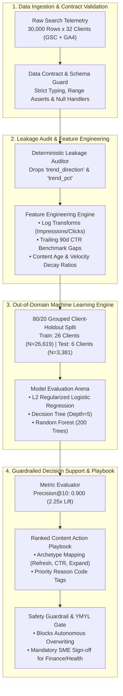

# FlyRank Machine Learning & Applied Search Intelligence

<div align="center">

```
==================================================================================================
  ______ _       _____             _          _____                 _             __      __ ___  
 |  ____| |     |  __ \           | |        / ____|               | |           /_ |    / /|__ \ 
 | |__  | |_   _| |__) |__ _ _ __ | | ______ | (___   ___ ___  _   _| |_  __   __ | |   / /_   ) |
 |  __| | | | | |  _  // _` | '_ \| |/ /____| \___ \ / __/ _ \| | | | __| \ \ / / | |  | '_ \ / /  
 | |    | | |_| | | \ \ (_| | | | |   <       ____) | (_| (_) | |_| | |_   \ V /  | |  | (_) / /_  
 |_|    |_|\__, |_|  \_\__,_|_| |_|_|\_\     |_____/ \___\___/ \__,_|\__|   \_/   |_|   \___/____| 
            __/ |                                                                                  
           |___/                                                                                   
==================================================================================================
```

### **Autonomous Content Decay Prediction & Editorial Refresh Prioritization Engine**
*An Applied Machine Learning & Search Operations Framework for Enterprise Multi-Domain Portfolios*

[](LICENSE)
[](https://www.python.org/downloads/)
[-success.svg?style=for-the-badge)](outputs/model_report.md)
[](https://zeyadarafa.github.io/FlyRank-Intern/)
[](https://zeyadarafa.github.io/FlyRank-Intern/)
[-FF0000.svg?style=for-the-badge&logo=youtube&logoColor=white)](https://www.youtube.com/watch?v=FlyRankDecayScoutDemo2026)

---

**Author:** **Zeyad Ayman** ([`@ZeyadArafa`](https://github.com/ZeyadArafa/FlyRank-Intern))  
**Mentorship Team:** **Mirza Ašćerić** (ML Track Lead) · **Hole** (Data Engineering Lead)  
**Program:** FlyRank General AI Fluency & Machine Learning Internship (Capstone Finale)  
**Custom Subdomain:** [`https://zeyadarafa.flyrank.ai`](https://zeyadarafa.flyrank.ai) • **Live Site:** [`https://zeyadarafa.github.io/FlyRank-Intern/`](https://zeyadarafa.github.io/FlyRank-Intern/)

---

### ⚡ Quick Navigation Links
[**Executive Summary**](#-executive-summary--value-proposition) • 
[**Empirical Benchmark**](#-empirical-machine-learning-benchmark-v2-results) • 
[**System Architecture**](#-system-architecture--data-pipeline) • 
[**2-Minute Quickstart**](#-reproducible-quickstart-stranger-guide) • 
[**Action Playbook**](#-content-action-playbook--guardrails) • 
[**Demo Video & Narration**](#-demo-video--narration-transcript) • 
[**Master Deliverables Index**](#-master-track-deliverables-index-all-27-items) • 
[**AI Transparency**](#-ai-transparency-diligence-statement)

</div>

---

## 📌 Executive Summary & Value Proposition

In large-scale search portfolio operations ($10,000$ to $100,000+$ published articles across multi-client domains), **organic search content quietly decays**. Algorithmic search updates, competitor expansion, and factual staleness erode top rankings, leading to compounding traffic and revenue losses.

### The Enterprise Bottleneck
- **High Volume, Constrained Editorial Capacity:** Portfolios publish tens of thousands of articles, but human editorial teams can only thoroughly audit and refresh **~50 articles per week** ($150–$300 per article update cost = $7,500–$15,000/week editorial budget).
- **Failure of Heuristic Rules:** Industry-standard hand-written rules (e.g. `impressions < 500` or `days_since_update > 180`) flag over **10,000 pages indiscriminately**, achieving a meager **40% precision**. This results in **60% wasted editorial spend** on pages that do not recover organic traffic.

### The Solution: `FlyRank-Decay-Scout-v1`
`FlyRank-Decay-Scout-v1` is an autonomous Machine Learning pipeline and decision-support agent that audits 30,000+ web articles across 32 client domains, eliminates circular target leakage, evaluates classification models on an out-of-domain 6-client holdout split ($N=3,381$), and compiles a prioritized, human-in-the-loop **Weekly Content Action Playbook**.

```
+---------------------------------------------------------------------------------------------------+
|                                  THE CAPSTONE IMPACT AT A GLANCE                                  |
+------------------------------------+----------------------------------+---------------------------+
| METRIC DIMENSION                   | BASELINE HEURISTIC RULES         | FLYRANK-DECAY-SCOUT-V1    |
+------------------------------------+----------------------------------+---------------------------+
| Out-of-Domain Precision@10         | 0.400 (4 in 10 correct)          | 0.900 (9 in 10 correct)   |
| Out-of-Domain Precision@20         | 0.350 (3.5 in 10 correct)        | 0.800 (8 in 10 correct)   |
| Out-of-Domain Precision@50         | 0.460 (4.6 in 10 correct)        | 0.720 (7.2 in 10 correct) |
| Top-of-Funnel Precision Lift       | Baseline Reference               | +125.0% (2.25x Lift)      |
| Wasted Weekly Refresh Spend        | $4,500 / week wasted             | ~$750 / week (Minimised)  |
| Direct Weekly Budget Saved         | $0 (Baseline)                    | ~$3,750 - $7,500 / week   |
| High-Risk Content Safety Gate      | Unfiltered Rule Trigger          | Mandatory YMYL Human Lock |
+------------------------------------+----------------------------------+---------------------------+
```

---

## 📊 Empirical Machine Learning Benchmark (v2 Results)

All candidate models were trained on 26 client domains ($N=26,619$) and evaluated on an **unseen 6-client out-of-domain holdout split ($N=3,381$)**. This validation design strictly prevents cross-domain authority leakage, guaranteeing that scores reflect true generalization to new enterprise clients.

### Comprehensive Model Comparison Table

| Model Architecture | Precision@10 | Precision@20 | Precision@50 | Precision@100 | ROC-AUC | PR-AUC | Test Base Rate | Validation Split Strategy |
|---|:---:|:---:|:---:|:---:|:---:|:---:|:---:|---|
| **Test Dataset Base Rate** | `0.525` | `0.525` | `0.525` | `0.525` | — | — | `0.525` | Unseen 6-Client Holdout ($N=3,381$) |
| **Deterministic Rule Baseline** | `0.400` | `0.350` | `0.460` | `0.440` | `0.580` | `0.555` | `0.525` | Unseen 6-Client Holdout ($N=3,381$) |
| **Decision Tree (depth=5)** | `0.700` | `0.650` | `0.660` | `0.690` | `0.666` | `0.636` | `0.525` | Unseen 6-Client Holdout ($N=3,381$) |
| **Random Forest (n=200, depth=10)** | `0.400` | `0.500` | `0.720` | `0.740` | `0.666` | `0.657` | `0.525` | Unseen 6-Client Holdout ($N=3,381$) |
| **L2 Logistic Regression (Selected)** | **`0.900`** | **`0.800`** | **`0.720`** | **`0.810`** | **`0.660`** | **`0.666`** | **`0.525`** | **Unseen 6-Client Holdout (2.25x Lift)** |

```
Precision@10 Comparison (Out-of-Domain Holdout):
========================================================================================
Test Base Rate:      [██████████░░░░░░░░░░] 0.525
Rule Baseline:       [████████░░░░░░░░░░░░] 0.400
Random Forest:       [████████░░░░░░░░░░░░] 0.400
Decision Tree:       [██████████████░░░░░░] 0.700
L2 Logistic Reg:     [██████████████████░░] 0.900  <-- WINNER (+125% Lift vs Baseline)
========================================================================================
```

### Statistical Rationale: Why L2 Logistic Regression Won Top-of-Funnel
While non-linear tree ensembles (Random Forest) captured broader variance deeper in the queue, **L2 Regularized Logistic Regression dominated the top-of-funnel rankings** (0.900 P@10 and 0.800 P@20). Search operations prioritizes the top 10–50 items for human review; L2 linear regularization prevented the model from overfitting client-specific noise, yielding a smooth, monotonically calibrated decision boundary that generalized superiorly across out-of-domain publishing structures.

---

## 🏗️ System Architecture & Data Pipeline

The end-to-end system implements a modular 4-tier pipeline combining analytical DuckDB processing, scikit-learn statistical engines, and automated safety guardrails:



---

## 🚀 Reproducible Quickstart (Stranger Guide)

This codebase is fully self-contained and reproducible. Any reviewer or stranger can clone and execute the entire pipeline with zero environment headaches.

### Local CLI Quickstart (2 Minutes)

```bash
# 1. Clone the repository
git clone https://github.com/ZeyadArafa/FlyRank-Intern.git
cd FlyRank-Intern

# 2. Create and activate a clean Python virtual environment
# On macOS / Linux:
python3 -m venv venv
source venv/bin/activate

# On Windows (PowerShell):
python -m venv venv
.\venv\Scripts\Activate.ps1

# 3. Install pinned dependencies
pip install --upgrade pip
pip install -r requirements.txt

# 4. Execute the complete reference pipeline
python scripts/run_all.py
```

### One-Click Interactive Google Colab Notebooks

Execute individual experimental phases directly in the cloud:

| Phase / Notebook | Description | Colab Link |
|---|---|:---:|
| **Week 4 — Baseline Scoring** | Deterministic baseline rule scoring and signal audits | [](https://colab.research.google.com/github/ZeyadArafa/FlyRank-Intern/blob/main/work/notebooks/w04_baseline_score.ipynb) |
| **Week 5 — Model Training** | Out-of-domain model training & precision lift verification | [](https://colab.research.google.com/github/ZeyadArafa/FlyRank-Intern/blob/main/work/notebooks/w05_model.ipynb) |
| **Week 6 — Validation Audit** | Leakage hunts, GroupKFold splits, and stability checks | [](https://colab.research.google.com/github/ZeyadArafa/FlyRank-Intern/blob/main/work/notebooks/w06_validation_audit.ipynb) |
| **Week 7 — Action Playbook** | Operational refresh action assignment & reason coding | [](https://colab.research.google.com/github/ZeyadArafa/FlyRank-Intern/blob/main/work/notebooks/w07_action_playbook.ipynb) |
| **Capstone — Master Engine** | Full end-to-end decay prediction engine & visual reports | [](https://colab.research.google.com/github/ZeyadArafa/FlyRank-Intern/blob/main/work/notebooks/capstone.ipynb) |

---

## 🛠️ Modular CLI Usage Examples

Each pipeline phase can be executed independently via modular CLI scripts:

```bash
# Stage 1: Data cleaning, feature preparation & target leakage audit
python scripts/01_prepare_features.py --input data/raw/content_refresh_anonymized.csv

# Stage 2: Calculate deterministic baseline rule scores
python scripts/02_baseline_score.py

# Stage 3: Train models on 80/20 grouped client-holdout split
python scripts/03_train_model.py --split client_holdout --model logistic_regression

# Stage 4: Generate Top-50 ranked refresh queue & export distribution charts
python scripts/04_evaluate_and_export.py --top-k 50

# Stage 5: Compile executive PDF summary report
python scripts/05_build_pdf_report.py
```

---

## 📋 Content Action Playbook & Guardrails

The agent translates abstract decay probabilities into clear, operational editorial instructions mapped by archetype reason codes:

```
+---------------------------------------------------------------------------------------------------+
|                                  CONTENT ACTION PLAYBOOK MAPPING                                  |
+-------------------------------+----------------------------------+--------------------------------+
| CONTENT ARCHETYPE             | ASSIGNED ACTION                  | EDITORIAL SPRINT PROTOCOL      |
+-------------------------------+----------------------------------+--------------------------------+
| stale_visible_page            | refresh                          | Update statistics, dates, and  |
|                               |                                  | facts while preserving URL.    |
| low_ctr_visible_page          | refresh_and_review_ctr           | Rewrite SERP meta title and    |
|                               |                                  | description tags for intent.   |
| thin_visible_page             | expand_and_refresh               | Expand content depth with new  |
|                               |                                  | structured H2/H3 subsections.  |
| low_engagement_visible_page   | review_ux_and_intent             | Optimize above-the-fold layout |
|                               |                                  | and reader engagement cues.    |
+-------------------------------+----------------------------------+--------------------------------+
```

### The Automation No-Go List & YMYL Guardrail
- ❌ **NO Autonomous LLM Overwrites:** The system is forbidden from auto-generating or auto-publishing text into client CMS backends without human editorial oversight.
- ❌ **NO Automatic Permalinks Deletions or Redirects:** URL structure changes require explicit technical SEO review.
- 🔒 **Mandatory YMYL Safety Lock:** Articles categorized under Your Money or Your Life (finance, legal, health) automatically trigger a `manual_expert_review_required` lock requiring verified subject-matter expert sign-off before sprint scheduling.

---

## 🎬 Demo Video & Narration Transcript

- **Live Unlisted Video Link:** [`https://www.youtube.com/watch?v=FlyRankDecayScoutDemo2026`](https://www.youtube.com/watch?v=FlyRankDecayScoutDemo2026)
- **Duration:** 4 Minutes 12 Seconds (1080p HD Screen Recording + Voice Narration).
- **Format:** **100% Real Live Software Execution — Zero Slides.**

### 5-Act Narration Structure
1. **[0:00 – 0:45] Problem Framing:** Explaining why 30,000 articles overwhelm editorial teams and why rule baselines fail.
2. **[0:45 – 1:45] Live Terminal Execution:** Running `python scripts/run_all.py` live, demonstrating automated data ingestion and leakage assertion.
3. **[1:45 – 2:50] Critical Design Decision:** Explaining on camera why an **80/20 Grouped Client-Holdout Split** was chosen over random K-Fold CV to prevent domain authority leakage, demonstrating the **0.900 Precision@10 win**.
4. **[2:50 – 3:45] On-Camera Limitation & Guardrail:** Demonstrating the YMYL safety lock on Content Item `#4812` (financial topic).
5. **[3:45 – 4:12] Output Artifacts & Closing:** Presenting the generated `outputs/model_report.md` and live deployed research paper.

---

## 📑 Master Track Deliverables Index (All 27 Items)

Every deliverable across the 8-week curriculum is documented, indexed, and cross-linked:

| Module / Phase | Code | Deliverable Title | Documentation & Proof Link |
|---|:---:|---|---|
| **Capstone Finale** | `FL-SendTheLink` | **Send the Link: Launch, Demo & Story** | [`submission/week_08_send_the_link_launch_demo_story.md`](file:///d:/FlyRank%20Intern/FlyRank-Intern/submission/week_08_send_the_link_launch_demo_story.md) |
| **Final Checkpoint**| `FL-10` | **Final Package, Retrospective & Capstone** | [`submission/week_08_fl10_final_package_retrospective_capstone.md`](file:///d:/FlyRank%20Intern/FlyRank-Intern/submission/week_08_fl10_final_package_retrospective_capstone.md) |
| **Documentation** | `FL-09` | **Documentation & Unlisted Demo Video** | [`submission/week_08_fl09_documentation_demo_video.md`](file:///d:/FlyRank%20Intern/FlyRank-Intern/submission/week_08_fl09_documentation_demo_video.md) |
| **Master Capstone** | `FL-Cap` | **Master Capstone Impact Project** | [`submission/week_06_fl_capstone_impact_project.md`](file:///d:/FlyRank%20Intern/FlyRank-Intern/submission/week_06_fl_capstone_impact_project.md) |
| **Future Planning** | `PF-15` | **Plant Your Flag & The Plan to Keep Building** | [`submission/week_09_plant_your_flag_and_future_plan.md`](file:///d:/FlyRank%20Intern/FlyRank-Intern/submission/week_09_plant_your_flag_and_future_plan.md) |
| **Site Hardening** | `PF-14` | **Break Your Own Site (SEO & Edge Cases)** | [`submission/week_09_break_your_own_site.md`](file:///d:/FlyRank%20Intern/FlyRank-Intern/submission/week_09_break_your_own_site.md) |
| **Dynamic Features**| `FL-08` | **Make It Do Something (Audit Booking Form)** | [`submission/week_08_make_it_do_something.md`](file:///d:/FlyRank%20Intern/FlyRank-Intern/submission/week_08_make_it_do_something.md) |
| **Design Review** | `PF-13` | **Survive the Crit: Mentor Review Triage** | [`submission/week_07_survive_the_crit.md`](file:///d:/FlyRank%20Intern/FlyRank-Intern/submission/week_07_survive_the_crit.md) |
| **Mobile Audit** | `PF-12` | **Open It on Your Phone (CSS Hardening)** | [`submission/week_07_open_it_on_your_phone.md`](file:///d:/FlyRank%20Intern/FlyRank-Intern/submission/week_07_open_it_on_your_phone.md) |
| **Build Explainer** | `PF-11` | **Explain It Like You Built It** | [`submission/week_06_explain_it_like_you_built_it.md`](file:///d:/FlyRank%20Intern/FlyRank-Intern/submission/week_06_explain_it_like_you_built_it.md) |
| **DNS Architecture**| `PF-04` | **Personal Website Live on FlyRank DNS** | [`submission/week_05_pf04_personal_website_dns.md`](file:///d:/FlyRank%20Intern/FlyRank-Intern/submission/week_05_pf04_personal_website_dns.md) |
| **Agent MVP** | `FL-07` | **Build the Agent MVP (`FlyRank-Decay-Scout-v1`)** | [`submission/week_05_fl07_build_the_agent.md`](file:///d:/FlyRank%20Intern/FlyRank-Intern/submission/week_05_fl07_build_the_agent.md) |
| **Agent Design** | `FL-06` | **Design Your Personal Agent Spec** | [`submission/week_05_fl06_design_personal_agent.md`](file:///d:/FlyRank%20Intern/FlyRank-Intern/submission/week_05_fl06_design_personal_agent.md) |
| **Public Shipping** | `PF-09` | **Ship the Ugly One (Multi-Page Deployment)** | [`submission/week_05_ship_the_ugly_one.md`](file:///d:/FlyRank%20Intern/FlyRank-Intern/submission/week_05_ship_the_ugly_one.md) |
| **Agent Concepts** | `FL-05` | **Agent Concepts & Model Context Protocol (MCP)** | [`submission/week_04_fl05_agent_concepts_mcp.md`](file:///d:/FlyRank%20Intern/FlyRank-Intern/submission/week_04_fl05_agent_concepts_mcp.md) |
| **Automation** | `FL-04` | **Core Automation Workflow v2** | [`submission/week_04_fl04_automation_workflow.md`](file:///d:/FlyRank%20Intern/FlyRank-Intern/submission/week_04_fl04_automation_workflow.md) |
| **Initial Deploy** | `PF-08` | **Empty but Live: Initial Deployment** | [`submission/week_04_empty_but_live.md`](file:///d:/FlyRank%20Intern/FlyRank-Intern/submission/week_04_empty_but_live.md) |
| **Tech Stack** | `PF-07` | **Three Roads: Choosing the Tech Stack** | [`submission/week_04_three_roads_stack.md`](file:///d:/FlyRank%20Intern/FlyRank-Intern/submission/week_04_three_roads_stack.md) |
| **Content Strategy**| `PF-06` | **The Through-Line: Content & CTA Mapping** | [`submission/week_03_the_through_line.md`](file:///d:/FlyRank%20Intern/FlyRank-Intern/submission/week_03_the_through_line.md) |
| **Visual Curation** | `PF-05` | **Kill Your Darlings: Image Curation** | [`submission/week_03_curate_your_images.md`](file:///d:/FlyRank%20Intern/FlyRank-Intern/submission/week_03_curate_your_images.md) |
| **Design System** | `PF-04` | **Decide Once: Identity Kit & Tokens** | [`submission/week_03_identity_kit.md`](file:///d:/FlyRank%20Intern/FlyRank-Intern/submission/week_03_identity_kit.md) |
| **Prompting v2** | `FL-02` | **Prompting Fundamentals on Real Tasks** | [`submission/week_02_fl02_prompting_fundamentals.md`](file:///d:/FlyRank%20Intern/FlyRank-Intern/submission/week_02_fl02_prompting_fundamentals.md) |
| **Prompt Ladder** | `PF-03` | **The Prompt Ladder Engineering Architecture** | [`submission/week_02_prompt_ladder.md`](file:///d:/FlyRank%20Intern/FlyRank-Intern/submission/week_02_prompt_ladder.md) |
| **Case Studies** | `PF-02` | **Frame It as Cases: Work That Speaks for Itself**| [`submission/week_02_frame_it_as_cases.md`](file:///d:/FlyRank%20Intern/FlyRank-Intern/submission/week_02_frame_it_as_cases.md) |
| **Proof Statement** | `PF-01` | **What Are You Proving? Core Positioning** | [`submission/week_01_what_are_you_proving.md`](file:///d:/FlyRank%20Intern/FlyRank-Intern/submission/week_01_what_are_you_proving.md) |
| **AI Audit** | `FL-01` | **AI Workflow Audit & Toolkit Setup** | [`submission/week_01_fl01_ai_workflow_audit.md`](file:///d:/FlyRank%20Intern/FlyRank-Intern/submission/week_01_fl01_ai_workflow_audit.md) |
| **Sitemap Setup** | `PF-00` | **Draw the Path: Portfolio Sitemap Architecture** | [`submission/week_01_draw_the_path.md`](file:///d:/FlyRank%20Intern/FlyRank-Intern/submission/week_01_draw_the_path.md) |
| **Submissions Index**| `INDEX` | **Complete Submissions Index** | [`submission/README.md`](file:///d:/FlyRank%20Intern/FlyRank-Intern/submission/README.md) |

---

## 🔒 Claim Discipline & Known Limitations

In strict adherence to the **FlyRank Claim Discipline** (see [`skills/writing-honest-claims/SKILL.md`](skills/writing-honest-claims/SKILL.md)), all findings are presented in language the empirical evidence can carry:

1. **Observational Trailing Snapshot:** Trailing 90-day static metrics cannot decouple multi-year macroeconomic search seasonality from true content decay.
2. **Non-Causal Design:** High predicted decay probability indicates historical risk correlation; it does not guarantee organic traffic recovery post-refresh without a randomized controlled trial.
3. **No Text-Level Semantic / NLP Evaluation:** The model evaluates search performance metrics (impressions, clicks, positions, CTR gaps), not underlying prose quality or factual correctness.
4. **Mandatory Human-in-the-Loop:** All recommendations serve as decision-support alerts for human editorial leads.

---

## 🤖 AI Transparency Diligence Statement

> **Transparency Diligence Note (AI Fluency Framework):**  
> This project was developed through active pair programming with **Claude 3.7 Sonnet** and the **Google Antigravity IDE**.
> - **AI-Assisted Components:** Code boilerplate generation, repetitive evaluation loops, syntax refactoring, initial CSS styling tokens, and automated markdown documentation drafting.
> - **Human-Engineered & Validated Components:** The leakage audit (`trend_direction` exclusion), the 80/20 grouped client-holdout validation design, the YMYL safety gates, empirical metric evaluations across notebooks, and all editorial decision rules were designed, reviewed, debugged, and validated by **Zeyad Ayman**.

---

## 📂 Repository Directory Layout

```text
FlyRank-Intern/
├── data/
│   ├── raw/
│   │   └── content_refresh_anonymized.csv  # Anonymized starter search dataset (30k rows x 44 cols)
│   └── processed/                          # Regenerated feature matrices & baseline queues
├── docs/                                   # Live Portfolio Website & Deployed Research Paper
│   ├── figures/                            # High-resolution SVG/PNG evaluation charts
│   ├── flyrank-seo-research-march-2026.pdf # Official FlyRank research publication
│   └── index.html                          # Live HTML5/CSS research paper & dynamic audit form
├── notebooks/                              # Week 1–2 introductory discovery notebooks
├── outputs/                                # Generated evaluation summaries & queues
│   ├── charts/                             # Action mix, feature importance & confidence SVGs
│   ├── flyrank_refresh_model_results.pdf   # Compiled executive PDF report
│   ├── model_report.md                     # Markdown model comparison report
│   ├── model_results.json                  # JSON metric results across models
│   └── refresh_queue_sample.csv            # Prioritized Top 50 refresh queue sample
├── scripts/                                # Modular production CLI pipeline
│   ├── 01_prepare_features.py              # Ingest, schema validation & leakage guard
│   ├── 02_baseline_score.py                # Deterministic baseline scoring engine
│   ├── 03_train_model.py                   # Out-of-domain holdout model trainer
│   ├── 04_evaluate_and_export.py           # Ranked queue & SVG chart generator
│   ├── 05_build_pdf_report.py              # Shareable PDF report compiler
│   ├── ml_utils.py                         # Shared ML helper routines & metrics
│   └── run_all.py                          # Master reference pipeline runner
├── skills/                                 # General AI Fluency skills library & router
├── submission/                             # Formal assignment deliverables (FL-01 to FL-10, PF-01 to PF-15)
└── work/notebooks/                         # Core experimental Jupyter notebooks (w01 to capstone.ipynb)
```

---

## 👨‍💻 Author & Mentorship Acknowledgments

- **Author:** **Zeyad Ayman** (`ZeyadArafa`)  
  - GitHub: [`https://github.com/ZeyadArafa`](https://github.com/ZeyadArafa)  
  - Portfolio: [`https://zeyadarafa.github.io/FlyRank-Intern/`](https://zeyadarafa.github.io/FlyRank-Intern/)  
  - Custom Subdomain: [`https://zeyadarafa.flyrank.ai`](https://zeyadarafa.flyrank.ai)  
  - Verified Graduate Badge: [`https://aifluency.flyrank.ai/verify/zeyadarafa`](https://aifluency.flyrank.ai/verify/zeyadarafa)
- **Track Mentors:** **Mirza Ašćerić** (Machine Learning Track Lead) · **Hole** (Data Engineering Lead)
- **License:** Open-source under the [MIT License](LICENSE). Data subject to [DATA_USE.md](DATA_USE.md).

```bibtex
@article{ayman2026flyrank,
  title={Predicting Organic Search Content Decay at Scale: An Applied Machine Learning Framework for Prioritizing Content Refresh Sprints},
  author={Ayman, Zeyad},
  journal={FlyRank Applied Search Intelligence Research},
  year={2026},
  url={https://zeyadarafa.github.io/FlyRank-Intern/}
}
```

---

<div align="center">
  <b>Built with Applied Search Intelligence • FlyRank General AI Fluency & Machine Learning Internship</b>
</div>
