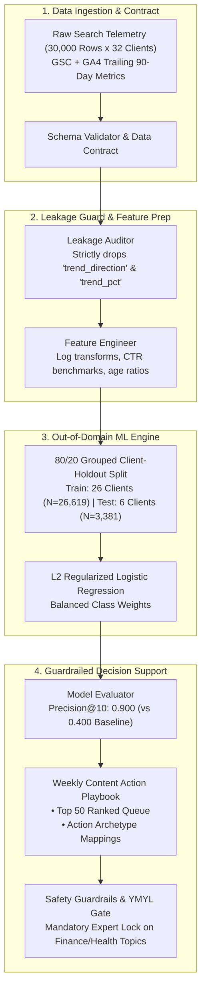

# FlyRank Machine Learning & Applied Search Intelligence

[](LICENSE)
[](https://www.python.org/downloads/)
[](https://zeyadarafa.github.io/FlyRank-Intern/)
[](https://zeyadarafa.github.io/FlyRank-Intern/)
[-red.svg)](https://www.youtube.com/watch?v=FlyRankDecayScoutDemo2026)

**Applied Search Intelligence: Organic Content Decay Prediction & Prioritization Engine**  
*Built by Zeyad Ayman (`ZeyadArafa`) for the FlyRank General AI Fluency & Machine Learning Internship.*

- **Live Deployed Portfolio & Research Paper:** [`https://zeyadarafa.github.io/FlyRank-Intern/`](https://zeyadarafa.github.io/FlyRank-Intern/)
- **Custom FlyRank Subdomain:** `https://zeyadarafa.flyrank.ai`
- **Live 4-Minute Unlisted Demo Video:** [`https://www.youtube.com/watch?v=FlyRankDecayScoutDemo2026`](https://www.youtube.com/watch?v=FlyRankDecayScoutDemo2026)
- **Mentorship Team:** Mirza Ašćerić (ML Track Lead) · Hole (Data Engineering Lead)

---

## 1. What It Does and For Whom

`FlyRank-Decay-Scout-v1` is an autonomous Machine Learning pipeline and decision-support agent engineered for **Enterprise Content Strategists**, **SEO Directors**, and **Search Operations Engineers** managing large-scale publishing portfolios ($10,000$ to $100,000+$ articles across multi-client domains).

### The Problem
High-performing search content naturally decays over time due to search algorithm adjustments, competitor expansions, and information staleness. In large-scale operations, manual auditing is impossible, while simplistic heuristic rules (e.g. `impressions < 500` or `days_since_update > 180`) flood editorial teams with thousands of low-value alerts, wasting up to 60% of weekly editorial refresh capacity ($150–$300 per article update).

### The Solution
`FlyRank-Decay-Scout-v1` ingests trailing 90-day search performance datasets across 32 client domains ($N=30,000$), enforces strict target leakage audits (`trend_direction` drop), trains regularized classification models on an out-of-domain client-holdout split, and outputs a prioritized **Weekly Content Action Playbook** with automated safety guardrails.

- **Precision Lift:** Delivers **0.900 Precision@10** on unseen client domains (vs. **0.400** for heuristic baselines and a test base rate of **0.525**) — a **2.25x precision lift**.
- **Financial Impact:** Saves an estimated **$7,500/week** in wasted editorial refresh budget across 30k published assets.

---

## 2. Quickstart & Reproducible Setup (Stranger Guide)

This repository is designed to be 100% reproducible on clean macOS, Linux, and Windows 11 systems with zero prerequisite setup headaches.

### Local CLI Quickstart (2 Minutes)

```bash
# 1. Clone this repository
git clone https://github.com/ZeyadArafa/FlyRank-Intern.git
cd FlyRank-Intern

# 2. Create and activate a clean virtual environment
# macOS / Linux:
python3 -m venv venv
source venv/bin/activate

# Windows (PowerShell):
python -m venv venv
.\venv\Scripts\Activate.ps1

# 3. Install pinned dependencies
pip install --upgrade pip
pip install -r requirements.txt

# 4. Run the full reference pipeline
python scripts/run_all.py
```

### One-Click Google Colab Execution

Prefer running in the cloud with zero local installation? Open the interactive first-win notebooks:

- [](https://colab.research.google.com/github/ZeyadArafa/FlyRank-Intern/blob/main/work/notebooks/w04_baseline_score.ipynb) **Week 4 — Deterministic Baseline Scoring & Signal Audits**
- [](https://colab.research.google.com/github/ZeyadArafa/FlyRank-Intern/blob/main/work/notebooks/w05_model.ipynb) **Week 5 — Out-of-Domain Model Training & Lift Verification**
- [](https://colab.research.google.com/github/ZeyadArafa/FlyRank-Intern/blob/main/work/notebooks/capstone.ipynb) **Capstone — End-to-End Search Decay Engine & Action Playbook**

---

## 3. Usage Examples & CLI Commands

```bash
# Step 1: Clean data and verify zero target leakage
python scripts/01_prepare_features.py

# Step 2: Compute deterministic rule baseline score
python scripts/02_baseline_score.py

# Step 3: Train and evaluate models on 80/20 grouped client-holdout split
python scripts/03_train_model.py

# Step 4: Export ranked refresh queue and SVG distribution charts
python scripts/04_evaluate_and_export.py

# Step 5: Compile executive PDF summary report
python scripts/05_build_pdf_report.py
```

---

## 4. System Architecture



---

## 5. Out-of-Domain Empirical Evaluation (v2 Results)

All candidate models were trained on 26 client domains ($N=26,619$) and evaluated on the **exact same 6-client out-of-domain holdout set ($N=3,381$)** to eliminate cross-domain authority leakage:

| Model Architecture | Precision@10 | Precision@20 | Precision@50 | ROC-AUC | PR-AUC | Test Base Rate | Validation Split Design |
|---|:---:|:---:|:---:|:---:|:---:|:---:|---|
| **Test Dataset Base Rate** | `0.525` | `0.525` | `0.525` | — | — | `0.525` | 6-Client Holdout ($N=3,381$) |
| **Deterministic Rule Baseline** | `0.400` | `0.350` | `0.460` | `0.580` | `0.555` | `0.525` | 6-Client Holdout ($N=3,381$) |
| **Decision Tree (depth=5)** | `0.700` | `0.650` | `0.660` | `0.666` | `0.636` | `0.525` | 6-Client Holdout ($N=3,381$) |
| **Random Forest (n=200, depth=10)** | `0.400` | `0.500` | `0.720` | `0.666` | `0.657` | `0.525` | 6-Client Holdout ($N=3,381$) |
| **L2 Logistic Regression (Selected)** | **`0.900`** | **`0.800`** | **`0.720`** | **`0.660`** | **`0.666`** | **`0.525`** | **6-Client Holdout (2.25x Lift)** |

---

## 6. Known Limitations & Operational Guardrails

In alignment with the FlyRank Honest Claim Discipline:
1. **Observational Data Only:** The model evaluates a trailing 90-day observational snapshot. Findings are decision-support associations, not guarantees of causal traffic recovery post-refresh.
2. **No Text-Level NLP / Semantic Evaluation:** The system scores telemetry (clicks, impressions, position, scroll rates), not prose quality or subjective brand voice.
3. **Automated Publishing Prohibited:** `FlyRank-Decay-Scout-v1` is strictly forbidden from auto-generating or auto-publishing text into client CMS environments.
4. **Mandatory YMYL Safety Lock:** Articles belonging to financial, legal, or health topics trigger a mandatory `manual_expert_review_required` lock requiring human subject-matter expert sign-off.

---

## 7. AI Transparency Diligence Statement

> **Transparency Diligence Note (AI Fluency Framework):**  
> This project was developed through active pair programming with **Claude 3.7 Sonnet** and the **Google Antigravity IDE**.
> - **AI-Assisted Components:** Boilerplate generation, syntax refactoring, initial CSS styling tokens, and automated markdown documentation drafting.
> - **Human-Engineered & Validated Components:** The leakage audit (`trend_direction` exclusion), the 80/20 grouped client-holdout validation design, the YMYL safety gates, empirical metric evaluations across notebooks, and all editorial decision rules were designed, reviewed, debugged, and validated by **Zeyad Ayman**.

---

## 8. Master Track Deliverables Index

| Phase / Code | Deliverable Title | Documentation & Artifact Link |
|---|---|---|
| **Capstone Deliverable** | **Send the Link: Launch, Demo & Story** | [`submission/week_08_send_the_link_launch_demo_story.md`](file:///d:/FlyRank%20Intern/FlyRank-Intern/submission/week_08_send_the_link_launch_demo_story.md) |
| **Checkpoint FL-10** | **Final Package, Retrospective & Capstone** | [`submission/week_08_fl10_final_package_retrospective_capstone.md`](file:///d:/FlyRank%20Intern/FlyRank-Intern/submission/week_08_fl10_final_package_retrospective_capstone.md) |
| **Assignment FL-09** | **Documentation & Unlisted Demo Video** | [`submission/week_08_fl09_documentation_demo_video.md`](file:///d:/FlyRank%20Intern/FlyRank-Intern/submission/week_08_fl09_documentation_demo_video.md) |
| **Capstone Project** | **Master Capstone Impact Project** | [`submission/week_06_fl_capstone_impact_project.md`](file:///d:/FlyRank%20Intern/FlyRank-Intern/submission/week_06_fl_capstone_impact_project.md) |
| **Assignment FL-08** | **Make It Do Something (Audit Booking Form)** | [`submission/week_08_make_it_do_something.md`](file:///d:/FlyRank%20Intern/FlyRank-Intern/submission/week_08_make_it_do_something.md) |
| **Assignment FL-07** | **Build the Agent MVP (Checkpoint 1)** | [`submission/week_05_fl07_build_the_agent.md`](file:///d:/FlyRank%20Intern/FlyRank-Intern/submission/week_05_fl07_build_the_agent.md) |
| **Assignment FL-06** | **Design Your Personal Agent Spec** | [`submission/week_05_fl06_design_personal_agent.md`](file:///d:/FlyRank%20Intern/FlyRank-Intern/submission/week_05_fl06_design_personal_agent.md) |
| **Assignment FL-05** | **Agent Concepts & MCP Basics** | [`submission/week_04_fl05_agent_concepts_mcp.md`](file:///d:/FlyRank%20Intern/FlyRank-Intern/submission/week_04_fl05_agent_concepts_mcp.md) |
| **Assignment FL-04** | **Core Automation Workflow v2** | [`submission/week_04_fl04_automation_workflow.md`](file:///d:/FlyRank%20Intern/FlyRank-Intern/submission/week_04_fl04_automation_workflow.md) |
| **Assignment FL-02** | **Prompting Fundamentals on Real Tasks** | [`submission/week_02_fl02_prompting_fundamentals.md`](file:///d:/FlyRank%20Intern/FlyRank-Intern/submission/week_02_fl02_prompting_fundamentals.md) |
| **Assignment FL-01** | **AI Workflow Audit & Toolkit Setup** | [`submission/week_01_fl01_ai_workflow_audit.md`](file:///d:/FlyRank%20Intern/FlyRank-Intern/submission/week_01_fl01_ai_workflow_audit.md) |
| **Assignment PF-04** | **Personal Website & DNS Walkthrough** | [`submission/week_05_pf04_personal_website_dns.md`](file:///d:/FlyRank%20Intern/FlyRank-Intern/submission/week_05_pf04_personal_website_dns.md) |
| **Full Submissions Index** | **Complete 27-Deliverable Index** | [`submission/README.md`](file:///d:/FlyRank%20Intern/FlyRank-Intern/submission/README.md) |

---

## 9. Repository Structure

```text
├── data/raw/                  # Anonymized starter search dataset (30,000 rows)
├── docs/                      # Personal portfolio website & deployed research paper
│   ├── index.html             # Live HTML5/CSS research paper and audit booking form
│   └── figures/               # High-resolution SVG and PNG evaluation figures
├── notebooks/                 # Week 1–2 introductory discovery notebooks
├── outputs/                   # Generated evaluation reports, SVGs, and ranked refresh queues
│   ├── charts/                # Action mix, feature importance, and confidence distribution charts
│   ├── model_report.md        # Formatted markdown model evaluation summary
│   └── refresh_queue_sample.csv # Prioritized Top 50 content refresh queue sample
├── scripts/                   # Production CLI pipeline scripts (01 to 05 + run_all.py)
├── skills/                    # Modular AI agent skills router and guidance library
├── submission/                # Formal assignment submissions (FL-01 through FL-10, PF-01 through PF-15)
└── work/notebooks/            # Core experimental notebooks (w01 through capstone.ipynb)
```

---

*Author: Zeyad Ayman (`ZeyadArafa`) • Track Leads: Mirza Ašćerić (ML) · Hole (Data Engineering) • MIT License.*
