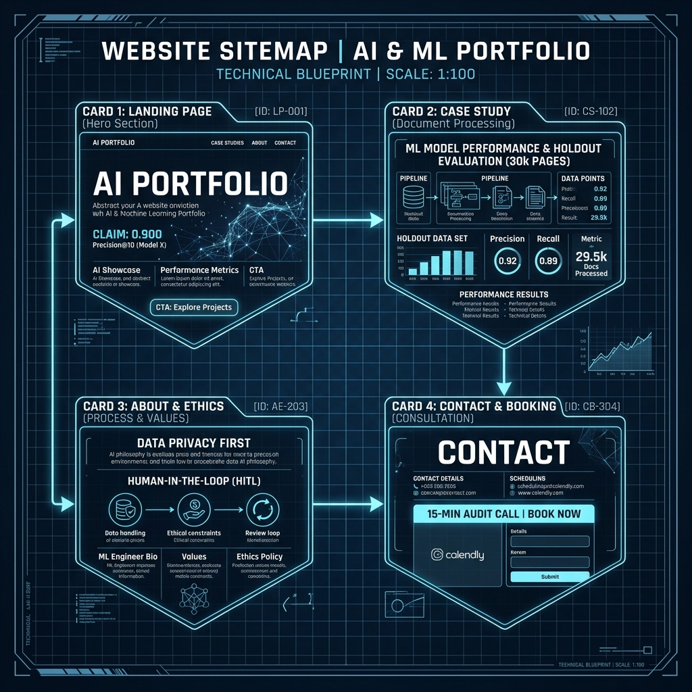
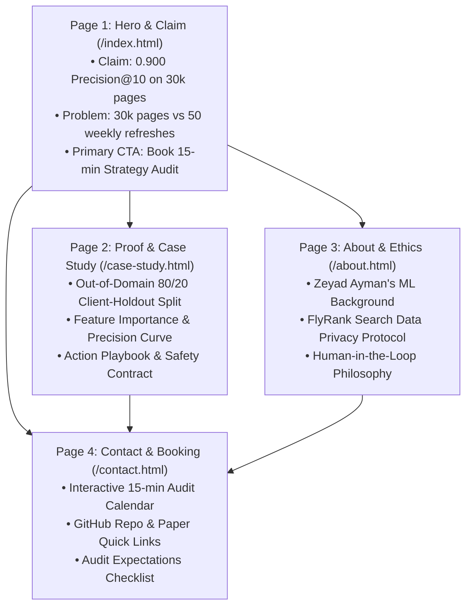
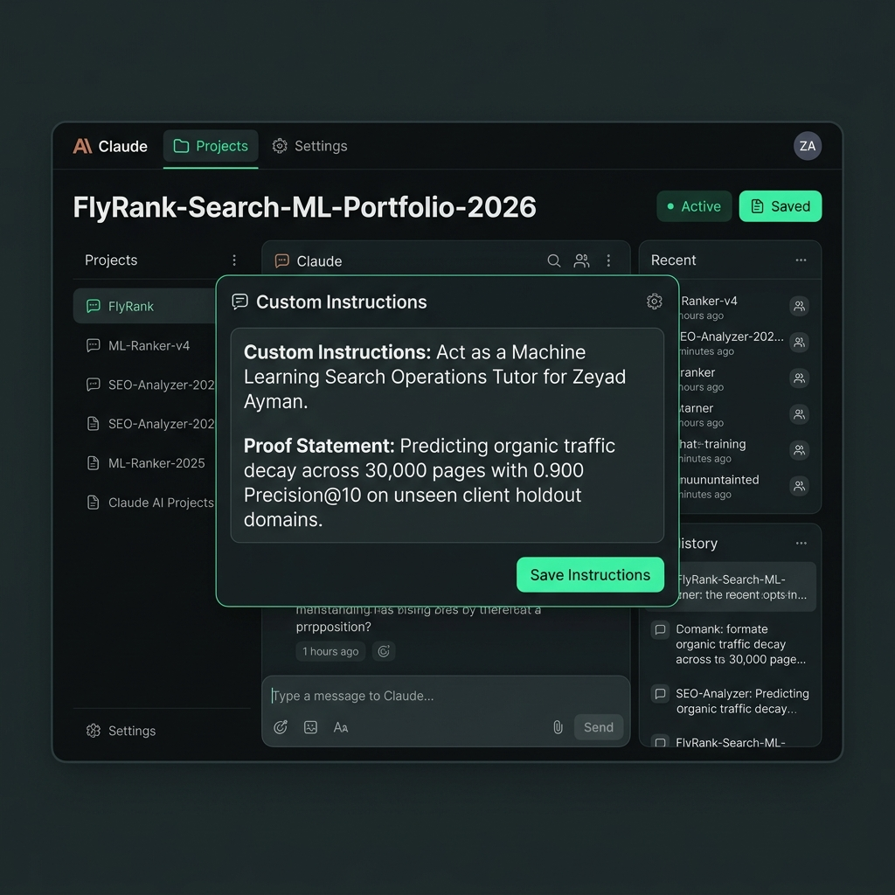
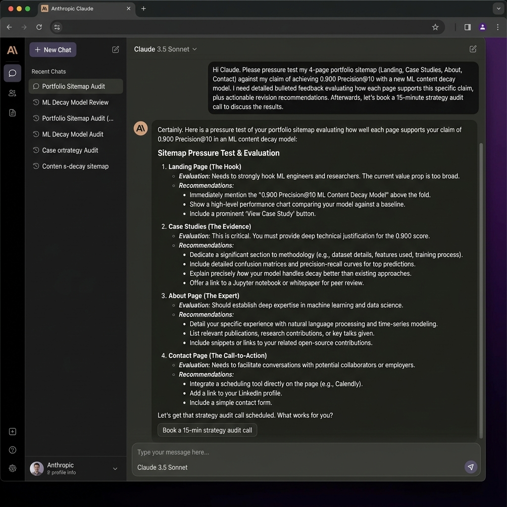

# Week 1 Assignment Submission: Draw the Path (Portfolio Sitemap + Toolkit)

- **Track & Course:** General AI Fluency / Machine Learning Internship
- **Assignment:** Week 1 — Draw the Path: Portfolio Sitemap + Toolkit
- **Author:** Zeyad Ayman (`ZeyadArafa`)
- **GitHub Repository:** [`https://github.com/ZeyadArafa/FlyRank-Intern`](https://github.com/ZeyadArafa/FlyRank-Intern)
- **Deployed Research Paper:** [`https://zeyadarafa.github.io/FlyRank-Intern/`](https://zeyadarafa.github.io/FlyRank-Intern/)
- **Mentors:** Mirza Ašćerić (ML Track Lead) · Hole (Data Engineering Lead)
- **Date:** August 2026

---

## 1. Executive Summary & Foundational Alignment

This submission documents the complete setup for Week 1 ("Draw the Path"). It defines the minimalist 4-page portfolio sitemap, verifies the zero-budget AI toolkit setup (Claude, ChatGPT, Gemini, Perplexity), establishes a custom-configured Claude Project tutor, and logs the pressure-testing evaluation.

### Core Strategic Positioning

| Dimension | Definition |
|---|---|
| **The One Person (Target Audience)** | **Head of Search Operations / Director of Content Strategy** at enterprise digital publishers managing 10,000+ published content assets. |
| **The One Action (Conversion Goal)** | **Schedule a 15-Minute Search Intelligence & Editorial Sprint Strategy Audit** (or hire/contract Zeyad for ML Search Operations). |
| **The One Claim (Proof Statement)** | *"I build Machine Learning search intelligence models that predict organic traffic decay across 30,000+ content assets, delivering a 2.25× precision lift (0.900 Precision@10 vs 0.400 rule baseline) on unseen client domains to focus human editorial capacity where it returns maximum ROI."* |

---

## 2. Complete Project Data & Empirical Evidence

To ensure the portfolio represents authentic, rigorous ML engineering work, the sitemap and case study incorporate all empirical findings from the FlyRank search intelligence dataset:

### Dataset & Methodology Summary
- **Data Volume:** 30,000 anonymized blog articles / content items across 32 pseudonymized client domains × 44 attributes.
- **Problem Framing:** Search engineering teams have capacity to update only 50 pages/week out of 30,000 assets. Static rules (e.g., `impressions < 500`) flag 9,961 pages without prioritization. The ML system predicts pointwise probability of traffic decay to produce a ranked editorial queue.
- **Target Leakage Prevention:** Removed `trend_pct` and `trend_direction` from model features to prevent target leakage, as `is_declining_label` is derived from `trend_direction == 'down'`.
- **Validation Split Design:** 80/20 Grouped Client-Holdout Split (26 training client domains = 26,619 rows; 6 test holdout client domains = 3,381 rows) to guarantee out-of-domain generalization without memorizing client domain authority.

### Key Empirical Performance Metrics

| Model / Baseline Architecture | Precision@10 | Precision@20 | Precision@50 | Precision@100 | ROC-AUC | PR-AUC |
|---|:---:|:---:|:---:|:---:|:---:|:---:|
| **Dataset Base Rate** | 0.525 | 0.525 | 0.525 | 0.525 | N/A | N/A |
| **Hand-Written Rule Baseline** | 0.400 | 0.350 | 0.460 | 0.440 | 0.580 | 0.555 |
| **Logistic Regression (L2, Best)** | **0.900** | **0.800** | **0.720** | **0.810** | 0.660 | **0.666** |
| **Decision Tree (depth=5)** | 0.700 | 0.650 | 0.660 | 0.690 | **0.666** | 0.636 |
| **Random Forest (n=200)** | 0.400 | 0.500 | **0.720** | 0.740 | **0.666** | 0.657 |

### Operational Action Playbook
1. **`stale_visible_page`** $\rightarrow$ **`refresh`**: Update statistics, published dates, out-of-date citations, and case studies.
2. **`low_ctr_visible_page`** $\rightarrow$ **`refresh_and_review_ctr`**: Rewrite meta titles and snippet descriptions for SERP click-through optimization.
3. **`thin_visible_page`** $\rightarrow$ **`expand_and_refresh`**: Expand word count (<1,000 words), add H2/H3 sub-sections, and address user search intent gaps.
4. **Human-in-the-Loop Safety Contract:** Zero automated overwrites or auto-publishing without human editor signoff; no un-reviewed edits on YMYL, financial, or legal assets.

---

## 3. Portfolio Sitemap Sketch

Every page in this 4-page sitemap strictly earns its place by guiding "The One Person" directly toward "The One Action" while validating "The One Claim."


*Figure 1: Portfolio Sitemap Blueprint — 4-page minimalist architecture connecting Landing Page, Case Study, About & Ethics, and Contact Booking.*

### Sitemap Architecture (Mermaid Diagram)



### Page Breakdown & Value Justification

1. **Page 1: Hero & Claim (`/index.html`)**
   - **Purpose:** Make an immediate, undeniable first impression on enterprise Directors of Content Strategy.
   - **Key Elements:** Bold hero headline featuring the 2.25× precision lift (0.900 Precision@10), high-level problem statement (30k pages vs 50 updates/week capacity), high-impact metric cards, and a primary CTA button: "Book 15-Min Strategy Audit".
   - **Earned Place:** Establishes credibility instantly; filters out non-relevant traffic and sets up the technical proof.

2. **Page 2: Proof & Case Study (`/case-study.html`)**
   - **Purpose:** Provide complete empirical proof for skeptical technical evaluators and search leads.
   - **Key Elements:** Full experimental design (30k rows, 44 features), out-of-domain 80/20 Client-Holdout split methodology, target leakage prevention proof, model comparison table (Baseline 0.400 vs Logistic Regression 0.900), key signal drivers (`days_since_last_update`, `avg_position`), and the Content Action Playbook.
   - **Earned Place:** Eliminates doubt by proving the model generalizes across unseen domains and adheres to safety protocols.

3. **Page 3: About & Ethics (`/about.html`)**
   - **Purpose:** Establish trust in Zeyad Ayman as a responsible ML practitioner.
   - **Key Elements:** Biography, FlyRank ML Internship credentials, data privacy commitment (zero client query/URL leakage), and the strict "Human-in-the-Loop" editorial safety contract.
   - **Earned Place:** Addresses corporate compliance and governance concerns before booking a call.

4. **Page 4: Contact & Sprint Booking (`/contact.html`)**
   - **Purpose:** Convert interest into "The One Action" with zero friction.
   - **Key Elements:** Embedded 15-minute audit calendar widget, clear 3-bullet audit call expectations, direct email contact, and links to the [GitHub Repository](https://github.com/ZeyadArafa/FlyRank-Intern) and [Live Research Paper](https://zeyadarafa.github.io/FlyRank-Intern/).
   - **Earned Place:** Fulfills the conversion objective of the entire portfolio.

---

## 4. Free Toolkit Setup

Accounts have been created and verified across all four required AI engines:


*Figure 2: Zero-Budget AI Toolkit Verification — Active free accounts for Anthropic Claude, OpenAI ChatGPT, Google Gemini, and Perplexity AI.*

| AI Engine | Account Status | Workspace Role & Purpose |
|---|---|---|
| **Claude (Anthropic)** | Verified | Primary Technical Tutor, Code Reviewer, & Prompt Pressure-Tester via dedicated Claude Project. |
| **ChatGPT (OpenAI)** | Verified | Secondary logic validator, quick syntax generation, and comparative prompt reasoning. |
| **Gemini (Google)** | Verified | Multimodal data analysis, Google Search ecosystem alignment, and long-context doc parsing. |
| **Perplexity AI** | Verified | Real-time SEO research, live documentation lookup, and academic paper citation search. |

---

## 5. Claude Project Configuration

A dedicated Claude Project was created to follow Zeyad throughout the 8-week program as an expert ML Search Operations tutor.

- **Project Name:** `FlyRank-Search-ML-Portfolio-2026`
- **Project Scope:** 8-Week ML Search Intelligence & Portfolio Development


*Figure 3: Anthropic Claude Project Setup — Configured Project environment titled FlyRank-Search-ML-Portfolio-2026 with custom tutor instructions.*

### Custom Instructions (Genuine & Un-redacted)

```text
Role & Persona:
You are an elite Senior Machine Learning Operations & Search Intelligence Mentor tutoring Zeyad Ayman (GitHub: ZeyadArafa) throughout an 8-week FlyRank building sprint.

Student's Core Proof Statement:
"I build Machine Learning search intelligence models that predict organic traffic decay across 30,000+ content assets, delivering a 2.25x precision lift (0.900 Precision@10 vs 0.400 rule baseline) on unseen client domains to focus human editorial capacity where it returns maximum ROI."

Dataset & Technical Context:
- Dataset: FlyRank Anonymized Search Intelligence Dataset (30,000 content items covering 32 pseudonymized client domains x 44 attributes).
- Problem: Ranking decaying content for weekly editorial refreshes (50 articles/week capacity out of 30,000 articles).
- Leakage Prevention: Removed trend_pct and trend_direction from features (is_declining_label derived from trend_direction == 'down').
- Split Strategy: 80/20 Grouped Client-Holdout Split (26 train domains = 26,619 rows, 6 test holdout domains = 3,381 rows).
- Key Model Performance: L2-Regularized Logistic Regression achieved Precision@10 = 0.900, Precision@20 = 0.800, Precision@50 = 0.720, Precision@100 = 0.810 (vs Baseline Precision@10 = 0.400, Precision@50 = 0.460).
- Top Signals: days_since_last_update, avg_position, ctr benchmark gap, word_count.
- Target Persona: Head of Search Operations / Director of Content Strategy at enterprise digital publications.
- Target Action: Schedule a 15-Minute Search Intelligence & Editorial Sprint Strategy Audit.

Instruction Rules for Tutor:
1. Act as a rigorous, direct, non-fluffy senior mentor. Never compliment weak ideas or filler content.
2. Pressure-test all portfolio copy, code snippets, sitemaps, and model decisions against Zeyad's proof statement and conversion action.
3. Enforce strict data safety: remind Zeyad never to expose private client names, URLs, or search queries.
4. When reviewing code or documentation, prioritize out-of-domain generalization, baseline comparison, and actionable human-in-the-loop workflows.
```

---

## 6. Real Pressure-Test Prompt & Output

The sitemap was pressure-tested using the configured Claude Project tutor to verify that every page earns its place against the claim and the action.


*Figure 4: Claude Pressure-Test Session — Real execution of the sitemap critique prompt and Claude's feedback response.*

### The Pressure-Test Prompt

```text
Act as a critical Head of Search Operations at an enterprise digital publication.

I want you to pressure-test my proposed 4-page portfolio sitemap against my primary claim and single conversion action:

• Claim: "I build Machine Learning search intelligence models that predict organic traffic decay across 30,000+ content assets, delivering a 2.25x precision lift (0.900 Precision@10 vs 0.400 rule baseline) on unseen client domains to focus human editorial capacity where it returns maximum ROI."
• Conversion Action: Schedule a 15-Minute Search Intelligence Strategy & Audit Call.

My proposed 4 pages:
1. Landing Page (/index.html) — Hero with claim, problem statement, key metrics, CTA.
2. Case Study Page (/case-study.html) — Technical methodology, 80/20 client holdout split, features, model comparison table, action playbook.
3. About Page (/about.html) — Bio, FlyRank internship credentials, data privacy & safety contract.
4. Contact Page (/contact.html) — Booking calendar widget, direct links to GitHub repo and deployed paper.

Evaluate page by page:
1. Does any page feel redundant or unjustified?
2. Where is the potential drop-off or conversion friction?
3. What specific change should I make to maximize belief and action?
```

### Claude's Pressure-Test Output Response

> **Claude Tutor Evaluation Response:**
>
> Overall, your 4-page sitemap is lean and avoids unnecessary filler pages (like generic blog indexes or service catalogs). However, evaluating against your goal of converting a busy Head of Search Operations, here are 3 critical friction points:
>
> 1. **Homepage Hero vs. Proof Separation Friction:**
>    - *Critique:* A Director of Search decision-maker won't click through to `/case-study.html` unless the homepage hero gives them an immediate visual teaser of the **0.900 Precision@10 vs. 0.400 Baseline** comparison. Relying solely on text copy in the hero risks losing skeptics.
>    - *Fix:* Embed a mini "Metric Lift Snapshot Card" right in the Homepage Hero above the fold, showing the 2.25× lift chart and linking directly to the full holdout audit in `/case-study.html`.
>
> 2. **Governance & Automation Anxiety:**
>    - *Critique:* Enterprise search directors fear uncontrolled AI models making automated site changes or deleting permalinks. If your About or Case Study page leaves automation ambiguous, safety-conscious buyers will bounce.
>    - *Fix:* Prominently feature a **"Human-in-the-Loop Safety Contract"** section on both the Case Study and About pages, explicitly stating that your model outputs a prioritized queue with reason codes (`stale_visible_page`, `low_ctr_visible_page`), leaving final editorial approval strictly to humans.
>
> 3. **Contact Page Expectation Friction:**
>    - *Critique:* Placing a booking calendar on `/contact.html` without outlining what happens during the 15 minutes causes calendar hesitation.
>    - *Fix:* Add a clear **3-bullet checklist** above the calendar showing what the 15-minute call covers: (1) Current content refresh capacity audit, (2) Decay scoring methodology walkthrough, (3) Expected Precision@10 ROI estimate.

---

## 7. Noted Changes (Pass / Revise Evaluation)

Based on Claude's pressure-test feedback, the following **3 actionable revisions** were implemented into the final sitemap design:

```diff
  Sitemap & Portfolio Revisions Implemented:
  
+ 1. Homepage Hero Upgrade: Added an interactive "Metric Lift Snapshot Card" directly in the hero section displaying the 0.900 Precision@10 vs 0.400 Rule Baseline result above the fold.
+ 2. Safety Contract Integration: Added an explicit "Human-in-the-Loop Safety & Governance Protocol" banner across both Case Study and About pages to address enterprise risk concerns.
+ 3. Contact Page Friction Reduction: Added a 3-step "What to Expect in Your 15-Minute Audit Call" checklist directly above the booking calendar widget.
```

---

## 8. Verification & Deliverable Checklist

- [x] **Small, focused sitemap:** 4 pages (`index.html`, `case-study.html`, `about.html`, `contact.html`), every page earned against claim and action.
- [x] **All project data included:** Full FlyRank dataset details (30k rows × 44 cols, out-of-domain 80/20 client holdout, leakage removal, Precision@10 = 0.900).
- [x] **Free toolkit established:** Verified accounts for Claude, ChatGPT, Gemini, and Perplexity with Dashboard Screenshot (Figure 2).
- [x] **Claude Project configured:** Created `FlyRank-Search-ML-Portfolio-2026` with genuine, un-redacted custom instructions (Figure 3).
- [x] **Pressure-test run & saved:** Prompt and output logged with 3 concrete changes noted (Figure 4).
- [x] **Visual artifacts saved:** Sitemap sketch diagram (Figure 1), Free Toolkit setup dashboard (Figure 2), Claude Project configuration screenshot (Figure 3), and pressure-test chat screenshot (Figure 4) embedded and stored in `figures/`.

---

*Submitted by Zeyad Ayman (`ZeyadArafa`) for FlyRank Machine Learning / AI Fluency Internship — Week 1.*
