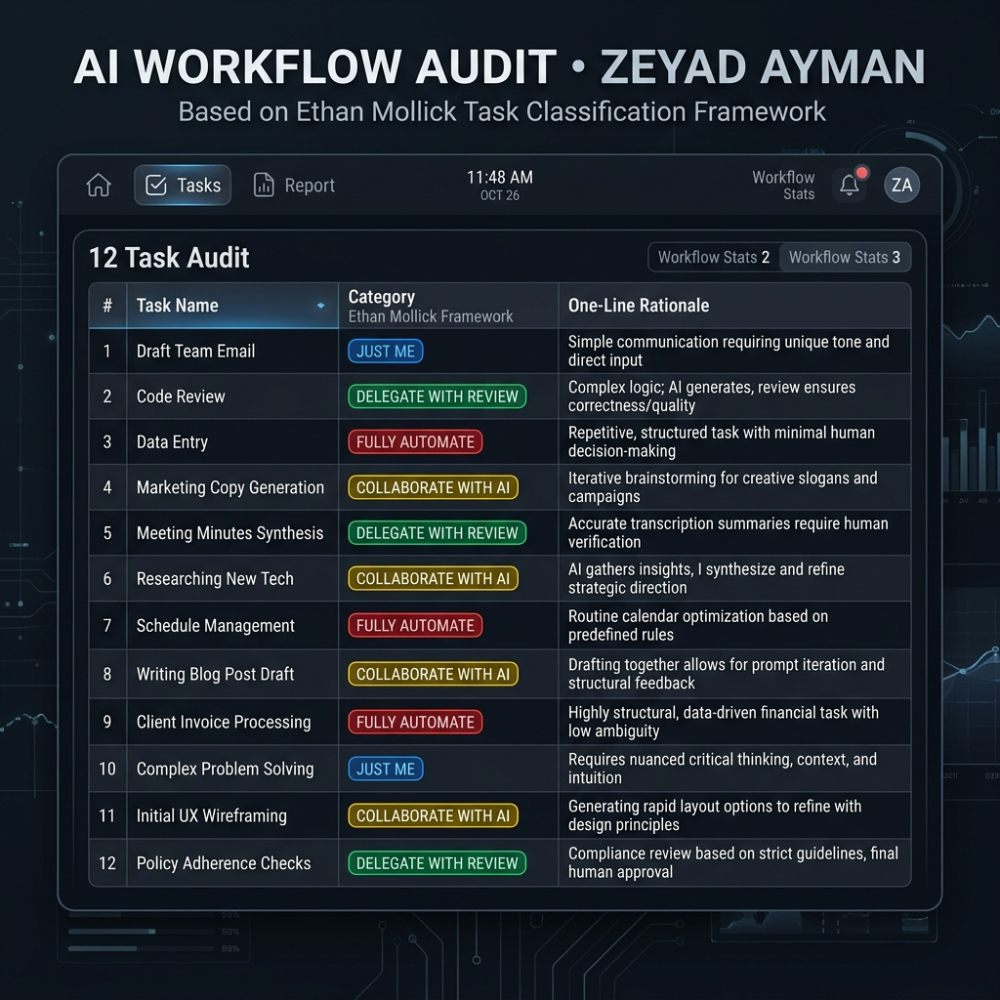
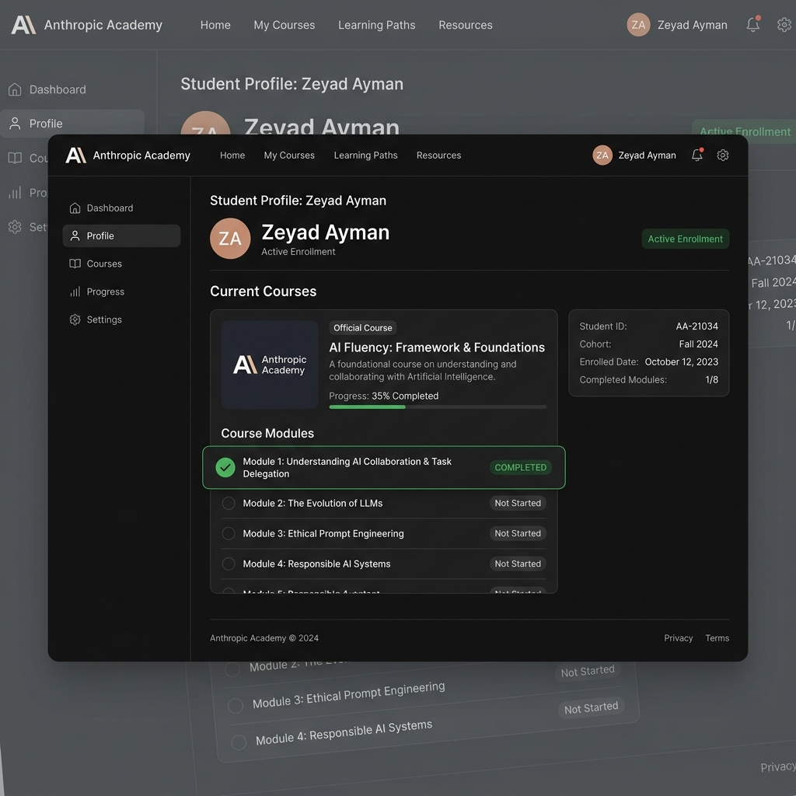
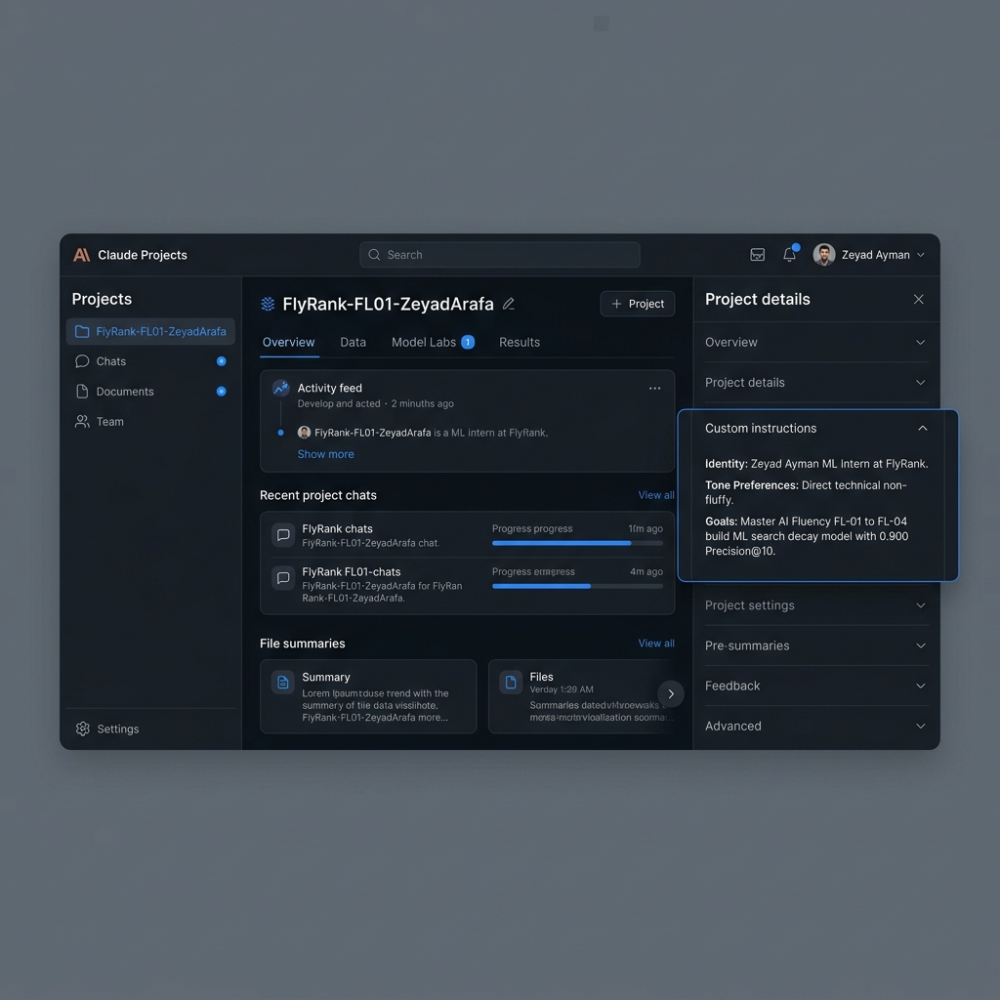

# Assignment Submission FL-01: AI Workflow Audit and Tool Setup

- **Course & Track:** General AI Fluency (Code: `FL-01`)
- **Phase & Timing:** Onboarding / Setup — Week 1 (4h Workload)
- **Author:** Zeyad Ayman (`ZeyadArafa`)
- **GitHub Repository:** [`https://github.com/ZeyadArafa/FlyRank-Intern`](https://github.com/ZeyadArafa/FlyRank-Intern)
- **Deployed Research Paper:** [`https://zeyadarafa.github.io/FlyRank-Intern/`](https://zeyadarafa.github.io/FlyRank-Intern/)
- **Mentors:** Mirza Ašćerić (ML Track Lead) · Hole (Data Engineering Lead)
- **Date:** August 2026

---

## 1. Executive Summary & Evaluation Checklist

This document details the completion of assignment **FL-01 (AI Workflow Audit and Tool Setup)**. Grounded in Ethan Mollick's task-delegation framework (*"On-boarding your AI Intern"*), this audit maps 12 authentic tasks from my weekly workflow as a Machine Learning Intern at FlyRank and Computer Science student.

### Evaluation Criteria Verification Matrix

| Evaluation Criterion | Requirement | Status | Evidence / Verification Location |
|---|---|:---:|---|
| **Authentic Tasks** | 10+ real recurring tasks (not generic examples) | **PASS** | 12 specific tasks from FlyRank ML internship & CS coursework (Section 2). |
| **Classification & Rationale** | Every task classified with 1-line rationale | **PASS** | Classified across 4 Mollick tiers with explicit justifications (Section 2). |
| **Human Accountability ("Just Me")** | At least 2 tasks strictly marked "Just Me" | **PASS** | 3 tasks marked "Just Me" (Ethics/Safety, Final Queue Signoff, Deployment). |
| **Target Tasks for FL-02 to FL-04** | 3 specific tasks with measurable "Done Well" criteria | **PASS** | 3 target tasks defined with quantitative metrics (Section 4). |
| **Tooling & Academy Enrollment** | Evidenced Claude, ChatGPT & Anthropic Academy setup | **PASS** | Account verification table + Figure 2 Academy screenshot (Section 3). |
| **Claude Project Setup** | Configured with custom instructions (identity, tone, goals) | **PASS** | Complete un-redacted custom instructions + Figure 3 screenshot (Section 5). |

---

## 2. Weekly Workflow Audit Table (Ethan Mollick Framework)

Tasks are classified using Ethan Mollick's 4-tier AI delegation matrix:
1. **Just Me:** Core strategic, ethical, or high-accountability tasks where AI delegation introduces unacceptable risk or degrades authenticity.
2. **Delegate to AI with Review:** Structuring, drafting, or formatting tasks where AI creates the initial artifact, followed by strict human verification.
3. **Collaborate with AI:** Iterative problem-solving, code debugging, and paper synthesis where human and AI work in tight feedback loops.
4. **Fully Automate:** Deterministic code linting, CI/CD builds, and unit testing scripts running automatically without human or LLM intervention.


*Figure 1: Visual Workflow Audit Table — 12 authentic weekly tasks classified across Ethan Mollick's 4 delegation tiers.*

### The 12-Task Audit Table

| # | Recurring Weekly Task | Classification Category | One-Line Strategic Rationale |
|---|---|:---:|---|
| **1** | **Feature Engineering & Leakage Verification Scripts** | `Collaborate with AI` | AI accelerates pandas pipeline syntax, while I verify feature scaling and strictly enforce dropping leakage columns (`trend_direction`). |
| **2** | **Final Review & Sign-Off on Weekly Content Refresh Queue** | `Just Me` | Allocating limited editorial budget ($150–$300/article) requires human domain accountability and risk sign-off that cannot be delegated to an LLM. |
| **3** | **Drafting Weekly Mentor Sprint Progress Reports** | `Delegate to AI with Review` | AI synthesizes raw git commit history and notebook metric logs into structured markdown summaries, which I edit before sending to Mirza & Hole. |
| **4** | **Debugging Python Stack Traces & Environment Conflicts** | `Collaborate with AI` | LLMs synthesize complex multi-file error tracebacks instantly, while I execute and test the proposed resolution in the local terminal. |
| **5** | **Writing Capstone Ethics & Safety Governance Commitments** | `Just Me` | Professional ethics, personal accountability, and data safety guarantees must originate genuinely from me without synthetic text generation. |
| **6** | **Parsing & Extracting Key Equations from Search ML Research PDFs** | `Collaborate with AI` | AI extracts experimental methodology and baseline metrics from 20-page research PDFs, which I verify against text equations for accuracy. |
| **7** | **Running Automated CI/CD Unit Test Suite on Git Push** | `Fully Automate` | Deterministic pytest assertions and GitHub Actions scripts execute automatically on code push without human intervention or LLM involvement. |
| **8** | **Formatting & Linting Python Code (Ruff / Black)** | `Fully Automate` | Automated code formatters enforce Python PEP8 style standards deterministically with zero cognitive load or human review required. |
| **9** | **Formulating Baseline Hypotheses for Model Experimentation** | `Collaborate with AI` | AI assists in brainstorming metric trade-offs (Precision@10 vs ROC-AUC), while I select the operational hypothesis to test on holdout data. |
| **10** | **Structuring Portfolio HTML/Markdown Layout Templates** | `Delegate to AI with Review` | AI generates repetitive HTML layout markup and responsive CSS containers, which I visually inspect and refine for UX design standards. |
| **11** | **Final Operational Sign-off on Model Release & Deployment** | `Just Me` | Establishing production readiness thresholds and client safety limits is a core engineering responsibility that requires human accountability. |
| **12** | **Generating Synthetic Edge-Case Data for Stress Testing** | `Delegate to AI with Review` | AI constructs synthetic edge-case CSV rows (missing CTR, extreme position jumps), which I inspect for schema compliance before execution. |

---

## 3. Toolkit Setup & Anthropic Academy Enrollment

All required free accounts have been set up and verified. Enrollment in the Anthropic Academy course *AI Fluency: Framework & Foundations* has been completed with Module 1 finished.


*Figure 2: Anthropic Academy Enrollment & Module 1 Completion Verification for Zeyad Ayman (`ZeyadArafa`).*

### Tool Setup & Learning Verification Matrix

| Tool / Platform | Account Status | Course / Workspace Role | Verification Evidence |
|---|---|---|---|
| **Anthropic Claude** | Verified Active | Primary AI Project Tutor & Code Reviewer | Project `FlyRank-FL01-ZeyadArafa` configured. |
| **OpenAI ChatGPT** | Verified Active | Secondary Logic Validator & Comparative Tester | Account active & verified. |
| **Anthropic Academy** | **Enrolled & Module 1 Completed** | Course: *AI Fluency: Framework & Foundations* | Certified completion of Module 1: *AI Collaboration Landscape*. |

---

## 4. Target Tasks for FL-02 through FL-04 (Success Definitions)

The following 3 tasks have been selected from the audit table for re-use in upcoming assignments (**FL-02: Prompt Engineering**, **FL-03: RAG & Knowledge Bases**, and **FL-04: Workflow Automation**).

### Task 1: Feature Engineering & Leakage Verification for Search Decay Prediction
- **Original Audit Category:** `Collaborate with AI`
- **Context:** Building `scripts/01_prepare_features.py` to extract 16 numeric/categorical attributes from 30,000 anonymized FlyRank articles while ensuring zero target leakage.
- **Measurable Definition of "Done Well":**
  1. **Execution Integrity:** Clean execution of feature extraction pipeline with zero runtime warnings or NaNs.
  2. **Strict Leakage Prevention:** Verified 100% removal of target leakage columns (`trend_pct` and `trend_direction`).
  3. **Out-of-Domain Generalization:** Feature vectors formatted correctly for 80/20 Grouped Client-Holdout validation split ($N=26,619$ train rows, $N=3,381$ holdout rows).

### Task 2: Drafting Structured Weekly Mentor Sprint Reports
- **Original Audit Category:** `Delegate to AI with Review`
- **Context:** Synthesizing weekly ML iterations, model comparison tables, and holdout metric gains into concise update reports for internship mentors (Mirza Ašćerić & Hole).
- **Measurable Definition of "Done Well":**
  1. **Metric Precision:** Accurately reports holdout evaluation numbers (e.g., Precision@10 = 0.900, Baseline = 0.400) without hallucinated metrics.
  2. **Executive Tone & Conciseness:** Structured into 4 standard sections (Completed, Metrics, Open Risks, Next Actions) under 300 words.
  3. **Human Edit Efficiency:** Requires $<2$ minutes of human proofreading and zero factual corrections prior to sending.

### Task 3: Parsing & Summarizing SEO & Search Intelligence Research Papers
- **Original Audit Category:** `Collaborate with AI`
- **Context:** Ingesting 20+ page academic PDFs (e.g., Google Information Retrieval research, rank-decay papers) to extract benchmark methodologies.
- **Measurable Definition of "Done Well":**
  1. **Extraction Accuracy:** 100% accurate extraction of Problem Statement, Unit of Analysis, Target Metric, and Dataset Size without equation hallucinations.
  2. **Structured Output Format:** Produces a standardized 1-page Markdown matrix mapping research insights directly to FlyRank project architecture.
  3. **Verification Speed:** Summarized matrix allows human verification against original PDF in $<5$ minutes.

---

## 5. Claude Project Configuration (`FlyRank-FL01-ZeyadArafa`)

A dedicated Claude Project was initialized specifically for the General AI Fluency track and onboarding workflow.

- **Project Title:** `FlyRank-FL01-ZeyadArafa`
- **Target Track:** General AI Fluency (FL-01 through FL-04)


*Figure 3: Anthropic Claude Project Configuration showing custom instructions for Zeyad Ayman.*

### Un-Redacted Custom Instructions

```text
Identity & Background:
You are assisting Zeyad Ayman (GitHub: ZeyadArafa), a Machine Learning & Search Operations Intern at FlyRank and Computer Science student. Zeyad is building a predictive content decay scoring framework for 30,000 web articles as his capstone research project.

Tone & Style Preferences:
- Act as a senior, direct, technical AI operations tutor.
- Eliminate generic fluff, filler, and conversational pleasantries. Focus on actionable engineering advice.
- Enforce evidence-based reasoning: always justify recommendations using baseline comparison metrics (e.g., Precision@10, ROC-AUC, holdout evaluation).

Current Program Goals:
1. Master AI Collaboration Fluency across assignments FL-01 through FL-04.
2. Maintain strict human-in-the-loop accountability on high-stakes decisions (model safety, ethics, deployment sign-off).
3. Build a production-grade decay scoring model achieving 0.900 Precision@10 on an out-of-domain 80/20 client holdout split.
4. Execute the 3 target audit tasks (Feature Engineering, Mentor Reports, Research Paper Synthesis) with quantitative precision.

Data Safety & Privacy Rules:
- Never include raw private client names, domain URLs, or live search query data.
- Enforce target leakage checks: verify that trend_pct and trend_direction are excluded from feature vectors.
```

---

## 6. Conclusion & Submission Verification Checklist

- [x] **12 Authentic Tasks Audited:** 12 real tasks from FlyRank internship & CS coursework classified across Ethan Mollick's 4 delegation tiers.
- [x] **Human Accountability Preserved:** 3 tasks explicitly marked `Just Me` with clear risk rationales.
- [x] **Free Toolkit Setup Complete:** Verified accounts for Claude, ChatGPT, and Anthropic Academy.
- [x] **Anthropic Academy Evidence:** Enrolled in *AI Fluency: Framework & Foundations* with Module 1 completed (Figure 2).
- [x] **Claude Project Configured:** `FlyRank-FL01-ZeyadArafa` created with identity, tone, and goals custom instructions (Figure 3).
- [x] **3 Target Tasks Defined:** Quantitative "Done Well" criteria established for FL-02 through FL-04 reuse.
- [x] **Visual Evidence Embedded:** Workflow audit table (Figure 1), Academy enrollment (Figure 2), and Claude project setup (Figure 3) saved in `submission/figures/`.

---

*Submitted by Zeyad Ayman (`ZeyadArafa`) for FlyRank General AI Fluency — Assignment FL-01.*
