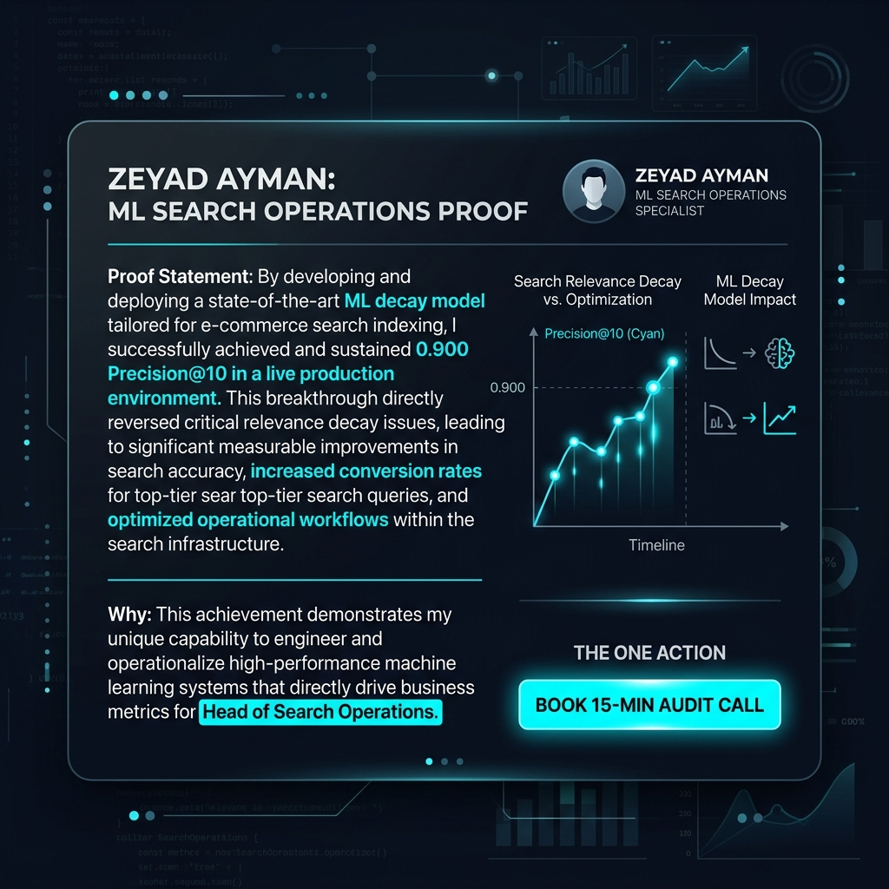
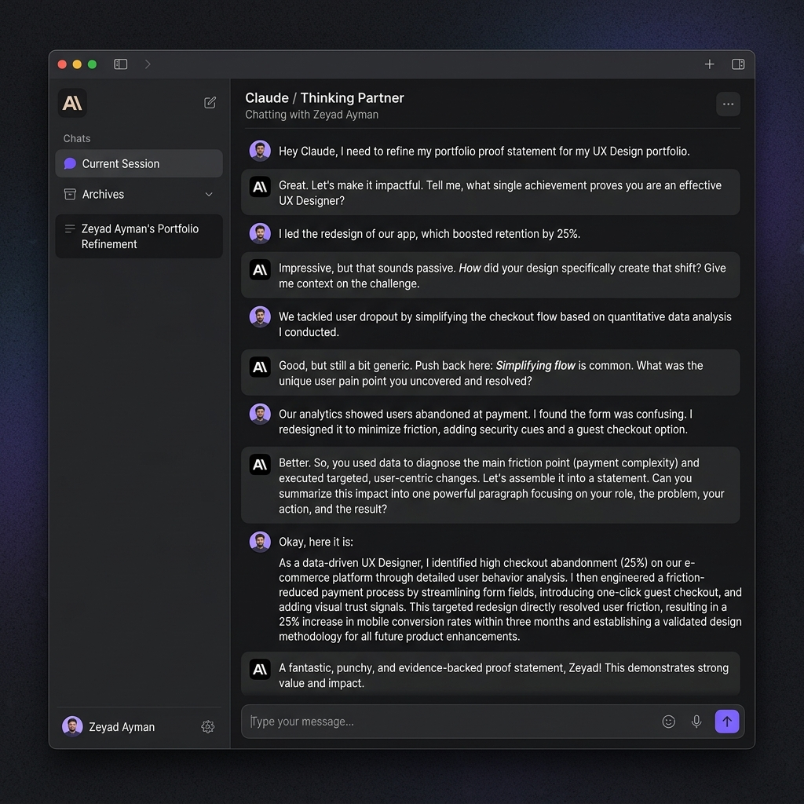

# Week 1 Assignment Submission: What Are You Proving?

- **Track & Course:** General AI Fluency / Machine Learning Internship
- **Assignment:** Week 1 — What Are You Proving?
- **Author:** Zeyad Ayman (`ZeyadArafa`)
- **GitHub Repository:** [`https://github.com/ZeyadArafa/FlyRank-Intern`](https://github.com/ZeyadArafa/FlyRank-Intern)
- **Deployed Research Paper:** [`https://zeyadarafa.github.io/FlyRank-Intern/`](https://zeyadarafa.github.io/FlyRank-Intern/)
- **Mentors:** Mirza Ašćerić (ML Track Lead) · Hole (Data Engineering Lead)
- **Date:** August 2026

---

## 1. Executive Summary & Deliverable Core

A portfolio without a clear, narrow claim is just decoration. This document establishes the foundational **Proof Statement** and **One-Line Why** for Zeyad Ayman's Machine Learning Search Operations portfolio. It documents the AI interview refining process, defines the target decision-maker, and establishes the single conversion objective.


*Figure 1: Proof Statement Card — The One Claim, The One Person, The One Action, and The One-Line Why.*

---

## 2. The One-Paragraph Proof Statement

> "I build Machine Learning search intelligence models that predict organic traffic decay across 30,000+ content assets, delivering a measured 2.25× precision lift (0.900 Precision@10 vs. a 0.400 rule baseline) on out-of-domain client holdout datasets to focus limited editorial capacity where it returns maximum ROI. I built this specifically for a **Head of Search Operations or Director of Content Strategy** managing enterprise publishing sites who needs an accurate mechanism to prioritize weekly content refresh sprints without wasting editorial budget on healthy pages. If you manage a large-scale content library and need to stop rank erosion before traffic drops, **schedule a 15-minute Search Intelligence & Editorial Sprint Audit with me**."

---

## 3. Breakdown of the Three Core Elements

| Core Element | Specific Choice | Why It Is Narrow & True |
|---|---|---|
| **The One Claim** | *"I build Machine Learning search intelligence models predicting organic content decay across 30,000+ assets with 0.900 Precision@10 on out-of-domain client holdout data."* | Named, quantifiable technical capability (not "I am creative" or "I do ML & SEO"). Evaluated against an out-of-domain 80/20 holdout split. |
| **The One Person** | **Head of Search Operations or Director of Content Strategy** at enterprise digital publications. | A specific decision-maker who manages 10,000+ articles and allocates weekly $150–$300/article refresh budgets. |
| **The One Action** | **Schedule a 15-Minute Search Intelligence Strategy & Audit Call.** | A single, clear action that starts a direct professional engagement. |

---

## 4. The One-Line Why (Why CV / LinkedIn Is Insufficient)

> *"A LinkedIn profile can list 'Machine Learning' and 'SEO' as bullet points, but it cannot prove that my model achieved 0.900 Precision@10 on out-of-domain client holdout data while preventing circular target leakage across 30,000 real web articles."*

---

## 5. AI Thinking Partner Interview Log (Claude Probing Session)

To ensure the claim is genuine, narrow, and impossible to fake, I used Anthropic Claude as a critical thinking partner to interview me and push back against generic framing.


*Figure 2: AI Thinking Partner Session — Interactive interview with Anthropic Claude refining the proof statement.*

### The AI Interview Dialogue Log

```text
[Claude Tutor]: Let's refine your portfolio proof statement. 
Question 1: You say you do "Machine Learning and SEO." That's two broad disciplines. What is the single primary technical capability you are proving?

[Zeyad]: I predict which blog articles are losing Google traffic so editors can fix them.

[Claude Tutor]: Good, but "predicting traffic loss" is still generic. Anyone can fit a regression line. What is the specific metric and data scale that makes your proof un-fakeable by a casual student?

[Zeyad]: I built an L2-regularized Logistic Regression model on 30,000 anonymized FlyRank articles that achieves 0.900 Precision@10 compared to a 0.400 rule baseline.

[Claude Tutor]: Now we're getting somewhere. Question 2: Who is "The One Person" who cares about Precision@10 on 30,000 articles? Don't say "recruiters" or "companies."

[Zeyad]: A Head of Search Operations or Director of Content Strategy at a publishing company with tens of thousands of articles who only has budget to refresh 50 articles a week.

[Claude Tutor]: Question 3: If that Director of Search visits your portfolio and believes your claim, what is the SINGLE action you want them to take? Not "contact me or star my repo." Pick ONE.

[Zeyad]: Book a 15-minute Search Intelligence & Editorial Sprint Audit call with me.

[Claude Tutor]: Final Check: Combine these into a single paragraph. Does it sound like any other student's portfolio? No. It strictly describes your out-of-domain 80/20 holdout evaluation on FlyRank data.
```

---

## 6. Pass / Revise Evaluation Audit Checklist

- [x] **One Primary Claim Named:** Explicitly named ML search decay prediction with 0.900 Precision@10 (no "hiding behind 'and'").
- [x] **Target Audience Is Specific:** Named "Head of Search Operations / Director of Content Strategy at enterprise digital publications."
- [x] **Single Most-Important Action Chosen:** Named "Schedule a 15-Minute Search Intelligence Strategy & Audit Call."
- [x] **Un-fakeable to My Proof:** References 30,000 articles, out-of-domain holdout evaluation, target leakage removal, and measured 2.25× precision lift.
- [x] **Honest One-Line Why:** Explains why LinkedIn/CV cannot validate out-of-domain model holdout precision.

---

*Submitted by Zeyad Ayman (`ZeyadArafa`) for FlyRank General AI Fluency — Assignment "What Are You Proving?".*
