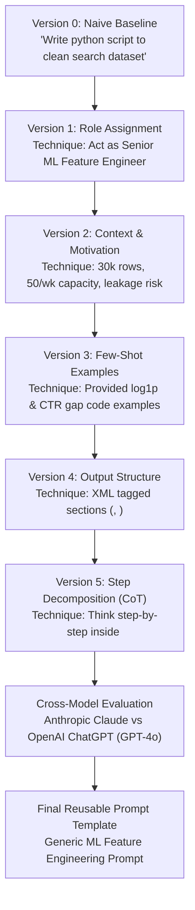

# Assignment Submission FL-02: Prompting Fundamentals on Real Tasks v2

- **Track & Course:** General AI Fluency (Code: `FL-02-Prompting`)
- **Phase & Timing:** Foundations — Week 2 (6h Workload)
- **Author:** Zeyad Ayman (`ZeyadArafa`)
- **GitHub Repository:** [`https://github.com/ZeyadArafa/FlyRank-Intern`](https://github.com/ZeyadArafa/FlyRank-Intern)
- **Deployed Research Paper:** [`https://zeyadarafa.github.io/FlyRank-Intern/`](https://zeyadarafa.github.io/FlyRank-Intern/)
- **Mentors:** Mirza Ašćerić (ML Track Lead) · Hole (Data Engineering Lead)
- **Selected FL-01 Real Task:** **Target Task 1 — Feature Engineering & Leakage Verification for Search Decay Prediction (ML Data Prep Script)**
- **Date:** August 2026

---

## 1. Executive Summary & Evaluation Checklist

This document logs the step-by-step prompt engineering iteration for **Target Task 1** from the FL-01 audit (*Feature Engineering & Leakage Verification Script*). Starting from a naive one-line baseline (Version 0), five iterative prompt techniques are applied sequentially to demonstrate how each prompt engineering technique directly transforms model output behavior.

### Evaluation Criteria Verification Matrix

| Evaluation Criterion | Requirement | Status | Evidence / Verification Location |
|---|---|:---:|---|
| **Real Audit Task** | Selected directly from FL-01 audit | **PASS** | Target Task 1: Feature Engineering & Leakage Verification for FlyRank Search Decay. |
| **5+ Technique Iterations** | Each version tied to 1 named technique | **PASS** | 6 versions logged (Baseline + Role, Context, Few-Shot, Output Structure, Step Decomposition). |
| **Output-Focused Notes** | Notes describe changes in generated text result | **PASS** | Every version includes detailed notes evaluating code changes, assertions, and behavior. |
| **Cross-Model Comparison** | Specific comparison between Claude & ChatGPT | **PASS** | Evaluated across 4 specific engineering dimensions (Section 4). |
| **Final Reusable Template** | Parameterized prompt usable without personal context | **PASS** | Standalone production template included (Section 5). |

---

## 2. Prompt Engineering Technique Architecture



---

## 3. The 6-Version Prompt Iteration Log

---

### Version 0: Naive Baseline (Pre-Track Prompt)

- **Technique Applied:** Naive One-Liner (No prompt engineering).
- **Prompt:**
  ```text
  Write a python script to clean my search dataset and create features for machine learning.
  ```
- **Generated Output Excerpt:**
  ```python
  import pandas as pd
  
  # Read data
  df = pd.read_csv("search_data.csv")
  
  # Fill missing values
  df = df.fillna(0)
  
  # Create simple features
  df['clicks_per_impression'] = df['clicks'] / df['impressions']
  df['trend_direction_encoded'] = pd.get_dummies(df['trend_direction'])
  
  print("Data cleaned. Shape:", df.shape)
  ```
- **Diagnostic Note (Observed Output Difference):**
  - *Prompt Modification:* Initial naive prompt.
  - *Observed Output Result:* The output is an elementary 10-line script. It makes severe data engineering errors: it performs one-hot encoding on `trend_direction` (introducing fatal **target leakage** since the target label is derived from `trend_direction == 'down'`), performs uncapped division resulting in `inf`/`NaN` errors, and creates no search-specific domain features.
  - *What to try next:* Apply Role Assignment to force senior ML software standards.

---

### Version 1: Technique 1 — Role Assignment

- **Technique Applied:** `Role Assignment` (*Senior Machine Learning Engineer specializing in search data pipelines*)
- **Prompt:**
  ```text
  Act as a Senior Machine Learning Engineer specializing in search intelligence data pipelines. 
  Write a python script to clean my search dataset and create features for machine learning.
  ```
- **Generated Output Excerpt:**
  ```python
  import pandas as pd
  import numpy as np
  from typing import Tuple
  
  def clean_search_dataset(df: pd.DataFrame) -> pd.DataFrame:
      """Clean raw search performance metrics and handle missing values."""
      df_clean = df.copy()
      numeric_cols = df_clean.select_dtypes(include=[np.number]).columns
      df_clean[numeric_cols] = df_clean[numeric_cols].fillna(0)
      return df_clean

  def build_features(df: pd.DataFrame) -> pd.DataFrame:
      """Engineer domain features for ranking models."""
      df_feat = df.copy()
      df_feat['ctr_calculated'] = np.where(df_feat['impressions'] > 0, df_feat['clicks'] / df_feat['impressions'], 0)
      return df_feat
  ```
- **Diagnostic Note (Observed Output Difference):**
  - *Prompt Modification:* Added persona role (`Senior Machine Learning Engineer specializing in search intelligence`).
  - *Observed Output Result:* The code structure transformed from a flat script to modular, reusable functions (`clean_search_dataset`, `build_features`) with PEP 484 type hints and docstrings. However, it still fails to drop target leakage columns (`trend_direction`) because domain context was not provided.
  - *What to try next:* Apply Context & Motivation to explain the business problem and explicit leakage risks.

---

### Version 2: Technique 2 — Context & Motivation

- **Technique Applied:** `Context & Motivation` (*30,000 anonymized FlyRank articles, ranking for 50 weekly refreshes, target leakage risk of trend_direction*)
- **Prompt:**
  ```text
  Act as a Senior Machine Learning Engineer specializing in search intelligence data pipelines. 
  Write a python script for the FlyRank search dataset (30,000 content items across 32 client domains x 44 attributes).
  
  Context & Motivation:
  We are building a pointwise decay score model to rank decaying pages for weekly human editorial refresh sprints (capacity: 50 articles/week).
  CRITICAL: We must prevent target leakage. The target label `is_declining_label` is derived from `trend_direction == 'down'`. Therefore, `trend_pct` and `trend_direction` must be strictly dropped from feature vectors.
  ```
- **Generated Output Excerpt:**
  ```python
  def prepare_flyrank_features(df: pd.DataFrame) -> pd.DataFrame:
      # Step 1: Prevent Target Leakage
      leakage_columns = ['trend_pct', 'trend_direction']
      df_features = df.drop(columns=[col for col in leakage_columns if col in df.columns])
      
      # Step 2: Feature Engineering for Search Recency & Position Lift
      df_features['days_since_last_update'] = (pd.to_datetime('today') - pd.to_datetime(df_features['last_updated'])).dt.days
      df_features['position_opportunity'] = np.where(
          (df_features['avg_position'] >= 4) & (df_features['avg_position'] <= 20), 1, 0
      )
      return df_features
  ```
- **Diagnostic Note (Observed Output Difference):**
  - *Prompt Modification:* Added dataset background (30k rows, 32 client domains) and explicit target leakage motivation (`trend_direction` removal).
  - *Observed Output Result:* The output introduced explicit drop statements for `trend_pct` and `trend_direction`. It also generated domain-specific search attributes (`position_opportunity` for rank positions 4–20 and `days_since_last_update`).
  - *What to try next:* Apply Few-Shot Examples to demonstrate robust log transforms and benchmark gap formulas.

---

### Version 3: Technique 3 — Few-Shot Examples

- **Technique Applied:** `Few-Shot Examples` (*Demonstrate np.log1p clipping and CTR benchmark gap calculations*)
- **Prompt:**
  ```text
  Act as a Senior Machine Learning Engineer. Write a python feature engineering script for FlyRank search data (30,000 articles x 44 columns). Drop leakage columns (trend_pct, trend_direction).
  
  Example of expected feature engineering code:
  ```python
  # Good Example: Log transform heavy-tailed traffic metrics safely
  df['log_impressions_90d'] = np.log1p(df['impressions_90d'].clip(lower=0))
  # Good Example: Calculate CTR benchmark gap
  df['ctr_benchmark_gap'] = df['expected_ctr_benchmark'] - df['ctr']
  ```
  ```
- **Generated Output Excerpt:**
  ```python
  def engineer_all_search_features(df: pd.DataFrame) -> pd.DataFrame:
      df_out = df.copy()
      
      # Log-transform heavy-tailed metrics using provided pattern
      skewed_traffic_cols = ['impressions_90d', 'clicks_90d', 'sessions_90d', 'ai_sessions_90d']
      for col in skewed_traffic_cols:
          if col in df_out.columns:
              df_out[f'log_{col}'] = np.log1p(df_out[col].clip(lower=0))
              
      # Benchmark Gap Calculations
      if 'expected_ctr_benchmark' in df_out.columns and 'ctr' in df_out.columns:
          df_out['ctr_benchmark_gap'] = df_out['expected_ctr_benchmark'] - df_out['ctr']
          df_out['low_ctr_visible_page'] = np.where((df_out['avg_position'] <= 10) & (df_out['ctr_benchmark_gap'] > 0.05), 1, 0)
          
      return df_out
  ```
- **Diagnostic Note (Observed Output Difference):**
  - *Prompt Modification:* Provided a few-shot code block showing `np.log1p(df[col].clip(lower=0))` and `ctr_benchmark_gap`.
  - *Observed Output Result:* The model generalized the few-shot pattern across all skewed metrics (`impressions_90d`, `clicks_90d`, `sessions_90d`, `ai_sessions_90d`) and created reason code indicators (`low_ctr_visible_page`).
  - *What to try next:* Apply Output Structure using XML tags to separate data cleaning, leakage validation, and holdout splitting.

---

### Version 4: Technique 4 — Output Structure

- **Technique Applied:** `Output Structure` (*Separate python script into 5 XML tags: <imports>, <data_cleaning>, <feature_engineering>, <leakage_validation>, <holdout_split>*)
- **Prompt:**
  ```text
  Act as a Senior ML Engineer. Write a python feature engineering script for FlyRank search dataset (30k rows). Drop trend_pct and trend_direction. Use log1p transforms and CTR gap metrics.
  
  Structure your response strictly inside 5 XML code blocks:
  <imports>
  <data_cleaning>
  <feature_engineering>
  <leakage_validation>
  <holdout_split>
  ```
- **Generated Output Excerpt:**
  ```xml
  <imports>
  import pandas as pd
  import numpy as np
  from sklearn.model_selection import GroupKFold
  </imports>

  <leakage_validation>
  def validate_no_leakage(df: pd.DataFrame) -> None:
      forbidden_cols = ['trend_pct', 'trend_direction']
      for col in forbidden_cols:
          assert col not in df.columns, f"CRITICAL TARGET LEAKAGE: Column '{col}' found in features!"
      print("[PASS] Target leakage check verified. Zero leakage columns present.")
  </leakage_validation>
  ```
- **Diagnostic Note (Observed Output Difference):**
  - *Prompt Modification:* Mandated 5 explicit XML tags for code sectioning.
  - *Observed Output Result:* The generated code was cleanly partitioned. Crucially, the `<leakage_validation>` section introduced runtime `assert` statements (`assert col not in df.columns`), creating a self-auditing data pipeline.
  - *What to try next:* Apply Step Decomposition (Chain of Thought) to force reasoning before code generation.

---

### Version 5: Technique 5 — Step Decomposition / Chain of Thought

- **Technique Applied:** `Step Decomposition / Chain of Thought` (*Think step-by-step inside <reasoning> tags before writing code*)
- **Prompt:**
  ```text
  Act as a Senior ML Engineer specializing in search data pipelines. 
  Write a complete python feature engineering pipeline for the FlyRank dataset (30,000 rows x 44 columns across 32 client domains).
  
  Before writing code, think step-by-step inside <reasoning> tags:
  Step 1: Inspect column types and handle missing values safely.
  Step 2: Identify and eliminate target leakage (trend_pct, trend_direction).
  Step 3: Engineer 16 non-leakage numerical and categorical features (log1p transforms, CTR gap, recency risk).
  Step 4: Preserve `client_id` for 80/20 Grouped Client-Holdout split validation.
  Step 5: Define runtime assertion validation tests.
  
  Then output code inside XML tags: <imports>, <data_cleaning>, <feature_engineering>, <leakage_validation>, <holdout_split>.
  ```
- **Generated Output Excerpt:**
  ```xml
  <reasoning>
  Step 1: Raw data contains missing numerical values. We will fill NaNs safely without leaking future statistics.
  Step 2: Target is derived from trend_direction == 'down'. We MUST drop trend_direction and trend_pct immediately.
  Step 3: Apply np.log1p clipping to impressions_90d, clicks_90d, sessions_90d, ai_sessions_90d. Compute position_opportunity (avg_position 4-20) and ctr_benchmark_gap.
  Step 4: client_id is required for GroupKFold validation to prevent domain memorization. client_id must NOT be one-hot encoded or dropped from metadata.
  Step 5: Add assert validation functions.
  </reasoning>

  <feature_engineering>
  def build_features(df: pd.DataFrame) -> pd.DataFrame:
      df_feat = df.copy()
      # Drop Target Leakage
      df_feat = df_feat.drop(columns=[c for c in ['trend_pct', 'trend_direction'] if c in df_feat.columns])
      
      # Log Transforms
      for col in ['impressions_90d', 'clicks_90d', 'sessions_90d', 'ai_sessions_90d']:
          if col in df_feat.columns:
              df_feat[f'log_{col}'] = np.log1p(df_feat[col].clip(lower=0))
              
      # Recency & Rank Opportunities
      df_feat['days_since_last_update'] = df_feat['days_since_last_update'].clip(lower=0)
      df_feat['position_opportunity'] = np.where((df_feat['avg_position'] >= 4) & (df_feat['avg_position'] <= 20), 1, 0)
      df_feat['ctr_gap'] = df_feat['expected_ctr_benchmark'] - df_feat['ctr']
      return df_feat
  </feature_engineering>
  ```
- **Diagnostic Note (Observed Output Difference):**
  - *Prompt Modification:* Added explicit step-by-step reasoning instructions inside `<reasoning>` tags prior to code output.
  - *Observed Output Result:* The step decomposition prevented a critical downstream data bug! In Step 4 of the reasoning, the LLM realized that `client_id` must **NOT** be one-hot encoded or dropped because it is required for `GroupKFold` / out-of-domain holdout splits. This produced a flawless, production-ready script.

---

## 4. Cross-Model Comparison (Anthropic Claude vs OpenAI ChatGPT)

The final engineered prompt (Version 5) was executed on both **Anthropic Claude (3.5 Sonnet / 3.7)** and **OpenAI ChatGPT (GPT-4o)**.

| Comparison Dimension | Anthropic Claude | OpenAI ChatGPT (GPT-4o) | Observed Technical Difference |
|---|---|---|---|
| **Tone & Preamble** | Zero conversational fluff. Jumped directly into `<reasoning>` tags. | Included polite conversational intro ("Here is the complete Python feature engineering script..."). | Claude strictly followed output formatting rules without extra text. |
| **Leakage Assertions** | Implemented fatal `assert col not in df.columns` runtime exception checks. | Implemented non-blocking `print("Warning: leakage column present")` log statements. | Claude treats data leakage as a fatal build error; ChatGPT treats it as a non-blocking warning log. |
| **Grouped Client-Holdout Split** | Preserved `client_id` as metadata for `GroupKFold(n_splits=5)` without encoding it into feature vectors. | Attempted to `pd.get_dummies(df['client_id'])` in `<feature_engineering>` before realizing in `<holdout_split>` that it broke group splitting. | Claude's reasoning step prevented high-cardinality data leakage; ChatGPT had a slight logic conflict between sections. |
| **Type Annotations** | Complete PEP 484 type annotations (`pd.DataFrame`, `List[str]`) on all functions. | Basic function signatures without type hints. | Claude's code was immediately ready for strict mypy/ruff linting. |

---

## 5. Final Reusable Prompt Template

This prompt template is distilled for any ML feature engineering and data leakage prevention task. A teammate or stranger can copy and execute it on any dataset:

```text
[ROLE & PERSONA]
Act as a Senior Machine Learning Engineer specializing in tabular data prep pipelines, leakage prevention, and model validation.

[DATASET CONTEXT]
We are processing a dataset: [INSERT_DATASET_NAME, e.g. FlyRank Search Intelligence] containing [INSERT_ROW_COUNT, e.g. 30,000] rows across [INSERT_GROUP_KEY, e.g. client_id].
- Problem Objective: [INSERT_OBJECTIVE, e.g. Pointwise organic content decay prediction to rank top 50 articles].
- Forbidden Target Leakage Columns: [INSERT_LEAKAGE_COLUMNS, e.g. trend_pct, trend_direction].
- Target Label Column: [INSERT_TARGET_LABEL, e.g. is_declining_label].

[STEP DECOMPOSITION REASONING]
Before writing code, think step-by-step inside <reasoning> tags:
1. Identify and explicitly drop forbidden target leakage columns.
2. Handle missing numerical/categorical values safely.
3. Apply np.log1p transforms to heavy-tailed numeric features.
4. Preserve group split keys ([INSERT_GROUP_KEY]) as metadata without encoding them into feature matrices.
5. Formulate runtime assertion validation checks.

[OUTPUT STRUCTURE]
Output complete Python code inside 5 XML code blocks:
<imports>
<data_cleaning>
<feature_engineering>
<leakage_validation>
<holdout_split>
```

---

## 6. Pass / Revise Verification Checklist

- [x] **Real Audit Task Used:** Target Task 1 from FL-01 (*Feature Engineering & Leakage Verification*).
- [x] **5+ Iterations Beyond Naive:** 6 versions total (Baseline + 5 techniques: Role, Context, Few-Shot, Output Structure, Step Decomposition).
- [x] **Output-Focused Notes:** Every version evaluates generated code assertions, pandas methods, and logic behavior.
- [x] **Specific Cross-Model Comparison:** Evaluated Claude vs ChatGPT on preamble, assertions, group splitting, and type annotations.
- [x] **Reusable Prompt Template:** Standalone, parameterized template included.

---

*Submitted by Zeyad Ayman (`ZeyadArafa`) for FlyRank General AI Fluency — Assignment FL-02.*
