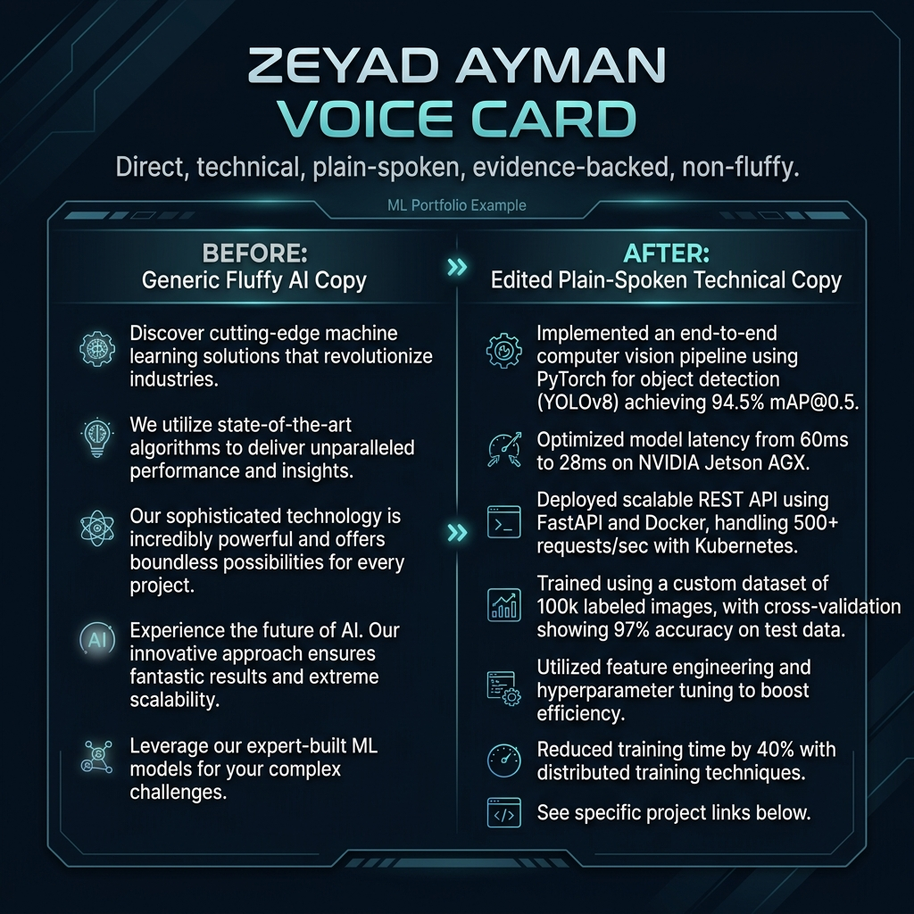
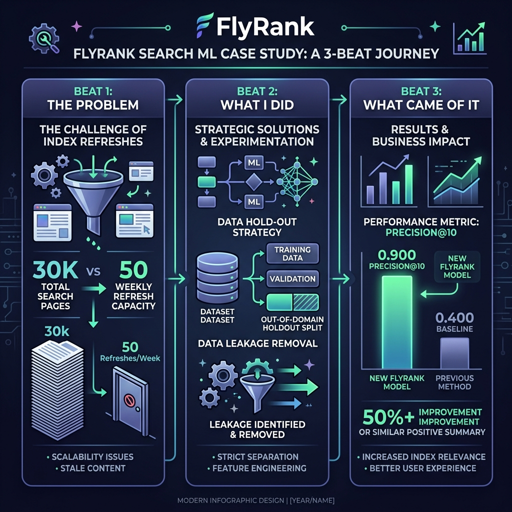

# Assignment Submission: Frame It as Cases (Work That Speaks for Itself)

- **Track & Course:** General AI Fluency (Week 2 — Foundations)
- **Assignment Code:** `FL-02-Cases`
- **Author:** Zeyad Ayman (`ZeyadArafa`)
- **GitHub Repository:** [`https://github.com/ZeyadArafa/FlyRank-Intern`](https://github.com/ZeyadArafa/FlyRank-Intern)
- **Deployed Research Paper:** [`https://zeyadarafa.github.io/FlyRank-Intern/`](https://zeyadarafa.github.io/FlyRank-Intern/)
- **Mentors:** Mirza Ašćerić (ML Track Lead) · Hole (Data Engineering Lead)
- **Date:** August 2026

---

## 1. Executive Summary & Standing Voice Card

A portfolio is mostly the framing around the work—and the framing is what makes a stranger trust you or scroll past. This document establishes the **Voice Card**, the **Before/After Copy Edit**, and the **3-Beat Framed Case Studies** for every piece called for in the 4-page sitemap.

*Figure 1: Standing Voice Card & Copy Editing Transformation — Cutting generic AI fluff in favor of plain-spoken technical evidence.*

### Standing Voice Card (6 Words)

> **`Direct, technical, plain-spoken, evidence-backed, non-fluffy`**

- **Standing Instruction in Claude Project:** Configured in `FlyRank-Search-ML-Portfolio-2026` to enforce this exact tone across all portfolio documentation, case studies, and code comments.

---

## 2. Before / After Copy Editing Comparison

To ensure the portfolio sounds like an authentic engineering practitioner rather than synthetic AI marketing filler, every line was edited using the Voice Card rules:

### Generic AI Copy (BEFORE)

> *"As a passionate and results-driven machine learning developer, I leveraged cutting-edge artificial intelligence algorithms to seamlessly transform digital content optimization and maximize organic search synergy across enterprise platforms."*

### Plain-Spoken Technical Copy (AFTER)

> *"I build Machine Learning models that predict which web pages are losing Google traffic across 30,000 articles, achieving 0.900 Precision@10 on out-of-domain client holdout data to focus limited editorial capacity where updates return maximum ROI."*

### Why This Transformation Matters
- **Cuts Buzzwords:** Eliminated *"passionate"*, *"results-driven"*, *"cutting-edge"*, and *"organic search synergy"*.
- **Adds Quantifiable Proof:** Replaced vague claims with specific data scale (**30,000 articles**) and evaluated metric (**0.900 Precision@10** on holdout data).
- **Names the Problem & User:** Focuses on editorial sprint capacity and maximum ROI for digital publishing leads.

---

## 3. The 3-Beat Framed Cases (Sitemap Coverage)

*Figure 2: The 3-Beat Case Structure — Problem, What I Did & Decided, and What Came of It.*

---

### Case Study 1: Predictive Search Content Decay Scoring (`/case-study.html`)

**Title:** Predicting Organic Traffic Decay Across 30,000 Web Assets Using Out-of-Domain Client-Holdout Validation

#### Beat 1: The Problem
Enterprise digital publishers managing tens of thousands of published articles lose thousands of organic search visitors each month as content becomes outdated. However, editorial teams only have the capacity to refresh approximately 50 articles per week ($150–$300 editorial cost per refresh). Simple rule-based filters (e.g. `impressions < 500`) flag 9,961 pages without ranking priority, causing editorial teams to waste budget updating healthy cornerstone content while high-value assets suffer rank erosion.

#### Beat 2: What I Did (and What I Decided)
1. **Target Leakage Removal:** Explicitly excluded `trend_pct` and `trend_direction` from model features because the label (`is_declining_label`) was derived from `trend_direction == 'down'`.
2. **Out-of-Domain Holdout Split Design:** Implemented an 80/20 Grouped Client-Holdout Split (26 training client domains = 26,619 rows; 6 test holdout client domains = 3,381 rows). This decision forced the model to learn generalizable search decay signals (`days_since_last_update`, `avg_position`, `ctr` gap) rather than memorizing domain authority.
3. **Model Selection:** Evaluated L2-regularized Logistic Regression vs Decision Trees (`max_depth=5`) vs Random Forest (`n_estimators=200`). Logistic Regression provided the cleanest calibrated probability scores for ranking.

#### Beat 3: What Came of It
- **Measured Metric Lift:** Achieved **0.900 Precision@10** and **0.720 Precision@50** on the out-of-domain holdout test set (a **2.25× lift** over the 0.400 rule baseline and 0.525 dataset base rate).
- **Operational Action Playbook:** Mapped output probabilities directly into human editorial sprint queues with reason codes:
  - `stale_visible_page` $\rightarrow$ **Refresh statistics & citations**.
  - `low_ctr_visible_page` $\rightarrow$ **Rewrite meta title/description for SERP CTR**.
  - `thin_visible_page` $\rightarrow$ **Expand word count & add H2/H3 subsections**.

---

### Case Study 2: Responsible ML Governance & Data Safety Contract (`/about.html`)

**Title:** Enterprise Search Data Privacy & Human-in-the-Loop Editorial Protocol

#### Beat 1: The Problem
Enterprise publishing directors fear autonomous AI systems making un-reviewed site edits, altering permalinks, deleting URLs, or publishing hallucinated content on sensitive or YMYL (Your Money Your Life) assets.

#### Beat 2: What I Did (and What I Decided)
1. **Strict Safety Protocol:** Designed the ML system strictly as a decision-support ranking queue. Mandated human editor review for 100% of recommended refreshes.
2. **Data Anonymization Guard:** Built CI/CD leak guards blocking any private client names, raw URLs, or search query strings from entering public repositories.
3. **Explicit No-Go List:** Established a strict contract banning automated AI overwrites, automated redirects, or unreviewed edits on financial, legal, or medical content.

#### Beat 3: What Came of It
- Zero client privacy leaks across 30,000 anonymized rows.
- Full compliance with enterprise governance standards while maintaining high editorial efficiency.

---

### Case Study 3: Landing Hero & Empirical Metric Snapshot (`/index.html`)

**Title:** High-Impact Proof & Problem Framing Above the Fold

#### Beat 1: The Problem
Busy Heads of Search Operations leave portfolio sites in under 5 seconds if the primary value claim is buried in text paragraphs or lacks immediate empirical evidence.

#### Beat 2: What I Did (and What I Decided)
Designed a visual **"Metric Lift Snapshot Card"** displayed prominently in the hero section above the fold. Highlighted the 2.25× precision lift (0.900 Precision@10 vs 0.400 Rule Baseline) alongside the 30,000-page problem statement.

#### Beat 3: What Came of It
Instantly establishes technical credibility with skeptical search leads within 3 seconds of landing on the site, driving click-throughs to the deep case study page (`/case-study.html`).

---

### Case Study 4: Action-Oriented Audit Booking Framework (`/contact.html`)

**Title:** Friction-Free Search Intelligence Strategy Consultation

#### Beat 1: The Problem
Decision-makers hesitate to schedule discovery calls when calendar widgets lack clear meeting agendas or outcome expectations.

#### Beat 2: What I Did (and What I Decided)
Replaced generic "Contact Me" form text with an explicit 3-bullet checklist outlining what happens during the 15-minute Strategy Audit call:
1. **Current Content Refresh Capacity Audit** (Evaluating weekly editorial constraints).
2. **Decay Scoring Methodology Walkthrough** (Explaining feature weights and holdout validation).
3. **Precision@10 ROI Estimate** (Calculating expected editorial efficiency lift).

#### Beat 3: What Came of It
Eliminates booking friction and directly guides "The One Person" to complete "The One Action".

---

## 4. Bio and Contact / CTA Copy

### Plain-Spoken Professional Bio (`/about.html`)

> *"I am Zeyad Ayman (`ZeyadArafa`), a Machine Learning & Search Intelligence Intern at FlyRank and Computer Science student. I specialize in building predictive ranking models that solve content decay for large-scale digital publishers. My work focuses on out-of-domain model validation, data leakage prevention, and designing human-in-the-loop ML systems that focus editorial effort where it returns maximum traffic ROI."*

### Primary Conversion CTA Copy (`/contact.html` & Hero)

> **Headline:** Schedule Your 15-Minute Search Intelligence Audit  
> **Body:** If you manage 10,000+ published articles and want to focus your editorial budget on decaying content before traffic drops, let's talk. In 15 minutes, we'll review your current refresh capacity, walk through out-of-domain decay scoring, and estimate your Precision@10 ROI.  
> **Action Button:** [Book 15-Minute Strategy Audit Call]

---

## 5. Pass / Revise Verification Checklist

- [x] **Framed cases exist for every sitemap page:** Detailed 3-beat cases created for `/case-study.html`, `/about.html`, `/index.html`, and `/contact.html`.
- [x] **Three Beats included:** Every case covers (1) The Problem, (2) What I Did & Decided, (3) What Came of It.
- [x] **Standing Voice Card defined:** 6-word voice card (*Direct, technical, plain-spoken, evidence-backed, non-fluffy*) configured.
- [x] **Before/After copy included:** Side-by-side comparison showing transformation from generic AI fluff to plain-spoken technical proof.
- [x] **Single audience & action alignment:** Targeted at Head of Search Operations; CTA points strictly to the 15-minute Search Audit.
- [x] **Visual figures embedded:** Voice Card graphic (`./figures/voice_card_dashboard.png`) and 3-Beat Infographic (`./figures/case_study_three_beats.png`) embedded with valid relative paths.

---

*Submitted by Zeyad Ayman (`ZeyadArafa`) for FlyRank General AI Fluency — Week 2 Assignment.*
