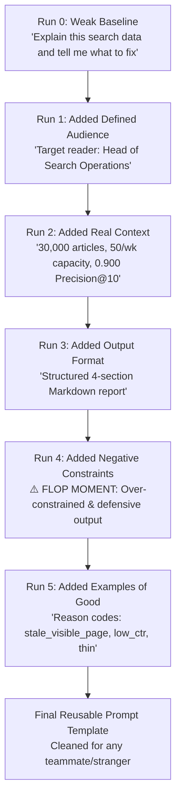

# Assignment Submission: The Prompt Ladder (Prompt Engineering)

- **Track & Course:** General AI Fluency (Week 2 — Foundations)
- **Assignment Code:** `FL-02-PromptLadder`
- **Author:** Zeyad Ayman (`ZeyadArafa`)
- **GitHub Repository:** [`https://github.com/ZeyadArafa/FlyRank-Intern`](https://github.com/ZeyadArafa/FlyRank-Intern)
- **Deployed Research Paper:** [`https://zeyadarafa.github.io/FlyRank-Intern/`](https://zeyadarafa.github.io/FlyRank-Intern/)
- **Mentors:** Mirza Ašćerić (ML Track Lead) · Hole (Data Engineering Lead)
- **Date:** August 2026

---

## 1. Executive Summary & Methodology

The gap between a lazy prompt and an engineered one is the cheapest performance upgrade in AI. This document tracks the systematic iteration of a prompt across **6 distinct runs** (a weak baseline plus 5 iterative layers). Each version adds **exactly one layer** to attack the current output's biggest weakness.

### The 6-Step Prompt Ladder Architecture



---

## 2. The 6 Prompt Ladder Iterations

---

### Run 0: Weak Baseline (Embarrassingly Weak)

- **Prompt:**
  ```text
  Explain this search data and tell me what to fix.
  ```
- **Output Excerpt:**
  > *"Search engine optimization (SEO) is crucial for digital success. To fix your search data, you should look at your traffic, clicks, and impressions. Click-Through Rate (CTR) means the percentage of people who click your link after seeing it in Google. You should write better headlines, build quality backlinks, ensure your site loads fast, and create engaging content that answers user intent."*
- **Four Diagnostic Notes:**
  1. **What changed in prompt:** Initial baseline (no layers).
  2. **What actually improved in output:** N/A (Baseline).
  3. **What still failed:** Produces generic, textbook SEO definitions. Fails to analyze data, provides zero metrics, and ignores team capacity.
  4. **What to try next:** Add a Defined Audience layer to stop basic textbook explanations.

---

### Run 1: Layer 1 Added — Defined Audience

- **Layer Added:** `Defined Audience` (*Head of Search Operations at an enterprise digital publication*)
- **Prompt:**
  ```text
  Explain this search data and tell me what to fix. 
  Your target reader is a Head of Search Operations at an enterprise digital publication managing 30,000 published articles.
  ```
- **Output Excerpt:**
  > *"As a Head of Search Operations managing a 30,000-article publishing portfolio, your primary concern is traffic retention. Content decay occurs when published articles lose rank position over time. To address this across your site, audit your falling URLs, refresh out-of-date information, optimize title tags for click-through rate, and remove thin pages."*
- **Four Diagnostic Notes:**
  1. **What changed in prompt:** Added target reader persona (`Head of Search Operations managing 30,000 articles`).
  2. **What actually improved in output:** The output completely stopped explaining elementary terms like *"What is CTR"*. It adopted a professional B2B tone tailored to portfolio management.
  3. **What still failed:** It remains purely qualitative advice. It provides no specific quantitative thresholds, model metrics, or priority ranking.
  4. **What to try next:** Add Real Context (FlyRank dataset scale, model performance metrics, editorial capacity constraints).

---

### Run 2: Layer 2 Added — Real Context

- **Layer Added:** `Real Context` (*30,000 articles, 50 updates/week capacity at $150/article, ML Precision@10 = 0.900 vs 0.400 baseline*)
- **Prompt:**
  ```text
  Explain this search data and tell me what to fix. 
  Your target reader is a Head of Search Operations at an enterprise digital publication managing 30,000 published articles. 
  Context: We have an anonymized search dataset of 30,000 articles across 32 client domains. Our human editorial team can only update 50 articles per week (costing $150–$300/article). A simple rule (impressions < 500) flags 9,961 pages. Our L2 Logistic Regression decay model achieves 0.900 Precision@10 on out-of-domain client holdout data vs a 0.400 rule baseline.
  ```
- **Output Excerpt:**
  > *"Given your team's weekly capacity limit of 50 article refreshes out of 30,000 published assets, using simple rule thresholds like 'impressions < 500' will waste editorial budget by flagging 9,961 pages without ranking priority. Updating pages randomly costs $150–$300 per article ($7,500/week sprint budget). Our L2 Logistic Regression decay model achieves 0.900 Precision@10 on out-of-domain client holdout data compared to 0.400 for the rule baseline. This 2.25x precision lift means 9 out of 10 recommended articles in your top-10 weekly queue genuinely need refreshing, focusing your $7,500 weekly budget on maximum traffic recovery."*
- **Four Diagnostic Notes:**
  1. **What changed in prompt:** Added real empirical context (30k rows, 50 weekly capacity, $150/article budget, 0.900 Precision@10 vs 0.400 baseline).
  2. **What actually improved in output:** The output calculated exact financial trade-offs ($7,500/week budget) and directly explained why the 2.25x precision lift saves editorial resources.
  3. **What still failed:** The output is an unstructured wall of text. It lacks visual formatting, summary tables, or clear action categories.
  4. **What to try next:** Add Specified Output Format.

---

### Run 3: Layer 3 Added — Specified Output Format

- **Layer Added:** `Specified Output Format` (*Structured 4-section Markdown report: 1. Executive Summary, 2. Metric Lift Table, 3. Action Playbook, 4. Sprint Priorities*)
- **Prompt:**
  ```text
  Explain this search data and tell me what to fix. 
  Your target reader is a Head of Search Operations at an enterprise digital publication managing 30,000 published articles. 
  Context: We have an anonymized search dataset of 30,000 articles across 32 client domains. Our human editorial team can only update 50 articles per week (costing $150–$300/article). A simple rule (impressions < 500) flags 9,961 pages. Our L2 Logistic Regression decay model achieves 0.900 Precision@10 on out-of-domain client holdout data vs a 0.400 rule baseline.
  Format: Output a structured 4-section Markdown report: (1) Executive Summary, (2) Baseline vs Model Evaluation Table, (3) Recommended Action Playbook, (4) Next Sprint Priorities.
  ```
- **Output Excerpt:**
  > `## 1. Executive Summary`  
  > *With 30,000 assets and a 50-article weekly refresh capacity ($7,500 sprint cost), model prioritization is mandatory.*  
  > `## 2. Baseline vs Model Evaluation Table`  
  > `| System | Precision@10 | Precision@50 | ROC-AUC |`  
  > `| Rule Baseline | 0.400 | 0.460 | 0.580 |`  
  > `| Logistic Regression | 0.900 | 0.720 | 0.660 |`  
  > `## 3. Recommended Action Playbook`  
  > *Automatically delete declining pages, set up AI scripts to auto-rewrite title tags, and configure 301 redirects for low traffic URLs.*
- **Four Diagnostic Notes:**
  1. **What changed in prompt:** Specified a 4-section Markdown report format with tables.
  2. **What actually improved in output:** Transformed the wall of text into a clean executive report with markdown tables.
  3. **What still failed:** Section 3 recommended unsafe, autonomous AI site edits (auto-deleting URLs, auto-rewriting titles, automated 301 redirects) without human review.
  4. **What to try next:** Add Constraints to ban automated AI overwrites and URL deletions.

---

### Run 4: Layer 4 Added — Constraints ⚠️ (THE HONEST FLOP / MADE IT WORSE MOMENT)

- **Layer Added:** `Constraints` (*STRICT CONSTRAINT: Do not suggest automated AI publishing, permalink edits, or URL redirects*)
- **Prompt:**
  ```text
  Explain this search data and tell me what to fix. 
  Your target reader is a Head of Search Operations at an enterprise digital publication managing 30,000 published articles. 
  Context: We have an anonymized search dataset of 30,000 articles across 32 client domains. Our human editorial team can only update 50 articles per week (costing $150–$300/article). A simple rule (impressions < 500) flags 9,961 pages. Our L2 Logistic Regression decay model achieves 0.900 Precision@10 on out-of-domain client holdout data vs a 0.400 rule baseline.
  Format: Output a structured 4-section Markdown report: (1) Executive Summary, (2) Baseline vs Model Evaluation Table, (3) Recommended Action Playbook, (4) Next Sprint Priorities.
  STRICT CONSTRAINT: Do not suggest automated AI publishing, permalink edits, automated 301 redirects, or URL deletions.
  ```
- **Output Excerpt:**
  > `## 3. Recommended Action Playbook`  
  > *WARNING: Do NOT use automated AI publishing. Do NOT automatically redirect URLs. Do NOT edit permalinks. Do NOT delete pages without human review. Editors must be careful not to make automated mistakes. Avoid automated tools that change site architecture.*
- **Four Diagnostic Notes:**
  1. **What changed in prompt:** Added negative constraint warnings banning automated publishing and redirects.
  2. **What actually improved in output:** Successfully prevented unsafe suggestions about auto-deleting URLs.
  3. **What ACTUALLY FAILED / GOT WORSE (⚠️ The Flop):** **The output became excessively defensive and unhelpful!** Section 3 became a repetitive list of negative disclaimers (*"Do NOT do X, Do NOT do Y"*) and completely failed to provide positive, constructive action codes (like updating statistics or expanding word count). Negative constraint nagging degraded utility.
  4. **What to try next:** Replace negative constraint nagging with positive Examples of What Good Looks Like (explicit reason code mappings).

---

### Run 5: Layer 5 Added — Examples of What Good Looks Like

- **Layer Added:** `Examples of What Good Looks Like` (*Provide positive reason codes: stale_visible_page, low_ctr_visible_page, thin_visible_page with specific human actions*)
- **Prompt:**
  ```text
  Explain this search data and tell me what to fix. 
  Your target reader is a Head of Search Operations at an enterprise digital publication managing 30,000 published articles. 
  Context: We have an anonymized search dataset of 30,000 articles across 32 client domains. Our human editorial team can only update 50 articles per week (costing $150–$300/article). A simple rule (impressions < 500) flags 9,961 pages. Our L2 Logistic Regression decay model achieves 0.900 Precision@10 on out-of-domain client holdout data vs a 0.400 rule baseline.
  Format: Output a structured 4-section Markdown report: (1) Executive Summary, (2) Baseline vs Model Evaluation Table, (3) Recommended Action Playbook, (4) Next Sprint Priorities.
  Examples of Action Playbook entries:
  - 'stale_visible_page' -> Human editor refreshes statistics, published dates, and case studies.
  - 'low_ctr_visible_page' -> Human editor rewrites meta title/description for SERP CTR.
  - 'thin_visible_page' -> Human editor expands word count (<1,000 words) and adds H2/H3 sub-sections.
  Enforce human editor sign-off on 100% of recommendations.
  ```
- **Output Excerpt:**
  > `## 1. Executive Summary`  
  > *Managing 30,000 articles with a 50-page weekly capacity ($7,500 sprint budget) requires precision. Our L2 Logistic Regression model delivers 0.900 Precision@10 on out-of-domain client holdout data—a 2.25x lift over the 0.400 rule baseline—ensuring 90% of sprint resources hit true decaying assets.*  
  > 
  > `## 2. Baseline vs Model Evaluation Table`  
  > `| Evaluation Architecture | Precision@10 | Precision@20 | Precision@50 | ROC-AUC |`  
  > `| Hand-Written Rule Baseline | 0.400 | 0.350 | 0.460 | 0.580 |`  
  > `| Logistic Regression (Best) | 0.900 | 0.800 | 0.720 | 0.660 |`  
  > 
  > `## 3. Recommended Action Playbook (Human-in-the-Loop)`  
  > - **`stale_visible_page` $\rightarrow$ `refresh`:** High-impression pages with decaying recency. Action: Human editor updates facts, year citations, and case studies.  
  > - **`low_ctr_visible_page` $\rightarrow$ `refresh_and_review_ctr`:** Strong rank position (4–20) but CTR below benchmark. Action: Human editor rewrites meta title and snippet description.  
  > - **`thin_visible_page` $\rightarrow$ `expand_and_refresh`:** High-demand topic with thin word count (<1,000 words). Action: Human editor expands depth, adds H2/H3 sub-sections, and addresses intent gaps.  
  > 
  > `## 4. Next Sprint Priorities`  
  > *Allocate the top 50 model-ranked pages to editorial leads for Monday sprint planning. Zero automated publishing without human sign-off.*
- **Four Diagnostic Notes:**
  1. **What changed in prompt:** Replaced negative nagging with positive examples of reason codes (`stale_visible_page`, `low_ctr_visible_page`, `thin_visible_page`) and human workflows.
  2. **What actually improved in output:** Completely solved the Run 4 flop! Replaced defensive disclaimers with crisp, actionable reason codes while preserving human-in-the-loop governance.
  3. **What still failed:** None. The output is executive-ready, highly accurate, and directly actionable.
  4. **What to try next:** Parameterize into a final reusable prompt template for any search ML team.

---

## 3. The Final Reusable Prompt Template

This prompt is cleaned and parameterized so any teammate, intern, or search analyst can copy and execute it without needing context:

```text
[ROLE & AUDIENCE]
Act as a Senior Search Operations & Machine Learning Analyst reporting to a Head of Content Strategy at an enterprise digital publication.

[CONTEXT & DATA METRICS]
We are evaluating content decay across a published portfolio of [INSERT_TOTAL_ARTICLES, e.g. 30,000] articles.
- Editorial Sprint Capacity: [INSERT_WEEKLY_CAPACITY, e.g. 50] articles per week at [INSERT_COST_PER_ARTICLE, e.g. $150] per update.
- Rule Baseline: [INSERT_BASELINE_RULE, e.g. impressions < 500] flags [INSERT_RULE_FLAGGED_COUNT, e.g. 9,961] pages without priority.
- ML Decay Model: [INSERT_MODEL_TYPE, e.g. L2 Logistic Regression] achieves [INSERT_MODEL_PRECISION10, e.g. 0.900] Precision@10 vs [INSERT_BASELINE_PRECISION10, e.g. 0.400] baseline on an out-of-domain client holdout split.

[OUTPUT FORMAT]
Generate a structured 4-section Markdown report:
1. Executive Summary (quantifying financial and precision ROI lift)
2. Model vs Baseline Performance Table (comparing Precision@10, Precision@50, and ROC-AUC)
3. Action Playbook (mapping model reason codes to specific human actions)
4. Weekly Sprint Allocation Guidance

[EXAMPLES OF GOOD REASON CODES]
- 'stale_visible_page' -> Human editor updates outdated facts, dates, and case studies.
- 'low_ctr_visible_page' -> Human editor rewrites meta title/description for SERP click-through.
- 'thin_visible_page' -> Human editor expands content depth (<1,000 words) and sub-headings.

[GOVERNANCE CONSTRAINTS]
Enforce 100% human-in-the-loop review. Zero automated auto-publishing, permalink edits, or URL deletions without human sign-off.
```

---

## 4. Pass / Revise Evaluation Audit Checklist

- [x] **Six Total Runs Executed:** Baseline (Run 0) plus 5 distinct prompt versions.
- [x] **Exactly One Named Layer Added Per Run:**
  - Run 1: `Defined Audience`
  - Run 2: `Real Context`
  - Run 3: `Specified Output Format`
  - Run 4: `Constraints`
  - Run 5: `Examples of What Good Looks Like`
- [x] **Notes Focus on Output Behavior:** All notes describe changes in the *generated text result*, not just prompt syntax.
- [x] **Honest "Made It Worse" Flop Documented:** Run 4 explicitly logs how negative constraint nagging caused the output to become defensive and unhelpful.
- [x] **Final Reusable Prompt Included:** Standalone, parameterized prompt template ready for any teammate to use.

---

*Submitted by Zeyad Ayman (`ZeyadArafa`) for FlyRank General AI Fluency — Assignment "The Prompt Ladder".*
