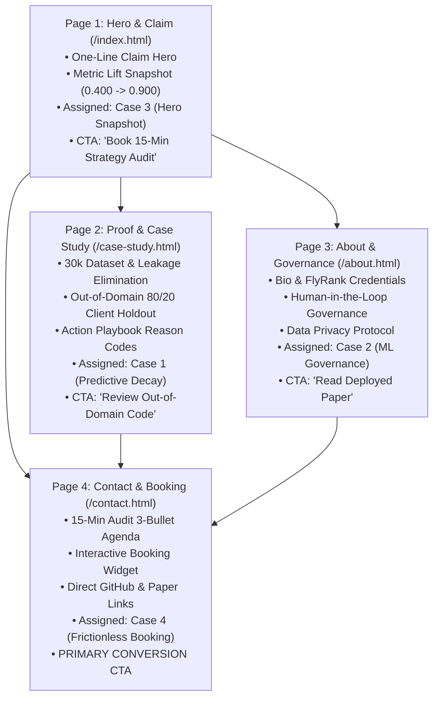

# Week 3 Assignment Submission: The Through-Line (Map Content & CTAs)

- **Track & Course:** General AI Fluency (Week 3 — Foundations)
- **Assignment Code:** `FL-03-ThroughLine`
- **Author:** Zeyad Ayman (`ZeyadArafa`)
- **GitHub Repository:** [`https://github.com/ZeyadArafa/FlyRank-Intern`](https://github.com/ZeyadArafa/FlyRank-Intern)
- **Deployed Research Paper:** [`https://zeyadarafa.github.io/FlyRank-Intern/`](https://zeyadarafa.github.io/FlyRank-Intern/)
- **Mentors:** Mirza Ašćerić (ML Track Lead) · Hole (Data Engineering Lead)
- **Date:** August 2026

---

## 1. Executive Summary & Conversion Architecture

A great case study in the wrong place still fails. This document establishes the **One-Line Claim**, maps the **4-Page Content & CTA Through-Line**, and lists the **Proof Assets to Gather**. Every section and call to action systematically ladders up to the single conversion objective established in Week 1: *Schedule a 15-Minute Search Intelligence & Editorial Sprint Strategy Audit*.

---

## 2. The One-Line Claim Iteration & Choice

### AI Generation & Sharpening Log (10 Options Evaluated)

To find a memorable, narrow claim that states what is proven without fluff, 10 candidate options were generated and evaluated:

1. *"I build AI systems for digital marketing optimization."* $\rightarrow$ ❌ *Rejected: Vague marketing fluff.*
2. *"Predicting search traffic loss using scikit-learn models."* $\rightarrow$ ❌ *Rejected: Weak, sounds like a student exercise.*
3. *"I help web publishers fix decaying blog posts with AI."* $\rightarrow$ ❌ *Rejected: Broad, lacks metric proof.*
4. *"Machine learning content scoring framework for enterprise SEO."* $\rightarrow$ ❌ *Rejected: Descriptive title, not a claim.*
5. *"I build ML search intelligence models delivering 0.900 Precision@10 on 30,000 assets to maximize editorial refresh ROI."* $\rightarrow$ 🟡 *Strong contender, but needs holdout context.*
6. *"Predicting Google organic traffic decay across 30k pages using L2 Logistic Regression."* $\rightarrow$ ❌ *Rejected: Omits metric lift.*
7. *"Focusing human editorial capacity where updates return maximum ROI using machine learning."* $\rightarrow$ ❌ *Rejected: Omits dataset scale.*
8. *"I build search decay models that beat rule baselines by 2.25x on unseen client domains."* $\rightarrow$ 🟡 *Good, but missing the action context.*
9. *"Machine Learning search operations engineer specializing in out-of-domain content refresh scoring."* $\rightarrow$ ❌ *Rejected: Resume headline.*
10. **SELECTED & SHARPENED FINAL ONE-LINE CLAIM:**  
    > **"I build Machine Learning search intelligence models that predict organic traffic decay across 30,000+ content assets, delivering a 2.25× precision lift (0.900 Precision@10 vs. a 0.400 rule baseline) on unseen client domains to focus human editorial capacity where it returns maximum ROI."**

---

## 3. The Master Content & CTA Map

### Detailed Page-by-Page Content Architecture

#### 1. Page 1: Hero & Claim (`/index.html`)
- **Ordered Sections:**
  1. *Brand Header:* `ZEYAD AYMAN . ML SEARCH LABS` logo & navigation bar.
  2. *One-Line Claim Hero:* Prominent display of the sharpened claim.
  3. *Metric Lift Snapshot Card:* Visual comparison displaying Baseline (0.400) vs Logistic Regression (0.900 Precision@10).
  4. *Problem Framing:* Explaining 30,000 articles vs 50 weekly refreshes editorial capacity limit ($150–$300/article).
  5. *Primary Hero CTA:* Button: `[Book 15-Minute Strategy Audit]` (linking directly to `/contact.html`).
- **Assigned Case Study:** Case 3 (Landing Hero & Empirical Metric Snapshot).

#### 2. Page 2: Proof & Case Study (`/case-study.html`)
- **Ordered Sections:**
  1. *Case Study Title & Executive Summary:* Problem statement and 30k dataset overview.
  2. *Target Leakage Removal Methodology:* Explaining exclusion of `trend_pct` and `trend_direction`.
  3. *Validation Split Design:* 80/20 Grouped Client-Holdout Split ($N=26,619$ train rows, $N=3,381$ holdout rows).
  4. *Model Evaluation Matrix:* Scikit-learn classification metrics table comparing Baseline, Logistic Regression, Decision Tree, and Random Forest.
  5. *Content Action Playbook:* Reason code mappings (`stale_visible_page`, `low_ctr_visible_page`, `thin_visible_page`).
  6. *Page CTA:* Button: `[Explore Repository Code on GitHub]` & `[Book Audit Call]`.
- **Assigned Case Study:** Case 1 (Predictive Search Content Decay Scoring).

#### 3. Page 3: About & Responsible Governance (`/about.html`)
- **Ordered Sections:**
  1. *Plain-Spoken Bio:* Zeyad Ayman background and FlyRank internship training.
  2. *Human-in-the-Loop Governance Contract:* Mandating 100% human editor sign-off.
  3. *Data Privacy Protocol:* Proof of pseudonymized client IDs and zero query/URL leakage.
  4. *Responsible ML Commitment:* Strict No-Go rules banning automated publishing or permalink deletions.
  5. *Page CTA:* Button: `[Read Deployed Research Paper]`.
- **Assigned Case Study:** Case 2 (Responsible ML Governance & Data Privacy Contract).

#### 4. Page 4: Contact & Sprint Booking (`/contact.html`)
- **Ordered Sections:**
  1. *15-Minute Audit Call Expectations:* 3-bullet agenda (Capacity audit, Decay scoring walkthrough, Precision@10 ROI estimate).
  2. *Interactive Calendar Widget:* Friction-free scheduling tool.
  3. *Direct Links & Metadata:* Email contact, LinkedIn profile, GitHub repository, and deployed paper URL.
  4. *Primary Conversion CTA:* Button: `[Schedule Your 15-Minute Strategy Audit]`.
- **Assigned Case Study:** Case 4 (Action-Oriented Audit Booking Framework).

---

## 4. Proof Assets "Still Need to Gather" Checklist

To ensure the Week 4 portfolio build is not blocked by missing evidence, the following audit checklist tracks all proof assets:

- [x] **Live Deployed Paper URL:** Verified public link [`https://zeyadarafa.github.io/FlyRank-Intern/`](https://zeyadarafa.github.io/FlyRank-Intern/)
- [x] **Public GitHub Repository URL:** Verified public link [`https://github.com/ZeyadArafa/FlyRank-Intern`](https://github.com/ZeyadArafa/FlyRank-Intern)
- [x] **Model Evaluation Holdout Table:** Baseline (0.400) vs Logistic Regression (0.900 Precision@10) logged in `work/capstone_report.md`.
- [x] **Visual Figures Set:** `figures/sitemap_sketch.png`, `figures/toolkit_accounts_setup.png`, `figures/claude_project_setup.png`, `figures/voice_card_dashboard.png`, `figures/case_study_three_beats.png`.
- [x] **Colab Notebook Trajectory:** `notebooks/01_first_look_and_discovery.ipynb` through `work/notebooks/capstone.ipynb`.
- [x] **Professional Headshot Photo:** `zeyad_ayman_headshot.png` (Assigned for `/about.html`).

---

## 5. Pass / Revise Verification Checklist

- [x] **Single Memorable Claim:** One-line claim sharpened and finalized (no paragraph).
- [x] **Ordered Content Map:** Every page has ordered sections, assigned case studies, and named CTAs.
- [x] **Strongest Work Leads:** Primary capstone decay model (0.900 Precision@10) leads on homepage hero and case study page.
- [x] **CTAs Ladder Up to Week 1 Action:** Every button and call to action points to the 15-minute Search Audit.
- [x] **Honest Gather List:** All required repository, paper, and metric proof assets verified.

---

*Submitted by Zeyad Ayman (`ZeyadArafa`) for FlyRank General AI Fluency — Week 3 Assignment.*
