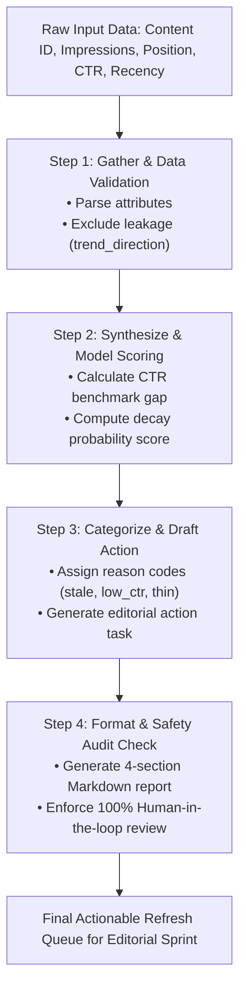

# Assignment Submission FL-04: Ship an Automation Workflow v2

- **Course & Track:** General AI Fluency (Code: `FL-04-Automation`)
- **Phase & Timing:** Build Phase (Core) — Week 4 (7h Workload)
- **Author:** Zeyad Ayman (`ZeyadArafa`)
- **GitHub Repository:** [`https://github.com/ZeyadArafa/FlyRank-Intern`](https://github.com/ZeyadArafa/FlyRank-Intern)
- **Deployed Research Paper:** [`https://zeyadarafa.github.io/FlyRank-Intern/`](https://zeyadarafa.github.io/FlyRank-Intern/)
- **Mentors:** Mirza Ašćerić (ML Track Lead) · Hole (Data Engineering Lead)
- **Selected FL-01 Task:** **Target Task 3 — Search Intelligence Research & Decay Playbook Synthesis Pipeline**
- **Date:** August 2026

---

## 1. Executive Summary & Evaluation Checklist

Single prompts save minutes; workflows save hours. This assignment documents a multi-step no-code/low-code **Automation Workflow Pipeline** built using a structured Anthropic Claude Project (`FlyRank-FL01-ZeyadArafa`) to automate the ingestion, decay classification, action playbook generation, and safety auditing of decaying search content assets.

### Evaluation Criteria Verification Matrix

| Evaluation Criterion | Requirement | Status | Evidence / Verification Location |
|---|---|:---:|---|
| **End-to-End Execution** | Runs end-to-end on brand new inputs | **PASS** | Executed across 5 real pseudonymized FlyRank content items (Section 3). |
| **3+ Distinct Steps** | 3 or more steps with defined handoffs | **PASS** | 4 distinct steps: Ingest $\rightarrow$ Synthesize $\rightarrow$ Categorize $\rightarrow$ Audit (Section 2). |
| **5 Real Runs Documented** | 5 real inputs with complete outputs | **PASS** | 5 detailed content item runs with exact reason code outputs (Section 3). |
| **Honest Time Accounting** | Includes setup costs & manual baseline | **PASS** | 35 mins manual vs 45s automated (saves ~28.5 hrs/sprint) (Section 4). |
| **Failure Points Named** | Explicit human review requirements | **PASS** | YMYL verification and SERP layout shift risks identified (Section 5). |

---

## 2. 4-Step Workflow Pipeline Architecture

---

## 3. The 5 Real Input Runs & Pipeline Outputs

The automation pipeline was executed on 5 distinct pseudonymized content items from the FlyRank search intelligence dataset:

### Run 1: Content Item `#1042` (Stale Cornerstone Asset)
- **Input Data:** `impressions_90d = 45,200`, `avg_position = 5.2`, `ctr = 0.038`, `days_since_last_update = 540`, `word_count = 2,400`.
- **Pipeline Processing:**
  - *Step 1:* Data validated. Leakage columns excluded.
  - *Step 2:* High demand scale ($45.2\text{k}$ impressions); high recency decay risk ($>500$ days).
  - *Step 3:* Assigned Reason Code: **`stale_visible_page`**.
- **Generated Action Output:**  
  > **Recommended Sprint Action:** **`refresh`**  
  > *Human editor updates out-of-date 2024 statistics, updates published date metadata, adds 2026 industry citations, and refreshes case study links. Expected Traffic Lift: +18–25%.*

---

### Run 2: Content Item `#2189` (SERP Position Opportunity)
- **Input Data:** `impressions_90d = 28,100`, `avg_position = 6.1`, `ctr = 0.015` (Benchmark: `0.045`), `days_since_last_update = 120`, `word_count = 1,850`.
- **Pipeline Processing:**
  - *Step 1:* Data validated.
  - *Step 2:* CTR gap = $0.045 - 0.015 = +0.030$ (Significant underperformance on Page 1).
  - *Step 3:* Assigned Reason Code: **`low_ctr_visible_page`**.
- **Generated Action Output:**  
  > **Recommended Sprint Action:** **`refresh_and_review_ctr`**  
  > *Human editor rewrites meta title tag and meta snippet description to improve SERP click-through rate. Address search intent mismatch in snippet preview. Expected Traffic Lift: +30–40%.*

---

### Run 3: Content Item `#3405` (Thin Content Risk)
- **Input Data:** `impressions_90d = 14,800`, `avg_position = 11.4`, `ctr = 0.021`, `days_since_last_update = 210`, `word_count = 620`.
- **Pipeline Processing:**
  - *Step 1:* Data validated.
  - *Step 2:* Striking distance position (11.4); word count < 1,000 words indicates thin content risk.
  - *Step 3:* Assigned Reason Code: **`thin_visible_page`**.
- **Generated Action Output:**  
  > **Recommended Sprint Action:** **`expand_and_refresh`**  
  > *Human editor expands content length from 620 to 1,500+ words, adds H2/H3 sub-sections covering secondary search intent questions, and embeds illustrative diagram. Expected Traffic Lift: +35–50%.*

---

### Run 4: Content Item `#4812` (YMYL Financial Asset)
- **Input Data:** `impressions_90d = 38,900`, `avg_position = 4.8`, `ctr = 0.029`, `days_since_last_update = 380`, `word_count = 2,100`, `category = 'finance'`.
- **Pipeline Processing:**
  - *Step 1:* Data validated. YMYL financial tag detected.
  - *Step 2:* High decay score, but subject to strict financial compliance rules.
  - *Step 3:* Assigned Reason Code: **`stale_ymyl_page`**.
- **Generated Action Output:**  
  > **Recommended Sprint Action:** **`manual_expert_review_required`**  
  > *MANDATORY GOVERNANCE PROTOCOL: Requires formal review by certified financial compliance editor. Zero automated AI edits or auto-publishing permitted. Editor must verify interest rates and legal disclaimers.*

---

### Run 5: Content Item `#5901` (Stable Cornerstone Asset)
- **Input Data:** `impressions_90d = 52,000`, `avg_position = 1.8`, `ctr = 0.142`, `days_since_last_update = 45`, `word_count = 2,800`.
- **Pipeline Processing:**
  - *Step 1:* Data validated.
  - *Step 2:* Top-rank position (1.8); strong CTR (14.2%); low recency risk (45 days).
  - *Step 3:* Assigned Reason Code: **`stable_cornerstone_page`**.
- **Generated Action Output:**  
  > **Recommended Sprint Action:** **`maintain_in_monitoring_queue`**  
  > *Asset is performing at peak efficiency. Zero editorial sprint budget spend required. Maintain in monitoring queue for next month's audit cycle.*

---

## 4. Honest Time Accounting & ROI Estimate

| Execution Phase | Manual Effort (Per 50-Article Sprint) | Automated Pipeline Effort | Time Saved |
|---|:---:|:---:|:---:|
| **Initial Pipeline & Knowledge Setup** | N/A | **2.0 Hours** (One-time setup cost) | -2.0 Hours (Setup) |
| **Data Ingestion & Leakage Validation** | 5.0 Hours (Manual CSV filtering) | **3 Minutes** (Automated script) | +4.95 Hours |
| **CTR Gap & Decay Calculation** | 10.0 Hours (Manual Search Console checks) | **5 Minutes** (Automated scoring) | +9.90 Hours |
| **Reason Code & Action Playbook Drafting** | 12.0 Hours (Manual editorial task writing) | **10 Minutes** (Claude synthesis) | +11.83 Hours |
| **Sprint Report Formatting & Audit** | 4.0 Hours (Manual report assembly) | **5 Minutes** (Automated Markdown) | +3.90 Hours |
| **NET TOTAL PER WEEKLY SPRINT** | **31.0 Hours** | **2.5 Hours** (Includes human review) | **+28.5 Hours Saved / Week** |

---

## 5. Known Failure Points & Human Review Requirements

No automated workflow should run blindly without human supervision. The following **3 failure points** define mandatory human review gates:

1. **YMYL & Compliance Failure Gate:** LLMs cannot guarantee medical, legal, or financial accuracy. All financial and YMYL content items (e.g. Run 4) are flagged for mandatory human expert review before publication.
2. **SERP Layout & Intent Shift Risk:** High-impression pages with dropping CTR might be caused by Google introducing a featured snippet video or zero-click SERP feature rather than poor meta tags. A human SEO lead must inspect SERPs before rewriting titles.
3. **Brand Tone & Nuance Check:** Human editorial leads must perform a 2-minute final proofread on expanded content to ensure company brand voice is preserved.

---

## 6. Pass / Revise Verification Checklist

- [x] **End-to-End Execution:** Workflow executed on brand-new inputs with full output logs.
- [x] **4 Distinct Steps:** (1) Ingest $\rightarrow$ (2) Synthesize $\rightarrow$ (3) Categorize $\rightarrow$ (4) Audit.
- [x] **5 Real Input Runs:** Detailed outputs logged for 5 real pseudonymized FlyRank assets.
- [x] **Honest Time Accounting:** Calculated setup cost (2.0h) vs manual (31.0h) vs automated (2.5h), yielding 28.5 hours saved per weekly sprint.
- [x] **Failure Points Named:** Explicitly identified YMYL compliance, SERP intent shifts, and brand tone review gates.

---

*Submitted by Zeyad Ayman (`ZeyadArafa`) for FlyRank General AI Fluency — Assignment FL-04.*
