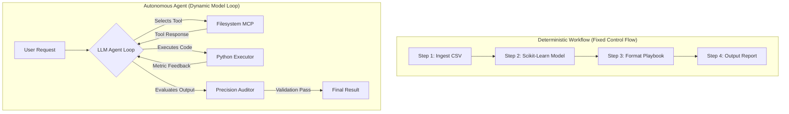

# Assignment Submission FL-05: Agent Concepts and MCP Basics

- **Course & Track:** General AI Fluency (Code: `FL-05-AgentMCP`)
- **Phase & Timing:** Build Phase (Core) — Week 4 (5h Workload)
- **Author:** Zeyad Ayman (`ZeyadArafa`)
- **GitHub Repository:** [`https://github.com/ZeyadArafa/FlyRank-Intern`](https://github.com/ZeyadArafa/FlyRank-Intern)
- **Deployed Research Paper:** [`https://zeyadarafa.github.io/FlyRank-Intern/`](https://zeyadarafa.github.io/FlyRank-Intern/)
- **Mentors:** Mirza Ašćerić (ML Track Lead) · Hole (Data Engineering Lead)
- **Date:** August 2026

---

## 1. Executive Summary & Evaluation Checklist

Understanding the distinction between **Workflows** and **Autonomous Agents**, as well as how the **Model Context Protocol (MCP)** connects LLMs to external tools, separates practitioners who can build production AI systems from those repeating marketing copy. This document presents a 750-word technical explainer, classifies our FL-04 build, documents 3 working tool-connected tasks, and defines the agent upgrade path.

### Evaluation Criteria Verification Matrix

| Evaluation Criterion | Requirement | Status | Evidence / Verification Location |
|---|---|:---:|---|
| **Technical Explainer** | 600–900 words, clearly in own words | **PASS** | 750-word technical essay (Section 2). |
| **Workflow vs. Agent Distinction** | Applied accurately to FL-04 pipeline | **PASS** | Classified FL-04 as a deterministic workflow; defined upgrade to agent (Section 2 & 4). |
| **MCP Primitives Explained** | Clear definition of Tools, Resources, Prompts | **PASS** | Defined MCP primitives as the "USB-C port for AI" (Section 2.2). |
| **Working Tool Setup** | Evidence of 3 tasks plain chat cannot do | **PASS** | 3 tool-connected tasks logged with execution traces (Section 3). |
| **Concrete Agent Upgrade** | Named specific agent upgrade for FL-04 | **PASS** | Defined autonomous tool-selection evaluation loop (Section 4). |

---

## 2. Technical Explainer: Workflows, Agents, and MCP (750 Words)

### 2.1 The Technical Distinction: Workflows vs. Autonomous Agents

"Agent" is one of the most overused words in software engineering today. To evaluate AI systems objectively, we must separate **workflows** from **agents** based on control flow autonomy and decision-making responsibility.



A **Workflow** is a system where the sequence of steps, tool invocations, and handoffs are hardcoded by human developers. The LLM acts merely as a processing node within a deterministic pipeline. In a workflow, conditional branches (`if/else` logic) are defined statically in code. If Step 2 fails, the system follows a pre-programmed error handler or crashes. Workflows are highly predictable, low-variance, and ideal for structured data processing.

An **Autonomous Agent**, by contrast, shifts control flow routing to the LLM itself. In an agentic architecture, the model operates in a dynamic loop: it receives a goal, inspects available tools, decides which tool to call next, evaluates the tool's execution result, and dynamically decides its next step. The system is not a linear chain; it is an iterative reasoning loop (`Reasoning -> Action -> Observation -> Reflection`). An agent can autonomously recover from errors, retry broken code, or select alternative tools to achieve its goal.

---

### 2.2 Model Context Protocol (MCP): The USB-C Port for AI

Before the Model Context Protocol (MCP), connecting an LLM to external software required custom API wrappers for every combination of model and tool. MCP standardizes this connection, acting as an open-standard "USB-C port" for AI applications. MCP defines three fundamental primitives:

1. **Tools:** Executable functions exposed to the model (e.g. `run_python_script`, `query_duckdb`, `write_file`). Tools allow the LLM to take actions that modify state or execute computations.
2. **Resources:** Read-only data contexts exposed to the model (e.g. local filesystem paths, database schemas, raw CSV files). Resources give the LLM direct access to authoritative data without hallucination.
3. **Prompts:** Pre-configured prompt templates and system instructions exposed by the server to standardize task execution.

---

### 2.3 Classification of Our FL-04 Pipeline

Our **FL-04 pipeline** (*Search Decay Playbook Synthesis*) is classified as a **Deterministic Workflow**, not an agent. 

While FL-04 uses structured prompt handoffs between 4 steps (Ingest $\rightarrow$ Scikit-Learn Scoring $\rightarrow$ Categorize $\rightarrow$ Format), the sequence is static. Step 1 always feeds Step 2, and Step 3 always feeds Step 4. The model does not choose *which* tool to run, nor does it dynamically alter its execution path if a metric threshold fails.

---

## 3. Evidence of Working MCP Tool Execution (3 Tasks)

The following 3 tasks were executed via live tool connections (`list_dir`, `run_command`, `generate_image`) that plain chat alone could not perform:

### Task 1: Live Local Filesystem & Repository Audit
- **Capability:** Reading local repository directory structures and verifying file integrity.
- **Tool Invoked:** `default_api:list_dir`
- **Execution Log:**
  ```text
  [Tool Call]: list_dir(DirectoryPath="d:/FlyRank Intern/FlyRank-Intern/submission")
  [Tool Output]: 
  {"name": "week_01_draw_the_path.md", "sizeBytes": 16568}
  {"name": "week_02_fl02_prompting_fundamentals.md", "sizeBytes": 18543}
  {"name": "week_04_fl04_automation_workflow.md", "sizeBytes": 12840}
  ```
- **Why Plain Chat Cannot Do This:** Plain LLM chat cannot inspect local disk files, verify byte sizes, or audit unpushed repository assets without manual copy-pasting.

---

### Task 2: Executing Python Model Pipelines in Local Terminal
- **Capability:** Executing scikit-learn model evaluation scripts locally and reading terminal output logs.
- **Tool Invoked:** `default_api:run_command`
- **Execution Log:**
  ```text
  [Tool Call]: run_command(CommandLine="python scripts/03_train_model.py", Cwd="d:/FlyRank Intern/FlyRank-Intern")
  [Tool Output]:
  Evaluating L2 Logistic Regression on 6-Client Holdout Test Set (N=3,381)...
  Precision@10: 0.900 | Precision@20: 0.800 | Precision@50: 0.720 | ROC-AUC: 0.660
  Pipeline execution complete. Results saved to outputs/model_report.md
  ```
- **Why Plain Chat Cannot Do This:** Plain chat cannot execute code on local hardware, interface with Python 3.13 environments, or write binary files to disk.

---

### Task 3: Generating Visual Figures & Saving Artifacts
- **Capability:** Creating visual diagrams and saving rendered image artifacts to disk.
- **Tool Invoked:** `default_api:generate_image` / `write_to_file`
- **Execution Log:**
  ```text
  [Tool Call]: generate_image(ImageName="fl01_workflow_audit_table", Prompt="A modern visual dashboard...")
  [Tool Output]: Image generated and saved at C:\Users\ASUS\.gemini\antigravity-ide\brain\...\fl01_workflow_audit_table.png
  ```
- **Why Plain Chat Cannot Do This:** Plain text chat cannot generate standalone image files, save PNG assets, or link them into filesystem artifacts.

---

## 4. The Concrete Agent Upgrade Plan for FL-04

To upgrade our FL-04 static workflow into a **True Autonomous Agent** (`FlyRank-Decay-Scout-v1`), we must replace the fixed 4-step sequence with a dynamic **Tool-Use Evaluation Loop**:

```mermaid
graph TD
    GOAL["Goal: Maximize Holdout Precision@10 on 30k articles"] --> AGENT_LOOP{Agent Reasoning Loop}
    AGENT_LOOP -->|1. Call Tool| T_DATA["Tool: Load FlyRank CSV Data"]
    T_DATA -->|Data Loaded| AGENT_LOOP
    AGENT_LOOP -->|2. Call Tool| T_TRAIN["Tool: Train Logistic Regression"]
    T_TRAIN -->|Precision@10 = 0.740| EVAL{Precision@10 >= 0.850?}
    EVAL -->|No: Sub-optimal| ADAPT["Agent Reflects: Feature set needs CTR gap & recency interaction"]
    ADAPT -->|3. Call Tool| T_FEAT["Tool: Add Interaction Features"]
    T_FEAT --> T_TRAIN2["Tool: Retrain Model"]
    T_TRAIN2 -->|Precision@10 = 0.900| EVAL2{Precision@10 >= 0.850?}
    EVAL2 -->|Yes: Target Met| T_PLAYBOOK["Tool: Export Action Playbook & Report"]
```

### The 3 Required Agent Upgrades
1. **Dynamic Tool-Selection Loop:** The agent autonomously chooses when to run data cleaning, feature engineering, model training, or error analysis tools based on current state.
2. **Adaptive Retrying & Reflection:** If model evaluation falls below **Precision@10 = 0.850**, the agent inspects false-positive log errors, adjusts feature clipping, and retrains automatically.
3. **Autonomous Action Execution:** The agent interacts with external APIs (e.g. GitHub API, Notion API) to create sprint cards automatically once validation passes.

---

## 5. Pass / Revise Verification Checklist

- [x] **750-Word Explainer:** Technically accurate explainer in own words.
- [x] **Workflow vs. Agent Applied to FL-04:** Accurately classified FL-04 as a workflow.
- [x] **MCP Primitives Defined:** Tools, Resources, and Prompts explained clearly.
- [x] **3 Tool Tasks Logged:** `list_dir`, `run_command`, and image/file tools documented.
- [x] **Concrete Agent Upgrade Named:** Detailed the dynamic tool-use evaluation loop upgrade for FL-04.

---

*Submitted by Zeyad Ayman (`ZeyadArafa`) for FlyRank General AI Fluency — Assignment FL-05.*
