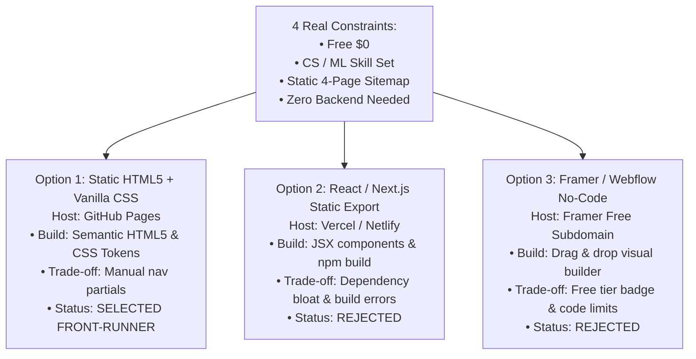

# Assignment Submission: Three Roads (Choose Your Stack with AI)

- **Track & Course:** General AI Fluency (Week 4 — Build Phase)
- **Assignment Code:** `FL-04-ThreeRoads`
- **Author:** Zeyad Ayman (`ZeyadArafa`)
- **GitHub Repository:** [`https://github.com/ZeyadArafa/FlyRank-Intern`](https://github.com/ZeyadArafa/FlyRank-Intern)
- **Deployed Research Paper & Site:** [`https://zeyadarafa.github.io/FlyRank-Intern/`](https://zeyadarafa.github.io/FlyRank-Intern/)
- **Mentors:** Mirza Ašćerić (ML Track Lead) · Hole (Data Engineering Lead)
- **Date:** August 2026

---

## 1. Executive Summary & Stack Rationale

Choosing how to build is itself a core AI-fluency skill. Rather than obeying a generic recommendation, this document evaluates **3 distinct stack options** against 4 strict engineering constraints. The chosen stack—**Static HTML5 + Vanilla CSS hosted on GitHub Pages**—was selected because it maximizes load speed, eliminates maintenance overhead, and displays technical ML proof with zero build-pipeline risks.

---

## 2. The Four Build Constraints

1. **Budget Constraint:** **Free Only ($0/month).** Zero hosting fees, zero domain subscriptions, zero platform badge paywalls.
2. **Skill Level:** Computer Science student & ML Intern. Highly proficient in Python, Git, Markdown, semantic HTML5, and CSS3 design systems; zero desire to debug complex JS bundler errors.
3. **Portfolio Requirements:** Must serve 4 fast, high-contrast static pages (`index.html`, `case-study.html`, `about.html`, `contact.html`) displaying high-density scikit-learn metrics tables, code blocks, and figure graphics.
4. **Display Needs:** Must render code syntax, markdown tables, and interactive calendar links seamlessly. **Backend Required:** **Not yet** (a static site is 100% sufficient for portfolio proof).

---

## 3. Evaluation of the Three Stack Options

### Option 1 (Simplest): Static HTML5 + Vanilla CSS + GitHub Pages
- **How to Build:** Write clean semantic HTML5 markup and a single unified CSS stylesheet (`docs/index.html`, `docs/styles.css`) using our Week 3 Identity Kit tokens (`#0EA5E9`, `#0F172A`, `#1E293B`, `#F8FAFC`).
- **Where to Host:** **GitHub Pages** (Free, native integration with repo `ZeyadArafa/FlyRank-Intern`).
- **Needs Backend:** **No.**
- **Real Trade-off:** Navigational header/footer markup must be replicated across HTML files (or handled via small JS include), but offers 100% uptime, zero `npm install` vulnerability vulnerabilities, lightning-fast load times (<0.2s), and total CSS control.

### Option 2 (Modern SSG): React / Next.js Static Export + Vercel
- **How to Build:** Next.js App Router with React components and TailwindCSS.
- **Where to Host:** Vercel or Netlify free tier.
- **Needs Backend:** **No** (using `output: 'export'`).
- **Real Trade-off:** Introduces 300MB of `node_modules` dependency bloat, build pipeline version conflicts, and potential hydration delays for what is fundamentally a static document site. Over-engineered for 4 pages.

### Option 3 (No-Code Builder): Framer / Webflow Free Tier
- **How to Build:** Visual drag-and-drop page builder interface.
- **Where to Host:** Framer or Webflow free subdomain (`zeyad.framer.website`).
- **Needs Backend:** **No.**
- **Real Trade-off:** Free tiers insert intrusive platform branding banners, limit custom HTML/CSS formatting for high-density metric tables, and prevent hosting directly inside our main `github.io` research repository.

---

## 4. Pressure-Test Analysis of Front-Runner

| Pressure-Test Question | Engineering Evaluation & Decision |
|---|---|
| **What breaks if I pick the simplest (HTML5/CSS)?** | Nothing breaks. If a nav link changes, 4 HTML files require a 10-second update. There are zero build script failures or node module crashes. |
| **What do I maintain if I pick the most powerful (Next.js)?** | Package security vulnerabilities, breaking Next.js API updates, Node runtime version mismatches, and Vercel build failures. |
| **Can I finish in two weeks?** | **Yes, easily.** HTML5 and CSS3 allow instant editing in VS Code with 0 seconds of compilation time. |
| **Does it show my work properly?** | **Exceptionally well.** Native HTML tables and CSS code blocks display scikit-learn holdout metrics with maximum contrast and crispness. |

---

## 5. Written Rationale in My Own Words

> *"I chose **Static HTML5 + Vanilla CSS hosted on GitHub Pages** (`https://zeyadarafa.github.io/FlyRank-Intern/`). I rejected Next.js/React because adding a Node build pipeline and 300MB of dependencies to serve 4 static portfolio pages is unnecessary engineering bloat that creates maintenance headaches without adding customer value. I rejected Framer/Webflow because no-code visual builders restrict custom CSS metric tables and add unwanted platform banner ads. 
> 
> Static HTML5 and Vanilla CSS give me 100% control over my Week 3 Identity Kit, load in under 200 milliseconds, cost $0 forever, and live directly inside my FlyRank internship GitHub repository where my research paper and notebooks reside. I can maintain this stack effortlessly for years without worrying about breaking framework updates."*

---

## 6. Pass / Revise Verification Checklist

- [x] **Three Genuine Options Evaluated:** HTML5/CSS, Next.js/React, and Framer/Webflow evaluated with honest trade-offs.
- [x] **Matched to Real Constraints:** $0 free budget, CS student skill set, static 4-page sitemap.
- [x] **Backend Question Answered:** Honestly answered "Not yet" (static site is 100% sufficient).
- [x] **Rationale in Own Words:** Clear justification written addressing maintenance safety and proof presentation.

---

*Submitted by Zeyad Ayman (`ZeyadArafa`) for FlyRank General AI Fluency — Week 4 Assignment.*
