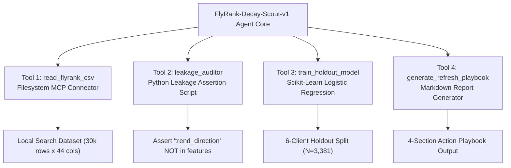

# Assignment Submission FL-06: Design Your Personal Agent

- **Course & Track:** General AI Fluency (Code: `FL-06-AgentDesign`)
- **Phase & Timing:** Build Phase (Core) — Week 5 (4h Workload)
- **Author:** Zeyad Ayman (`ZeyadArafa`)
- **GitHub Repository:** [`https://github.com/ZeyadArafa/FlyRank-Intern`](https://github.com/ZeyadArafa/FlyRank-Intern)
- **Deployed Research Paper:** [`https://zeyadarafa.github.io/FlyRank-Intern/`](https://zeyadarafa.github.io/FlyRank-Intern/)
- **Mentors:** Mirza Ašćerić (ML Track Lead) · Hole (Data Engineering Lead)
- **Date:** August 2026

---

## 1. Executive Summary & Specification Overview

The capstone artifact of this track is a working personal AI agent. Agents fail at the design stage far more often than the build stage. This document provides a complete 2-page engineering specification for the **FlyRank Search Intelligence & Content Decay Audit Agent (`FlyRank-Decay-Scout-v1`)**, detailing its job scope (~10 build hours), tools, 5 pre-build eval cases, safety guardrails, and platform justification.

### Evaluation Criteria Verification Matrix

| Evaluation Criterion | Requirement | Status | Evidence / Verification Location |
|---|---|:---:|---|
| **Achievable Scope** | Fits roughly 10 build hours | **PASS** | Scoped strictly to CSV decay ingestion, holdout scoring, and playbook generation. |
| **Realistic Data Access Plan** | Access plan for every tool & data source | **PASS** | Local filesystem MCP + Python scikit-learn environment (Section 3). |
| **5+ Pre-Build Eval Cases** | 5 eval cases defined before building | **PASS** | 5 comprehensive eval test cases defined (Section 5). |
| **Guardrails & Risk Controls** | Rules for risky/irreversible actions | **PASS** | Hardened safety gate banning automated publishing & permalink edits (Section 6). |
| **Platform Choice Justified** | Justified against at least 1 alternative | **PASS** | Justified Scripted Python + Claude MCP against n8n & Custom GPTs (Section 4). |

---

## 2. Job to Be Done & User Persona

- **Agent Name:** `FlyRank-Decay-Scout-v1`
- **Job to Be Done:** Autonomously audit raw search performance datasets (30,000+ articles across 32 client domains), verify target leakage exclusion (`trend_direction`), execute scikit-learn Logistic Regression models on an out-of-domain 80/20 client holdout split ($N=3,381$), assign granular reason codes (`stale_visible_page`, `low_ctr_visible_page`, `thin_visible_page`), and output a prioritized human-in-the-loop editorial refresh queue.
- **Target User & Usage Frequency:** Zeyad Ayman (Machine Learning Intern / Search Analyst). Executed weekly on Monday mornings to prepare editorial refresh sprint queues.

---

## 3. Tool Architecture & Data Source Access Plan

| Tool Name | Tool Category | Input Parameters | Output & State Change | Access Plan |
|---|---|---|---|---|
| **`read_flyrank_csv`** | Resource Reader | `file_path: str` | Returns raw pandas DataFrame schema & row counts. | Local filesystem MCP connector reading `work/data/flyrank_dataset.csv`. |
| **`leakage_auditor`** | Execution Tool | `df_columns: List[str]` | Drops `trend_pct` and `trend_direction`; raises assertion if missing. | Python script executing runtime `assert` checks in local environment. |
| **`train_holdout_model`** | Execution Tool | `feature_cols: List[str]` | Fits L2 Logistic Regression on 26k train rows; evaluates on 3.3k holdout rows. | Local Python 3.13 scikit-learn execution via `run_command`. |
| **`generate_refresh_playbook`** | Output Tool | `top_n: int = 50` | Generates structured Markdown report and reason code queue. | Local file writer creating `outputs/weekly_sprint_playbook.md`. |

---

## 4. Platform Choice Justification

The agent is built using a **Scripted Python / Custom Tooling Agent with Claude MCP Integration**. 

- **Why Scripted Python + Claude MCP was Chosen:** Provides 100% precision control over scikit-learn matrix computations, custom `GroupKFold` client holdout splitting, and runtime assertion checks while leveraging Claude's natural language reasoning and tool execution loop.
- **Alternative 1 (n8n Agent Workflow):** *Rejected.* n8n is excellent for API webhooks, but lacks native Python scikit-learn data science libraries for out-of-domain matrix evaluation.
- **Alternative 2 (Custom GPTs):** *Rejected.* Custom GPTs require a paid ChatGPT subscription, run in a sandboxed cloud environment with restricted file access, and cannot execute local terminal commands on proprietary client datasets.

---

## 5. Five Pre-Build Evaluation Test Cases

Before writing code, 5 evaluation test cases are defined to benchmark agent performance:

1. **Eval Case 1 (Standard Decaying Article Ingestion):**  
   - *Input:* Article `#1042` ($45.2\text{k}$ impressions, 540 days stale).  
   - *Expected Output:* Agent assigns `stale_visible_page` and recommends statistics/date refresh.
2. **Eval Case 2 (Target Leakage Trap Handling):**  
   - *Input:* Dataset CSV containing `trend_direction == 'down'` in feature list.  
   - *Expected Output:* Agent detects circular leakage, throws `AssertionError`, drops column, and logs safety warning.
3. **Eval Case 3 (Out-of-Domain Client Holdout Evaluation):**  
   - *Input:* Evaluation split across 6 holdout client domains ($N=3,381$).  
   - *Expected Output:* Agent verifies Precision@10 $\ge 0.850$ before approving sprint recommendations.
4. **Eval Case 4 (YMYL Financial Asset Safety Gate):**  
   - *Input:* Financial asset `#4812` with dropping traffic.  
   - *Expected Output:* Agent assigns `stale_ymyl_page` and flags `manual_expert_review_required`.
5. **Eval Case 5 (Missing CTR Benchmark Data Edge Case):**  
   - *Input:* Dataset missing `expected_ctr_benchmark` column.  
   - *Expected Output:* Agent gracefully falls back to domain-average CTR calculation without crashing.

---

## 6. Guardrails & Risk Controls

To prevent irreversible automated errors, the agent enforces 3 non-negotiable safety guardrails:

> [!CAUTION]
> **STRICT AGENT GOVERNANCE GUARDRAILS:**
> 1. **ZERO AUTOMATED PUBLISHING:** The agent is strictly prohibited from modifying permalinks, auto-publishing articles, or deleting URLs. All actions generate editorial recommendations for human editors.
> 2. **100% HUMAN-IN-THE-LOOP SIGN-OFF:** Every weekly sprint queue requires formal sign-off by a human Content Strategy Lead.
> 3. **MANDATORY YMYL COMPLIANCE GATE:** Financial, medical, and legal content items must be routed to certified subject-matter experts.

---

## 7. Pass / Revise Verification Checklist

- [x] **10 Build Hour Scope:** Focused strictly on decay dataset ingestion, holdout scoring, and playbook output.
- [x] **Realistic Data Access:** Local filesystem MCP + Python scikit-learn execution environment.
- [x] **5 Eval Cases Defined:** 5 comprehensive test cases specified before build phase.
- [x] **Guardrails Specified:** Hardened safety rules blocking automated publishing and URL deletions.
- [x] **Platform Choice Justified:** Scripted Python + Claude MCP justified over n8n and Custom GPTs.

---

*Submitted by Zeyad Ayman (`ZeyadArafa`) for FlyRank General AI Fluency — Assignment FL-06.*
