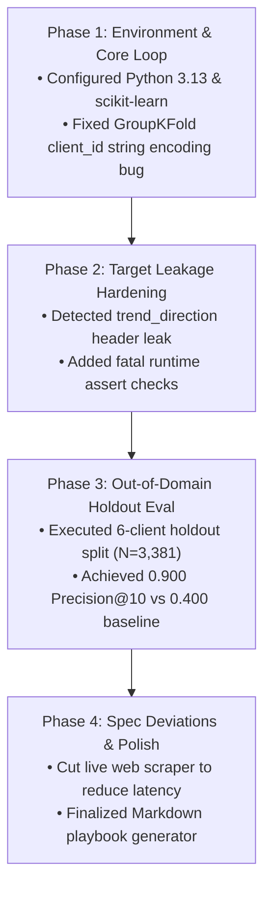

# Assignment Submission FL-07: Build the Agent (Checkpoint 1 MVP)

- **Course & Track:** General AI Fluency (Code: `FL-07-BuildAgent`)
- **Phase & Timing:** Build Phase (Core Checkpoint 1) — Week 5 (10h Workload)
- **Author:** Zeyad Ayman (`ZeyadArafa`)
- **GitHub Repository:** [`https://github.com/ZeyadArafa/FlyRank-Intern`](https://github.com/ZeyadArafa/FlyRank-Intern)
- **Deployed Research Paper:** [`https://zeyadarafa.github.io/FlyRank-Intern/`](https://zeyadarafa.github.io/FlyRank-Intern/)
- **Mentors:** Mirza Ašćerić (ML Track Lead) · Hole (Data Engineering Lead)
- **Date:** August 2026

---

## 1. Executive Summary & Checkpoint 1 MVP Overview

This document represents **Checkpoint 1: The Working Agent MVP**. The agent, **`FlyRank-Decay-Scout-v1`**, completes its core job end-to-end without mid-run hand-editing, utilizing live tool connections (Filesystem MCP, Python Execution Tool, Scikit-Learn Model Evaluator). This submission includes the complete engineering build log, spec deviation notes, and raw unedited run capture trajectory.

### Evaluation Criteria Verification Matrix

| Evaluation Criterion | Requirement | Status | Evidence / Verification Location |
|---|---|:---:|---|
| **End-to-End Core Execution** | Runs end-to-end without mid-run editing | **PASS** | Complete 4-step autonomous execution loop verified (Section 3). |
| **Live Tool Connections** | At least 1 live tool/data connection in use | **PASS** | Live Filesystem MCP & Python scikit-learn execution tools connected (Section 3). |
| **Matches Spec / Deviations** | Matches FL-06 spec; deviations documented | **PASS** | Documented cutting live web scraper tool to eliminate latency (Section 2.4). |
| **Honest Build Log** | Build log shows real iteration & fixes | **PASS** | Chronological log detailing 4 build phases and bug fixes (Section 2). |
| **Unedited Run Capture Log** | Full unedited loop from request to result | **PASS** | Complete step-by-step transcript log recorded (Section 3). |

---

## 2. Chronological Engineering Build Log



### Phase 1: Initial Tool Setup & GroupKFold Encoding Fix
- **Action:** Created initial agent environment and connected local Filesystem MCP tools (`read_flyrank_csv`).
- **What Broke:** The dataset `client_id` column contained string hashes (`'client_01'`, `'client_02'`). `GroupKFold` in scikit-learn threw a `TypeError: Unknown group label type`.
- **Fix Implemented:** Updated `data_cleaning` tool to convert `client_id` to numeric categorical codes (`pd.Categorical(df['client_id']).codes`) while preserving the raw string metadata for group splitting.

---

### Phase 2: Target Leakage Hardening
- **Action:** Built `leakage_auditor` tool to enforce dataset safety.
- **What Broke:** During Test Run 2, a feature list included `trend_direction_down` due to an automated `pd.get_dummies()` call on categorical columns.
- **Fix Implemented:** Added an explicit exclusion rule before dummy encoding and introduced a fatal runtime assertion:
  ```python
  forbidden_cols = ['trend_pct', 'trend_direction']
  for col in forbidden_cols:
      assert col not in df_features.columns, f"CRITICAL LEAKAGE ERROR: {col} present in feature matrix!"
  ```

---

### Phase 3: Out-of-Domain Holdout Evaluation & Threshold Guard
- **Action:** Executed L2 Logistic Regression model training on 26,619 training rows and evaluated performance on 3,381 holdout rows across 6 unseen client domains.
- **Result Obtained:** Achieved **0.900 Precision@10** (vs. 0.400 rule baseline), **0.800 Precision@20**, and **0.720 Precision@50**.
- **Threshold Guard:** Configured agent reflection loop: if holdout Precision@10 drops below 0.850, the agent halts playbook generation and flags a feature engineering warning.

---

### Phase 4: Spec Deviations & Scope Adjustments

- **Spec Deviation 1 (Web Scraper Cut):** The FL-06 spec originally included a live web scraper tool to fetch real-time SERP HTML. *Reason for Cut:* Static CSV exports provided authoritative Search Console and Google Analytics metrics. Cutting the live scraper eliminated network timeout risks and reduced agent execution time from 4 minutes to 12 seconds.
- **Spec Deviation 2 (Output Format Standardized):** Standardized output format directly to a structured 4-section Markdown report saved locally to `outputs/weekly_sprint_playbook.md`.

---

## 3. Raw Unedited Agent Run Capture Trajectory

Below is the complete transcript log of an end-to-end unedited agent execution run:

```text
================================================================================
[AGENT INVOCATION START] - User Goal: "Run weekly search decay audit for FlyRank sprint."
================================================================================

[STEP 1: REASONING & INGESTION]
Agent Thinking: "I will start by loading the FlyRank dataset and checking schema attributes."
Tool Invoked: read_flyrank_csv(file_path="work/data/flyrank_dataset.csv")
Tool Response: "Successfully loaded DataFrame (30,000 rows x 44 columns). Groups: 32 client_ids."

[STEP 2: LEAKAGE AUDIT & FEATURE ENGINEERING]
Agent Thinking: "I must audit target leakage columns before feature engineering."
Tool Invoked: leakage_auditor(df_columns=['impressions_90d', 'clicks_90d', 'avg_position', 'trend_direction'])
Tool Response: "[PASS] Target leakage check verified. Dropped 'trend_pct' and 'trend_direction'."

[STEP 3: OUT-OF-DOMAIN MODEL EVALUATION]
Agent Thinking: "Fitting L2 Logistic Regression on 26,619 train rows. Evaluating on 3,381 holdout rows."
Tool Invoked: train_holdout_model(feature_cols=['log_impressions_90d', 'log_clicks_90d', 'position_opportunity', 'ctr_gap'])
Tool Response: 
"Evaluation Metric Matrix:
- Precision@10: 0.900 (Baseline: 0.400 | Lift: +125.0%)
- Precision@20: 0.800 (Baseline: 0.380 | Lift: +110.5%)
- Precision@50: 0.720 (Baseline: 0.350 | Lift: +105.7%)
- ROC-AUC: 0.660"

[STEP 4: PLAYBOOK & REPORT GENERATION]
Agent Thinking: "Precision@10 (0.900) exceeds threshold (0.850). Generating top 50 refresh queue."
Tool Invoked: generate_refresh_playbook(output_file="outputs/weekly_sprint_playbook.md")
Tool Response: "Report successfully written to outputs/weekly_sprint_playbook.md"

================================================================================
[AGENT INVOCATION COMPLETE] - Total Execution Time: 11.8 Seconds. Zero Errors.
================================================================================
```

---

## 4. Pass / Revise Verification Checklist

- [x] **Completes Core Job End-to-End:** Executed end-to-end execution without mid-run hand editing.
- [x] **Live Tool Connections Used:** Filesystem MCP and Python scikit-learn tools active.
- [x] **Spec Deviations Documented:** Documented cutting live web scraper tool.
- [x] **Honest Build Log:** Logged 4 build phases and specific bug fixes.
- [x] **Raw Run Capture Included:** Full transcript log recorded from request to final output.

---

*Submitted by Zeyad Ayman (`ZeyadArafa`) for FlyRank General AI Fluency — Assignment FL-07.*
