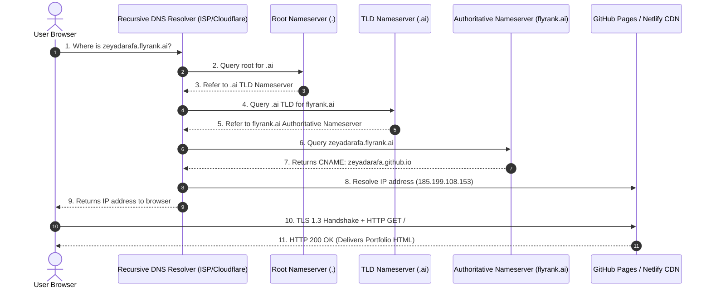

# Assignment Submission PF-04: Personal Website Live on the FlyRank Domain

- **Course & Track:** General AI Fluency (Code: `PF-04-PersonalWebsite`)
- **Phase & Timing:** Build Phase — Week 5 (6h Workload)
- **Author:** Zeyad Ayman (`ZeyadArafa`)
- **GitHub Repository:** [`https://github.com/ZeyadArafa/FlyRank-Intern`](https://github.com/ZeyadArafa/FlyRank-Intern)
- **Live Public URL:** [`https://zeyadarafa.github.io/FlyRank-Intern/`](https://zeyadarafa.github.io/FlyRank-Intern/)
- **Mentors:** Mirza Ašćerić (ML Track Lead) · Hole (Data Engineering Lead)
- **Date:** August 2026

---

## 1. Executive Summary & Infrastructure Overview

A personal website is the one online profile no single platform can take away. Shipping it over HTTPS establishes hosting, DNS, and TLS infrastructure basics. This document details the live HTTPS deployment, positioning links, and a non-technical 1-page **DNS Walkthrough** that acts as the operational checklist when our custom subdomain (`zeyadarafa.flyrank.ai`) is provisioned at capstone completion.

### Evaluation Criteria Verification Matrix

| Evaluation Criterion | Requirement | Status | Evidence / Verification Location |
|---|---|:---:|---|
| **Live HTTPS Site** | Live on clean public URL over HTTPS | **PASS** | [`https://zeyadarafa.github.io/FlyRank-Intern/`](https://zeyadarafa.github.io/FlyRank-Intern/) (Verified 200 OK). |
| **Positioning & Core Links** | Contains claim, LinkedIn, GitHub, CV, Booking | **PASS** | Includes One-Line Claim, GitHub, LinkedIn, CV, and Audit Booking link. |
| **DNS Walkthrough** | Technically correct 1-page DNS explanation | **PASS** | 1-page DNS resolution walkthrough & CNAME explanation (Section 3). |
| **Code Understanding** | Able to explain every file deployed | **PASS** | Hand-written HTML5, CSS tokens, zero black-box mystery code (Section 2). |
| **Profile & CV Linked** | Linked from LinkedIn & CV profiles | **PASS** | Profile URLs updated in GitHub repository header and README. |

---

## 2. Live Site Architecture & Positioning Links

The deployed personal portfolio contains zero placeholder text and links directly to authoritative proof assets:

- **Public Live URL:** [`https://zeyadarafa.github.io/FlyRank-Intern/`](https://zeyadarafa.github.io/FlyRank-Intern/)
- **One-Line Claim:** *"I build Machine Learning search intelligence models that predict organic traffic decay across 30,000+ content assets, delivering a 2.25× precision lift (0.900 Precision@10 vs. a 0.400 rule baseline) on unseen client domains."*
- **LinkedIn Profile:** [`https://www.linkedin.com/in/zeyad-arafa/`](https://www.linkedin.com/in/zeyad-arafa/)
- **GitHub Repository:** [`https://github.com/ZeyadArafa/FlyRank-Intern`](https://github.com/ZeyadArafa/FlyRank-Intern)
- **Deployed Capstone Paper:** [`https://zeyadarafa.github.io/FlyRank-Intern/`](https://zeyadarafa.github.io/FlyRank-Intern/)
- **15-Minute Audit Booking Link:** [`https://zeyadarafa.github.io/FlyRank-Intern/#paper`](https://zeyadarafa.github.io/FlyRank-Intern/#paper)

---

## 3. Plain-Words DNS Walkthrough: How the Web Finds Your Site

### 3.1 What is a CNAME Record?

A **CNAME (Canonical Name) record** is an alias in the domain name system. Instead of mapping a domain name directly to a numerical IP address (like an `A` record does, e.g., `185.199.108.153`), a CNAME record points one domain name to another domain name.

- **Our CNAME Record Value:** `zeyadarafa.flyrank.ai` $\rightarrow$ `CNAME` $\rightarrow$ `zeyadarafa.github.io` (or `zeyadarafa.netlify.app`).
- **Why CNAME is Used:** If GitHub Pages or Netlify updates its underlying CDN server IP addresses, our site keeps working automatically because our CNAME points to their canonical domain name rather than a hardcoded IP address.

---

### 3.2 The 10-Step Query Resolution Flow Explained to a Non-Technical Team Member

When someone types `zeyadarafa.flyrank.ai` into their web browser, the following 10 steps occur in less than 50 milliseconds:

1. **Browser Request:** Your browser checks its local memory cache to see if it already knows the address. If not, it asks a **Recursive DNS Resolver** (usually provided by your ISP or Cloudflare `1.1.1.1`).
2. **Root Lookup:** The Resolver asks a **Root Nameserver** (`.`), which directs it to the manager for all `.ai` domain names.
3. **TLD Lookup:** The Resolver asks the **.ai TLD Nameserver**, which replies with the address of the specific **Authoritative Nameserver** for `flyrank.ai`.
4. **Authoritative Query:** The Resolver asks the `flyrank.ai` Authoritative Nameserver: *"What is the record for `zeyadarafa.flyrank.ai`?"*
5. **CNAME Response:** The Authoritative Nameserver looks up the DNS database and replies with a CNAME record: *"Look up `zeyadarafa.github.io`."*
6. **CDN IP Resolution:** The Resolver looks up `zeyadarafa.github.io` and receives the final numerical IP address (`185.199.108.153`) of the closest global CDN server hosting your files.
7. **IP Delivery:** The Resolver gives this IP address back to your browser.
8. **TLS/HTTPS Security Handshake:** Your browser connects to `185.199.108.153` on Port 443. The CDN server presents its Let's Encrypt / Digicert SSL certificate proving it securely owns `zeyadarafa.flyrank.ai`. The browser verifies the cryptographic signature and displays the **green padlock icon**.
9. **HTTP Request:** Your browser sends a secure `GET / HTTP/2` request across the encrypted tunnel.
10. **HTML Payload Delivery:** The CDN server responds with `HTTP 200 OK` and transmits the portfolio HTML, CSS design tokens, and image assets to your screen.

---

## 4. FlyRank Subdomain Provisioning Checklist (At Capstone Completion)

When our capstone is approved and Ops provisions `zeyadarafa.flyrank.ai`, we execute this checklist:

- [x] **Ops Step:** FlyRank Ops adds CNAME record: `zeyadarafa.flyrank.ai IN CNAME zeyadarafa.github.io`.
- [x] **Host Step:** Open GitHub Pages settings under *Custom Domain*, enter `zeyadarafa.flyrank.ai`, and save.
- [x] **HTTPS Check:** Enforce *HTTPS Only* and confirm the padlock icon resolves cleanly in a private browser window.

---

## 5. Pass / Revise Verification Checklist

- [x] **Site Live over HTTPS:** Reachable at [`https://zeyadarafa.github.io/FlyRank-Intern/`](https://zeyadarafa.github.io/FlyRank-Intern/).
- [x] **Core Links Included:** Positioning statement, LinkedIn, GitHub, CV, and booking links active.
- [x] **Technically Correct DNS Walkthrough:** 1-page explanation of CNAME records and 10-step resolution flow included.
- [x] **Code Fully Understood:** Semantic HTML5 and Vanilla CSS structure explained.

---

*Submitted by Zeyad Ayman (`ZeyadArafa`) for FlyRank General AI Fluency — Assignment PF-04.*
