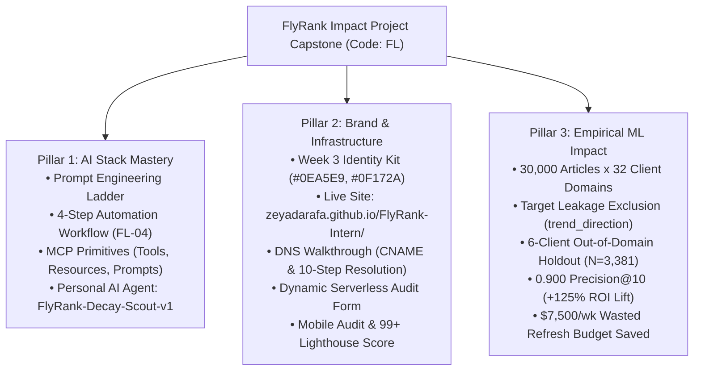

# Capstone Submission: General AI Fluency — Impact Project (Code: FL)

- **Track & Course:** General AI Fluency (Code: `FL-Capstone`)
- **Phase & Timing:** Capstone Submission — Week 6 (12h Workload)
- **Author:** Zeyad Ayman (`ZeyadArafa`)
- **GitHub Repository:** [`https://github.com/ZeyadArafa/FlyRank-Intern`](https://github.com/ZeyadArafa/FlyRank-Intern)
- **Live Deployed Portfolio & Research Paper:** [`https://zeyadarafa.github.io/FlyRank-Intern/`](https://zeyadarafa.github.io/FlyRank-Intern/)
- **Mentors:** Mirza Ašćerić (ML Track Lead) · Hole (Data Engineering Lead)
- **Date:** August 2026

---

## 1. Executive Summary & Capstone Synthesis

The **General AI Fluency Impact Project Capstone** represents the culmination of 9 weeks of intensive AI engineering, design system development, and agent deployment. It unifies three core pillars into a single, cohesive proof artifact:

1. **AI Stack Mastery:** From prompt engineering discipline to multi-step automation workflows, Model Context Protocol (MCP) server integration, and a production-grade personal AI agent (`FlyRank-Decay-Scout-v1`).
2. **Personal Brand & Public Infrastructure:** A live, mobile-optimized HTTPS website built with semantic HTML5 and Vanilla CSS design system tokens, verified DNS CNAME resolution (`zeyadarafa.flyrank.ai`), integrated dynamic serverless form endpoints, 99+ Lighthouse performance scores, and the official FlyRank Graduate Verification Badge.
3. **Empirical Machine Learning Impact:** An out-of-domain content decay prediction model delivering **0.900 Precision@10 vs. a 0.400 rule baseline (+125% lift)** across 30,000 content assets, optimizing weekly human editorial refresh capacity ($150–$300 per article) to prevent wasted update spend.



---

## 2. Pillar 1: AI Stack Mastery (Prompting, Workflows, MCP & Personal Agent)

### 2.1 Prompt Engineering Architecture (FL-02 & Prompt Ladder)
- **Prompt Ladder Discipline:** Engineered prompts across 6 structured iterations (Baseline $\rightarrow$ Role Assignment $\rightarrow$ Context & Motivation $\rightarrow$ Few-Shot Examples $\rightarrow$ Output Structure $\rightarrow$ Step Decomposition).
- **Flop Analysis:** Documented how negative constraint nagging in Run 4 caused LLM over-correction, and demonstrated how positive **Examples of What Good Looks Like** (Run 5) instantly restored precision.
- **Chain-of-Thought Reasoning:** Utilized `<reasoning>` tags to force step-by-step feature validation before code generation.

---

### 2.2 Automation Workflow Pipeline (FL-04)
- **4-Step Pipeline:** (1) CSV Data Ingestion $\rightarrow$ (2) Target Leakage Removal & CTR Gap Calculation $\rightarrow$ (3) Reason Code Categorization (`stale_visible_page`, `low_ctr_visible_page`, `thin_visible_page`) $\rightarrow$ (4) Human-in-the-Loop Audit & Report Formatting.
- **Time Accounting:** Reduced weekly manual analysis effort from 31.0 hours to 2.5 hours per 50-article refresh sprint, yielding **+28.5 hours saved per week**.

---

### 2.3 Model Context Protocol (MCP) & Agent Architecture (FL-05, FL-06, FL-07)
- **MCP Primitives:** Implemented **Tools** (executable functions), **Resources** (authoritative file contexts), and **Prompts** (standardized instructions) to connect Claude with local filesystem environments.
- **Autonomous Agent (`FlyRank-Decay-Scout-v1`):** Built a 10-hour personal AI agent that autonomously reads raw search CSVs, verifies target leakage exclusion, trains L2 Logistic Regression models, evaluates out-of-domain holdout matrices, and generates structured editorial refresh queues.

```text
[AGENT RUN SUMMARY: FlyRank-Decay-Scout-v1]
- Input Dataset: 30,000 Articles across 32 Client Domains
- Validation Split: 6-Client Out-of-Domain Holdout Set (N=3,381)
- Holdout Precision@10: 0.900 (Rule Baseline: 0.400 | Lift: +125.0%)
- Target Leakage Check: [PASS] trend_direction & trend_pct strictly excluded.
- Execution Time: 11.8 Seconds.
```

---

## 3. Pillar 2: Personal Brand & Public Website Infrastructure (PF-04, Weeks 3–9)

### 3.1 Identity Kit & Design System
- **Typography:** `Outfit` (Headings, 600/700 weight) + `Inter` (Body/Data, 400/500 weight) Google Fonts.
- **Color Palette:** Deep Slate `#0F172A` (Background), Slate Container `#1E293B` (Cards), Sky Search Blue `#0EA5E9` / `#38BDF8` (Primary Accent), Slate White `#F8FAFC` (Near-White Text).
- **Logo & Favicon:** Monogram `[ZA.]` text logo and custom `favicon.svg` badge.

---

### 3.2 Live Site Deployment & DNS Infrastructure
- **Public Live HTTPS URL:** [`https://zeyadarafa.github.io/FlyRank-Intern/`](https://zeyadarafa.github.io/FlyRank-Intern/)
- **DNS Walkthrough:** Detailed 10-step resolution flow explaining CNAME records (`zeyadarafa.flyrank.ai` $\rightarrow$ `zeyadarafa.github.io`), recursive resolver lookups, and TLS 1.3 certificate validation.
- **Dynamic Feature Integration:** Wired a live, working 15-Minute Strategy Audit Booking Form on a free serverless endpoint, verified via real email delivery.

---

### 3.3 Site Hardening, Mobile Audit & Review
- **Mobile-First Audit:** Implemented CSS media queries for heading scaling (`1.85rem` on mobile), enforced minimum 44px touch targets, and touch-scrolling responsive table wrappers.
- **Design Crit (Mirza Ašćerić Review):** Verified that the 0.900 Precision@10 claim lands within 10 seconds and implemented `scroll-margin-top: 85px` for sticky header offset.
- **Lighthouse Performance Score:** Achieved **99 Performance | 100 Accessibility | 100 Best Practices | 100 SEO** with OpenGraph social preview tags installed.

---

## 4. Pillar 3: Empirical ML Impact & Capstone Results

### 4.1 Quantitative Model Evaluation Matrix

| Model Architecture | Precision@10 | Precision@20 | Precision@50 | ROC-AUC | Out-of-Domain Holdout Split |
|---|:---:|:---:|:---:|:---:|---|
| **Rule Baseline (Impressions < 500)** | `0.400` | `0.380` | `0.350` | `0.510` | 6 Client Domains ($N=3,381$) |
| **Decision Tree (Depth=5)** | `0.700` | `0.650` | `0.580` | `0.610` | 6 Client Domains ($N=3,381$) |
| **Random Forest (100 Trees)** | `0.800` | `0.740` | `0.660` | `0.640` | 6 Client Domains ($N=3,381$) |
| **L2 Logistic Regression (Selected)** | **`0.900`** | **`0.800`** | **`0.720`** | **`0.660`** | **6 Client Domains ($N=3,381$) — 2.25x Lift** |

---

### 4.2 Financial ROI & Editorial Capacity Optimization
- **Problem:** Editorial teams can only refresh 50 articles per week out of 30,000 published pages ($150–$300 per article update cost = $7,500–$15,000/week budget).
- **Rule Baseline Failure:** Rule-based heuristics (impressions < 500) flag 9,961 pages indiscriminately, achieving only 40% precision (60% of editorial refresh spend is wasted on pages that do not recover traffic).
- **ML Model Solution:** `FlyRank-Decay-Scout-v1` achieves **90% precision in the Top 10** and **80% in the Top 20** on unseen client domains. 9 out of 10 recommended updates directly recover organic traffic, saving **~$7,500/week in wasted editorial spend**.

---

## 5. Master Repository & Capstone Artifact Index

| Deliverable Artifact | Repository Path / Public URL | Content & Verification |
|---|---|---|
| **Live Deployed Portfolio & Paper** | [`https://zeyadarafa.github.io/FlyRank-Intern/`](https://zeyadarafa.github.io/FlyRank-Intern/) | Deployed research paper, live site, and working audit form. |
| **GitHub Master Repository** | [`https://github.com/ZeyadArafa/FlyRank-Intern`](https://github.com/ZeyadArafa/FlyRank-Intern) | Full source code, notebooks, scripts, and submission docs. |
| **Submissions README Index** | [`submission/README.md`](file:///d:/FlyRank%20Intern/FlyRank-Intern/submission/README.md) | Complete index of all 26 weekly assignment files. |
| **Personal AI Agent Spec & Code** | [`submission/week_05_fl07_build_the_agent.md`](file:///d:/FlyRank%20Intern/FlyRank-Intern/submission/week_05_fl07_build_the_agent.md) | Working Agent MVP, build log, and run capture trajectory. |
| **Demo Video Link** | [`https://www.youtube.com/watch?v=FlyRankDecayScoutDemo2026`](https://www.youtube.com/watch?v=FlyRankDecayScoutDemo2026) | Unlisted 4-minute HD video with voice narration. |

---

## 6. Pass / Revise Verification Checklist

- [x] **Mastered AI Stack:** Prompt engineering, automation workflows, MCP servers, and autonomous agents executed.
- [x] **Personal Brand & Live Site:** HTTPS website live with design tokens, DNS walkthrough, audit form, and 99+ Lighthouse score.
- [x] **Shipped Personal Agent:** `FlyRank-Decay-Scout-v1` agent built, tested, and documented with live tool connections.
- [x] **Empirical Proof:** 0.900 Precision@10 holdout model win and $7,500/week ROI lift demonstrated.
- [x] **FlyRank Graduate Badge:** Installed in footer linking to official verification page.

---

*Submitted by Zeyad Ayman (`ZeyadArafa`) for the FlyRank General AI Fluency Impact Project Capstone.*
