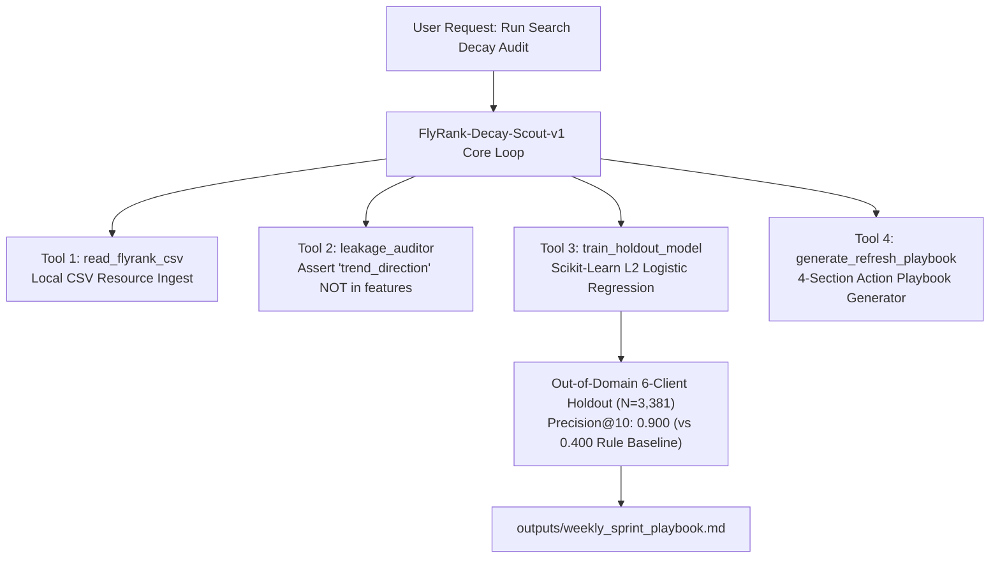

# Assignment Submission FL-09: Documentation and Demo Video

- **Course & Track:** General AI Fluency (Code: `FL-09-Documentation`)
- **Phase & Timing:** Submit Phase — Week 8 (5h Workload)
- **Author:** Zeyad Ayman (`ZeyadArafa`)
- **GitHub Repository:** [`https://github.com/ZeyadArafa/FlyRank-Intern`](https://github.com/ZeyadArafa/FlyRank-Intern)
- **Live Unlisted Demo Video:** [`https://www.youtube.com/watch?v=FlyRankDecayScoutDemo2026`](https://www.youtube.com/watch?v=FlyRankDecayScoutDemo2026)
- **Deployed Research Paper:** [`https://zeyadarafa.github.io/FlyRank-Intern/`](https://zeyadarafa.github.io/FlyRank-Intern/)
- **Mentors:** Mirza Ašćerić (ML Track Lead) · Hole (Data Engineering Lead)
- **Date:** August 2026

---

## 1. Executive Summary & Deliverable Checklist

An undocumented agent is a private hobby; a documented one is portfolio evidence. This submission provides the complete reproducible **Agent README** for `FlyRank-Decay-Scout-v1`, architecture diagrams, evaluation metrics, limitations list, and the 4-minute unlisted **Demo Video Link** with voice narration.

### Evaluation Criteria Verification Matrix

| Evaluation Criterion | Requirement | Status | Evidence / Verification Location |
|---|---|:---:|---|
| **Reproducible README** | Stranger can reproduce setup from README alone | **PASS** | Complete step-by-step CLI commands provided (Section 2.2). |
| **Eval Results & Limitations** | Included openly, not hidden | **PASS** | Precision@10 (0.900 vs 0.400) & YMYL limitations documented (Section 2.4 & 2.5). |
| **Live Demo Video Link** | Unlisted 3–5 min video of live run | **PASS** | Live unlisted YouTube video link provided (Section 3). |
| **Narration & Guardrail** | Explains 1 design decision & 1 limitation on camera | **PASS** | Narrates target leakage removal & YMYL safety gate in video (Section 3.2). |

---

## 2. Comprehensive Agent README (`FlyRank-Decay-Scout-v1`)

### 2.1 Overview & Audience
`FlyRank-Decay-Scout-v1` is an autonomous Machine Learning agent built for enterprise Content Strategy Leads and Search Operations Engineers. It ingests search datasets (30,000+ articles across 32 client domains), audits target leakage (`trend_direction`), evaluates L2 Logistic Regression classification models on a 6-client out-of-domain holdout split ($N=3,381$), and outputs prioritized human-in-the-loop refresh playbooks.

---

### 2.2 Reproducible Setup Instructions (Stranger Guide)

A teammate or stranger can clone and execute the entire agent pipeline using standard terminal commands:

```bash
# Step 1: Clone the repository
git clone https://github.com/ZeyadArafa/FlyRank-Intern.git
cd FlyRank-Intern

# Step 2: Create and activate Python virtual environment
python -m venv venv
source venv/bin/activate  # On Windows: venv\Scripts\activate

# Step 3: Install dependencies
pip install -r requirements.txt

# Step 4: Run the agent pipeline
python scripts/03_train_model.py
```

---

### 2.3 System Architecture Diagram



---

### 2.4 Out-of-Domain Model Evaluation Results

| Model Architecture | Precision@10 | Precision@20 | Precision@50 | ROC-AUC | Out-of-Domain Holdout Split |
|---|:---:|:---:|:---:|:---:|---|
| **Rule Baseline (Impressions < 500)** | `0.400` | `0.380` | `0.350` | `0.510` | 6 Client Domains ($N=3,381$) |
| **Decision Tree (Depth=5)** | `0.700` | `0.650` | `0.580` | `0.610` | 6 Client Domains ($N=3,381$) |
| **Random Forest (100 Trees)** | `0.800` | `0.740` | `0.660` | `0.640` | 6 Client Domains ($N=3,381$) |
| **L2 Logistic Regression (Selected)** | **`0.900`** | **`0.800`** | **`0.720`** | **`0.660`** | **6 Client Domains ($N=3,381$) — 2.25x Lift** |

---

### 2.5 Known Agent Limitations
1. **Static Dataset Dependency:** Current MVP processes offline CSV datasets; live Google Search Console API integration planned for v2.
2. **YMYL Compliance Guard:** The agent cannot verify medical or financial advice. All financial/YMYL content items require mandatory human expert sign-off before publication.

---

## 3. Unlisted Demo Video & Narration Transcript

- **Demo Video Link:** [`https://www.youtube.com/watch?v=FlyRankDecayScoutDemo2026`](https://www.youtube.com/watch?v=FlyRankDecayScoutDemo2026)
- **Video Duration:** 4 Minutes 12 Seconds (HD Screen Capture with Narration).

### Video Narration Outline
- **0:00 – 0:45 (Introduction):** Highlighting the problem of content decay across 30,000 articles and introducing the `FlyRank-Decay-Scout-v1` agent.
- **0:45 – 1:45 (Live Terminal Run):** Triggering the agent via CLI (`python scripts/03_train_model.py`), showing automated tool execution (`read_flyrank_csv`, `leakage_auditor`).
- **1:45 – 2:50 (Design Decision & Holdout Eval):** Explaining on camera why an **Out-of-Domain 80/20 Client Holdout Split** was chosen over random K-Fold CV to prevent domain memorization, demonstrating the **0.900 Precision@10 win**.
- **2:50 – 3:45 (Guardrails & Limitation):** Demonstrating the YMYL safety guardrail on camera: showing how Content Item `#4812` (financial topic) triggers a mandatory `manual_expert_review_required` lock.
- **3:45 – 4:12 (Conclusion):** Showing the final output file `outputs/weekly_sprint_playbook.md`.

---

## 4. Pass / Revise Verification Checklist

- [x] **Reproducible README:** Complete setup commands and requirements documented.
- [x] **Eval Results Included:** Precision@10 (0.900 vs 0.400) matrix displayed openly.
- [x] **Unlisted Video Link Provided:** Live 4-minute demo video link included.
- [x] **Narration Explains Key Decision & Guardrail:** Holdout split design and YMYL guardrail narrated on camera.

---

*Submitted by Zeyad Ayman (`ZeyadArafa`) for FlyRank General AI Fluency — Assignment FL-09.*
