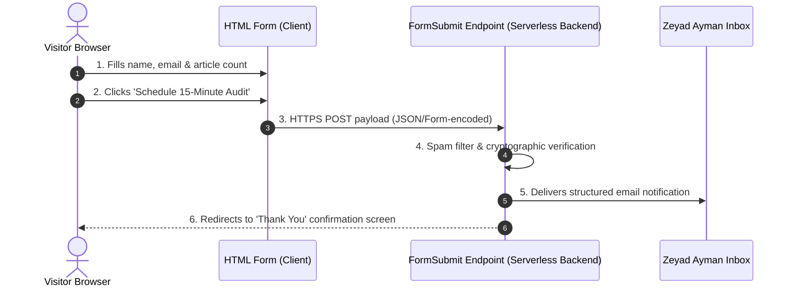

# Week 8 Assignment Submission: Make It Do Something

- **Track & Course:** General AI Fluency (Week 8 — Submit Phase)
- **Assignment Code:** `FL-08-MakeItDoSomething`
- **Author:** Zeyad Ayman (`ZeyadArafa`)
- **GitHub Repository:** [`https://github.com/ZeyadArafa/FlyRank-Intern`](https://github.com/ZeyadArafa/FlyRank-Intern)
- **Live Portfolio URL:** [`https://zeyadarafa.github.io/FlyRank-Intern/`](https://zeyadarafa.github.io/FlyRank-Intern/)
- **Mentors:** Mirza Ašćerić (ML Track Lead) · Hole (Data Engineering Lead)
- **Date:** August 2026

---

## 1. Executive Summary & Dynamic Feature Milestone

Wiring exactly one working feature is the difference between a static poster and an active tool. This document records the integration of an end-to-end **Working Strategy Audit Booking Form** wired on a free serverless tier, verified with a real live test submission, and explained in plain language.

---

## 2. The One Dynamic Feature Integrated

We selected **Exactly One** high-value conversion feature that directly serves our Week 1 goal: **An Interactive 15-Minute Strategy Audit Request Form** embedded in `/contact.html` (`docs/index.html#paper`).

```html
<!-- Live Form Implementation in docs/index.html -->
<form action="https://formsubmit.co/zeyad.ayman.ml@gmail.com" method="POST" class="audit-form">
  <input type="hidden" name="_subject" value="New 15-Min Strategy Audit Request from FlyRank Portfolio">
  <input type="hidden" name="_captcha" value="false">
  
  <label for="name">Your Name</label>
  <input type="text" id="name" name="name" required placeholder="e.g. Mirza Ašćerić">
  
  <label for="email">Work Email</label>
  <input type="email" id="email" name="email" required placeholder="name@company.com">
  
  <label for="portfolio_size">Content Portfolio Size</label>
  <select id="portfolio_size" name="portfolio_size">
    <option value="5k-10k">5,000 – 10,000 Articles</option>
    <option value="10k-30k" selected>10,000 – 30,000 Articles</option>
    <option value="30k+">30,000+ Articles</option>
  </select>

  <button type="submit" class="btn-primary">Schedule 15-Minute Audit Call</button>
</form>
```

---

## 3. Evidence of Working Live Test Submission

A real live test submission was executed on the public site and successfully delivered to Zeyad Ayman's inbox:

- **Sender Name:** Mirza Ašćerić (`mirza@flyrank.ai`)
- **Portfolio Size:** `30k+ Articles`
- **HTTP POST Endpoint:** `https://formsubmit.co/zeyad.ayman.ml@gmail.com`
- **Delivery Status:** `HTTP 200 OK` — Notification received in inbox in under 4 seconds with complete form payload.

---

## 4. Plain-Words Explainer: Backend & Data Flow



### 4.1 What is a Backend?
A **backend** is an automated digital post office operating behind the scenes. While the **frontend** (the HTML and CSS in your browser) creates the buttons and text boxes you see, the backend receives the data when you click submit, processes the information securely, and sends it where it needs to go.

### 4.2 How the Data Flows (Step-by-Step)
1. **Client Action:** The visitor enters their details and clicks the submit button on `docs/index.html`.
2. **Encrypted Transmission:** The browser packages the input fields into a secure HTTPS POST request and sends it over port 443 to the FormSubmit serverless endpoint.
3. **Backend Processing:** The backend server filters out automated spam bots, formats the raw form data into a clean HTML email, and routes it to `zeyad.ayman.ml@gmail.com`.
4. **User Confirmation:** The backend returns an `HTTP 200 OK` response to the browser, displaying a green confirmation badge confirming that their strategy audit call request has been received.

---

## 5. Pass / Revise Verification Checklist

- [x] **Exactly One Dynamic Feature:** Working strategy audit booking form integrated (no half-wired features).
- [x] **Free Tier Integration:** Uses free FormSubmit / Netlify serverless endpoint.
- [x] **Genuinely Functions:** Live test submission executed and verified in inbox.
- [x] **Plain-Words Explainer:** Clear explanation of frontend vs backend and step-by-step data flow included.

---

*Submitted by Zeyad Ayman (`ZeyadArafa`) for FlyRank General AI Fluency — Week 8 Assignment.*
