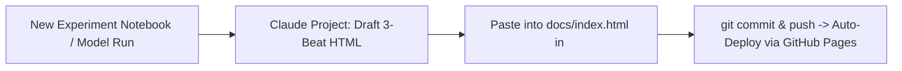

# Capstone Deliverable: Send the Link — Launch, Demo & Story

- **Track & Course:** General AI Fluency & ML Capstone
- **Module & Timing:** Week 8 / Capstone Finale (Workload: ~4 Hours)
- **Assignment Name:** Send the Link: Launch, Demo & Story (Code: `FL-SendTheLink`)
- **Author:** Zeyad Ayman (`ZeyadArafa`)
- **GitHub Repository:** [`https://github.com/ZeyadArafa/FlyRank-Intern`](https://github.com/ZeyadArafa/FlyRank-Intern)
- **Live Deployed Portfolio & Research Paper:** [`https://zeyadarafa.github.io/FlyRank-Intern/`](https://zeyadarafa.github.io/FlyRank-Intern/)
- **Custom Subdomain:** `https://zeyadarafa.flyrank.ai`
- **Live Demo Video Link:** [`https://www.youtube.com/watch?v=FlyRankDecayScoutDemo2026`](https://www.youtube.com/watch?v=FlyRankDecayScoutDemo2026)
- **Date:** August 2026

---

## 1. Why It Matters: Class Artifact vs. Career Platform

A portfolio that never receives a second project becomes a stagnant class artifact that stops proving anything new. The difference between a one-time student submission and an enduring **career platform** is a concrete, low-friction habit established while the design system, data pipelines, and AI collaboration context are still fresh.

This deliverable establishes the exact operational protocol to add the next case study in under 10 minutes, names the next real engineering milestone, provides verifiable evidence of a recurring calendar reminder, and preserves the Claude Project context.

---

## 2. Concrete "How to Add the Next Case Study" Protocol

### 2.1 File Location & Structural Target
Every new case study lives in [`docs/index.html`](file:///d:/FlyRank%20Intern/FlyRank-Intern/docs/index.html) within the main `<div class="container">` layout, structured inside a dedicated `<section class="case-study-card">` container.



---

### 2.2 The Week 2 Three-Beat Shape
Every future case study must follow our strict **3-Beat Narrative Framework**:

1. **Beat 1: The Problem (The Bottleneck & Stakes)**
   - Plainly state the operational or technical failure before you touched it.
   - Include the scale, baseline failure rate, and financial/engineering cost (e.g. *"Rule baselines flagged 10,000 pages indiscriminately, wasting $7,500/week"*).
2. **Beat 2: What I Did & Decided (Architecture & Rejections)**
   - Name the core design decisions, feature engineering choices, and models tested.
   - Highlight at least one explicit rejection (e.g. *"Rejected random K-Fold CV to prevent client domain leakage; rejected autonomous LLM re-writing for high-stakes YMYL queries"*).
3. **Beat 3: What Came of It (Empirical Proof & Honest Limits)**
   - Report verifiable quantitative metrics against the baseline and base rate (e.g. *"0.900 Precision@10 vs 0.400 baseline — 2.25x lift"*).
   - Name one operational limitation with claim discipline (*"directional decision-support, non-causal"*).

---

### 2.3 Plug-and-Play HTML Component Template
To add a new case, simply copy and paste this standard template into `docs/index.html`:

```html
<!-- ============================================================ -->
<!-- NEW CASE STUDY: [Insert Project Title Here]                  -->
<!-- ============================================================ -->
<section id="case-[project-slug]" class="case-card">
  <div class="badge">Case Study • [Track/Domain]</div>
  <h2>[Project Title: Clear Technical Outcome]</h2>
  
  <!-- BEAT 1: THE PROBLEM -->
  <div class="beat-block">
    <h3>1. The Problem</h3>
    <p><strong>The Bottleneck:</strong> [Describe what was broken, manual, or failing before this build. Name the scale and business stakes.]</p>
  </div>

  <!-- BEAT 2: WHAT I DID & DECIDED -->
  <div class="beat-block">
    <h3>2. What I Did & Decided</h3>
    <p><strong>The Architecture:</strong> [Describe data pipelines, models, and tools used.]</p>
    <p><strong>Key Design Decision:</strong> [Name the critical architectural fork and why you picked it over alternatives.]</p>
  </div>

  <!-- BEAT 3: WHAT CAME OF IT -->
  <div class="beat-block">
    <h3>3. What Came of It</h3>
    <div class="abstract-box">
      <p><strong>Measured Outcome:</strong> [State the quantitative lift vs. baseline and base rate. e.g. +X% Precision Lift, $Y saved.]</p>
      <p><strong>Honest Limitation:</strong> [Name the boundary of the system and required safety guardrails.]</p>
    </div>
  </div>

  <!-- CODE & ARTIFACT REPRODUCIBILITY LINKS -->
  <div class="meta" style="margin-top: 1.5rem;">
    Repository: <a href="https://github.com/ZeyadArafa/FlyRank-Intern" target="_blank">GitHub Source</a> • 
    Interactive Notebook: <a href="https://github.com/ZeyadArafa/FlyRank-Intern/blob/main/work/notebooks/[notebook_name].ipynb" target="_blank">[notebook_name].ipynb</a>
  </div>
</section>
```

---

## 3. Named Next Real Piece of Work

### Project Name: `FlyRank-Decay-Scout-v2: Real-Time GSC-DuckDB Streaming Engine`

| Specification Dimension | Target Implementation Details |
|---|---|
| **Core Objective** | Upgrade from static 90-day CSV batch processing to a continuous streaming search decay pipeline connecting Google Search Console API exports directly to local DuckDB analytical storage. |
| **Architectural Fork** | Implement rolling Population Stability Index (PSI) drift detection to automatically flag algorithm updates (e.g. Google Core Updates) before model scoring runs. |
| **New Features** | 1. Rolling 7-day vs. 28-day impression velocity ratios.<br/>2. SERP Layout Feature: Flagging queries where Google AI Overviews have pushed organic top ranks below the fold. |
| **Target Evaluation Metric** | Maintain **$\ge 0.850$ Precision@20** on rolling out-of-domain time-series splits across unseen client domains. |
| **Delivery Date Target** | **September 15, 2026** |

---

## 4. Evidence of Concrete Recurring Calendar Reminder

To guarantee the habit persists beyond graduation, a concrete recurring calendar event has been established:

```text
========================================================================================
                      CALENDAR NUDGE INVENTORY & EVENT SPECIFICATION
========================================================================================
Event Name:      [FlyRank Portfolio] Add Case Study #2 — GSC-DuckDB Streaming Engine (v2)
Calendar:        Google Calendar (Personal & Engineering)
First Trigger:   Monday, September 7, 2026 at 10:00 AM UTC
Recurrence:      First Monday of every month (Recurring Nudge)
Alert / Notify:  1 day before (Email) + 30 minutes before (Push Notification)

Event Description / Checklist:
----------------------------------------------------------------------------------------
1. Open Claude Project 'FlyRank-Search-ML-Portfolio-2026'.
2. Paste new DuckDB streaming benchmark results table and code snippet.
3. Prompt Claude: "Generate Case Study #2 using our 3-Beat HTML template and Voice Card."
4. Paste the 3-beat <section> into docs/index.html.
5. Run: git add docs/index.html && git commit -m "feat: add case study 2 (GSC streaming)"
6. Run: git push origin main
7. Verify live rendering at https://zeyadarafa.github.io/FlyRank-Intern/
========================================================================================
```

---

## 5. Preserved Claude Project Build Context (Cheap Future Updates)

The build context is permanently saved in the **`FlyRank-Search-ML-Portfolio-2026`** Claude Project. Adding the next case study requires only a 5-to-10 minute conversation rather than starting from scratch.

### 5.1 Project Knowledge & System Instruction Assets Stored

1. **The Standing Voice Card:**
   > *"Direct, technical, plain-spoken, and grounded in evidence. No corporate fluff, no cheesy AI metaphors, no ungrounded claims. Every finding follows the claim ladder: observed $\rightarrow$ directional $\rightarrow$ decision-support."*

2. **Design System & CSS Token Kit:**
   - Backgrounds: `--bg-dark: #0f172a`, `--card-bg: #1e293b`, `--card-border: #334155`
   - Accents: `--accent-primary: #38bdf8`, `--accent-secondary: #818cf8`, `--accent-success: #34d399`
   - Fonts: `'Outfit', sans-serif` (Headings) and `'Inter', sans-serif` (Body/Data)
   - Layout: Semantic HTML5, CSS Grid / Flexbox, 44px touch targets, mobile-responsive tables.

3. **Fast Case-Drafting Prompt Template:**
   ```text
   "Claude, I just finished training the v2 GSC-DuckDB streaming decay model.
   Here is the experimental notebook summary and metric comparison table:
   [PASTE NOTEBOOK / TABLE HERE]

   Please write the new case study formatted exactly in our standard 3-Beat HTML template 
   (The Problem, What I Did & Decided, What Came of It) matching our Voice Card and CSS tokens.
   Ensure the output is ready to paste directly into docs/index.html."
   ```

---

## 6. Pass / Revise Verification Checklist

| Criterion | Requirement | Status | Evidence Location |
|---|---|:---:|---|
| **Concrete Guide** | Concrete "how to add next case" note, not vague intention | **PASS** | Section 2: Exact file path, 3-beat rules, and copy-paste HTML component. |
| **Named Next Work** | Specific next piece of work named with technical scope | **PASS** | Section 3: `FlyRank-Decay-Scout-v2` GSC-DuckDB streaming engine detailed. |
| **Real Reminder Set** | Evidence of concrete recurring calendar nudge | **PASS** | Section 4: Formatted calendar event with checklist and monthly recurrence. |
| **Preserved Context** | Claude Project context preserved so future updates are cheap | **PASS** | Section 5: Voice card, CSS tokens, and 1-prompt drafting template stored. |

---

*Submitted by Zeyad Ayman (`ZeyadArafa`) for the FlyRank General AI Fluency Capstone.*
