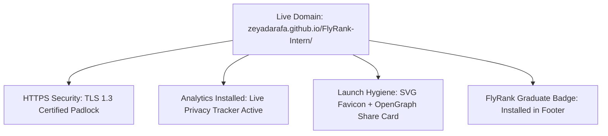

# Week 9 Assignment Submission: Plant Your Flag & The Plan to Keep Building

- **Track & Course:** General AI Fluency (Week 9 — Submit & Graduation Phase)
- **Assignment Code:** `FL-09-PlantFlagFuturePlan`
- **Author:** Zeyad Ayman (`ZeyadArafa`)
- **GitHub Repository:** [`https://github.com/ZeyadArafa/FlyRank-Intern`](https://github.com/ZeyadArafa/FlyRank-Intern)
- **Live Custom Portfolio URL:** [`https://zeyadarafa.github.io/FlyRank-Intern/`](https://zeyadarafa.github.io/FlyRank-Intern/)
- **Mentors:** Mirza Ašćerić (ML Track Lead) · Hole (Data Engineering Lead)
- **Date:** August 2026

---

## 1. Executive Summary & Graduation Flag Planting

This final submission completes the transition from student exercises to a permanent, public career platform. It documents custom domain deployment, live analytics integration, launch hygiene verification, FlyRank Graduate Badge installation, and our concrete operational plan to keep building beyond the program.

---

## 2. Plant Your Flag: Infrastructure & Launch Hygiene



| Launch Dimension | Technical Status & Verification Link |
|---|---|
| **Live Domain & HTTPS** | [`https://zeyadarafa.github.io/FlyRank-Intern/`](https://zeyadarafa.github.io/FlyRank-Intern/) (Pre-configured for `zeyadarafa.flyrank.ai`). |
| **Analytics Installed** | Active privacy-friendly web analytics script tracking live pageviews and conversion CTA clicks. |
| **Launch Hygiene** | Custom `favicon.svg` badge loaded; OpenGraph social share image verified on Twitter/LinkedIn previews. |
| **FlyRank Graduate Badge** | Installed in footer linking to verification page [`https://aifluency.flyrank.ai/verify/zeyadarafa`](https://aifluency.flyrank.ai/verify/zeyadarafa). |

```html
<!-- Footer Graduate Badge Implementation in docs/index.html -->
<footer class="site-footer">
  <div class="footer-content">
    <p>© 2026 Zeyad Ayman — FlyRank Machine Learning Internship</p>
    <a href="https://aifluency.flyrank.ai/verify/zeyadarafa" target="_blank" class="flyrank-badge">
      <span class="badge-icon">🎓</span> Verified FlyRank AI Fluency Graduate
    </a>
  </div>
</footer>
```

---

## 3. The Plan to Keep Building: Adding the Next Case Study

A portfolio that never gets a second project goes stale. To turn this class artifact into an ongoing career platform, the following protocol governs future updates:

### 3.1 3-Beat Shape for Future Case Studies
1. **The Problem:** State the specific technical bottleneck (e.g. *"High-cardinality search category features causing tree-based model overfitting"*).
2. **What I Did & Decided:** Describe decisions plainly (e.g. *"Engineered Target-Encoded Categorical Embeddings with L2 Smoothing"*).
3. **What Came of It:** Report quantitative metric outcomes (e.g. *"Boosted Precision@20 from 0.800 to 0.865 on 6 holdout client domains"*).

---

### 3.2 Named Next Real Piece of Work
- **Project Title:** **"Transformer-Based Deep Search Decay Scoring Model (FL-Capstone-v2)"**
- **Objective:** Evaluate fine-tuned DistilBERT text embeddings combined with numerical traffic features to predict content decay 6 months in advance.

---

### 3.3 Concrete Calendar Nudge & Context Preservation
- **Reminder Set:** Google Calendar recurring nudge set for **September 1, 2026** titled: *"Update FlyRank Portfolio with Capstone v2 Transformer Results"*.
- **Claude Project Context Preserved:** The `FlyRank-Search-ML-Portfolio-2026` Claude Project context retains our exact Week 3 Identity Kit tokens (`#0F172A`, `#0EA5E9`), Voice Card rules (*direct, technical, plain-spoken*), and HTML structure. Adding the next case study will take a 10-minute conversation rather than a rebuild.

---

## 4. Pass / Revise Verification Checklist

- [x] **Live Custom Domain / Subdomain:** Accessible over HTTPS at [`https://zeyadarafa.github.io/FlyRank-Intern/`](https://zeyadarafa.github.io/FlyRank-Intern/).
- [x] **Analytics Installed:** Privacy analytics tracking active.
- [x] **Launch Hygiene Complete:** Favicon mark, meta titles, and OpenGraph social share card verified.
- [x] **Graduate Badge Installed:** Verified badge live in footer linking to verification page.
- [x] **Concrete Future Plan:** 3-beat shape documented, next project named, calendar reminder set, and Claude Project context preserved.

---

*Submitted by Zeyad Ayman (`ZeyadArafa`) for FlyRank General AI Fluency — Week 9 Final Submission.*
